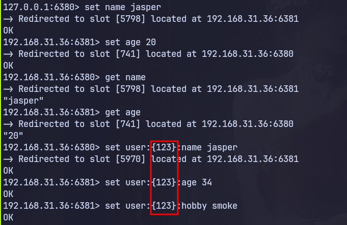

# cluster

slave不对外提供读写，主要是为了高可用，故障转移

集群总线是节点间通信通道，它使用二进制协议，由于带宽和处理时间有限，更适合节点间的信息交换。节点使用集群总线进行故障检测、配置更新、故障转移授权等操作

the cluster bus port is set by adding 10000 to the data port (e.g., 16379)

集群之间使用的16379 port
使用容器这里要用announceip地址，不然cluster创建不成功
 --cluster-replicas 1 表示希望每个创建的主节点都对应一个副本

```zsh
valkey-cli --cluster create \
    192.168.31.36:6380 192.168.31.36:6381 192.168.31.36:6382 \
    192.168.31.36:6383 192.168.31.36:6384 192.168.31.36:6385 \
    --cluster-replicas 1
```

查看cluster节点信息

```zsh
valkey-cli -p 6380 cluster nodes
```

## hash slot

```txt
5caf85c34c73d381be55ff553d35d49b8377f90a 192.168.31.36:6384@16384 slave dcb5351f57e2bdfe0a31e54d71b4b3435605cf04 0 1773047898000 1 connected
e75e12acaa43d40442e1d6ee45f84458c78e2399 192.168.31.36:6383@16383 slave 2f8991bcbd520497096f6d6f5481d5c39a57447e 0 1773047897604 3 connected
2f8991bcbd520497096f6d6f5481d5c39a57447e 192.168.31.36:6382@16382 master - 0 1773047899000 3 connected 10923-16383
62f94d903e46f58c87a73125d7666a028a3a5cfa 192.168.31.36:6381@16381 master - 0 1773047899612 2 connected 5461-10922
91c5902d1d1d86a84ad1a1d945240d1b7cb4d373 192.168.31.36:6385@16385 slave 62f94d903e46f58c87a73125d7666a028a3a5cfa 0 1773047898609 2 connected
dcb5351f57e2bdfe0a31e54d71b4b3435605cf04 192.168.31.36:6380@16380 myself,master - 0 0 1 connected 0-5460
```

valkey 将master节点映射为0-16383个slot上，数据和slot绑定
利用crc16算法计算key的hash值，hash值对16384取模得到slot编号,

**如果键中包含花括号 {} 内的子字符串，则只有子字符串内部的内容会被哈希处理**。例如，键 user:{123}:profile 和 user:{123}:account 保证位于同一个哈希槽中，因为它们共享同一个哈希标签

集群禁止跨节点的事务或多键操作（比如 MGET、SUNION、RENAME 或 Lua 脚本），因为这会产生巨大的网络开销和一致性问题。
如果尝试对位于不同节点的两个 Key 执行 SUNION（求并集），
集群会报错 (error) CROSSSLOT Keys in request don't hash to the same slot

在集群中，只有当事务涉及的所有 Key 都在同一个槽位时，MULTI/EXEC 才能工作

## valkey-cli 集群模式  

```zsh
valkey-cli -c -p 6380
```

它的核心作用只有两个字：重定向 (Redirection)
-c 就像是给你的命令行工具装了一个自动导航系统。在处理集群环境时，
它能自动处理节点间的跳转，让你无需关心数据到底存在哪台服务器上



## 集群伸缩

```text
  add-node       new_host:new_port existing_host:existing_port
                 --cluster-replica
                 --cluster-primaries-id <arg>
--cluster-slave: 告诉集群，这个新人是来当下属的。
--cluster-master-id: 后面接那个 Master 的 40 位长 ID。
```

什么都不加，默认是主节点，但是此时没有slot 需要reshard 手动分配

```zsh
valkey-cli --cluster add-node 192.168.31.36:6386 192.168.31.36:6380
valkey-cli --cluster reshard 192.168.31.36:6386
```

```zsh
valkey-cli --cluster reshard 192.168.31.36:6386
```

## 故障转移

当master 宕机之后 slave会自动升级为master，集群会自动更新配置

```conf
# ms 15s 
cluster-node-timeout 15000
# 设置为 0。这意味着无论 Slave 掉线多久，它都会尝试在 Master 挂掉时接管
cluster-replica-validity-factor 10
```

如果节点是副本，则当主节点链路断开时间超过指定时长时(timeout*factor)，副本将不会尝试启动故障转移

### manual failover

手动故障转移是一种特殊情况，与主节点实际故障导致的故障转移相比，它更加安全。手动故障转移避免了数据丢失，只有当系统确信新主节点已处理完来自旧主节点的所有复制流时，才会将客户端从原主节点切换到新主节点

故障切换期间，向主服务器发送写入命令的客户端会被阻塞。当主服务器将其复制偏移量发送给副本服务器时，副本服务器会等待自身达到该偏移量。当达到复制偏移量后，故障切换开始，原主服务器会收到配置切换的通知。切换完成后，原主服务器上的客户端将被解除阻塞，并重定向到新的主服务器

要将副本提升为主节点，它必须首先被集群中的大多数主节点识别为副本。否则，它就无法赢得备用选举。如果副本刚刚添加到集群中，您可能需要等待一段时间才能发送 CLUSTER FAILOVER 命令，以确保集群中的主节点知道新的副本
