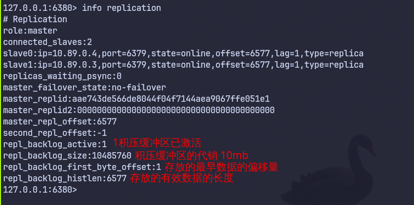
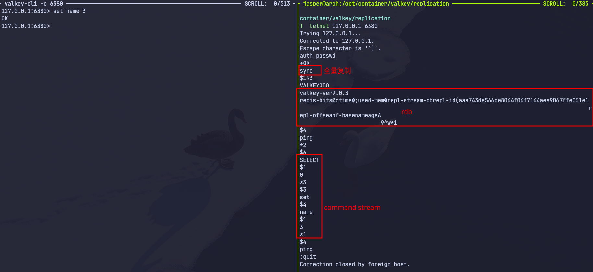

# replication

## config

- replicaof valkey-primary 6379
- primaryauth passwd 主节点设置了密码

## podman deploy

```yaml
services:
  valkey-primary:
    image: docker.io/valkey/valkey:9.0.3
    container_name: valkey-primary
    command: ["valkey-server", "/usr/local/etc/valkey/valkey.conf"]
    volumes:
      - ./conf/valkey-primary.conf:/usr/local/etc/valkey/valkey.conf:ro,Z
      - ./primary/data:/data:Z
    ports:
      - "6380:6379"
    networks:
      - valkey-net

  valkey-replica-1:
    image: docker.io/valkey/valkey:9.0.3
    container_name: valkey-replica-1
    command: ["valkey-server", "/usr/local/etc/valkey/valkey.conf"]
    depends_on:
      - valkey-primary
    volumes:
      - ./conf/valkey-replica.conf:/usr/local/etc/valkey/valkey.conf:ro,Z
      - ./replica1/data:/data:Z
    ports:
      - "6381:6379"
    networks:
      - valkey-net

  valkey-replica-2:
    image: docker.io/valkey/valkey:9.0.3
    container_name: valkey-replica-2
    command: ["valkey-server", "/usr/local/etc/valkey/valkey.conf"]
    depends_on:
      - valkey-primary
    volumes:
      - ./conf/valkey-replica.conf:/usr/local/etc/valkey/valkey.conf:ro,Z
      - ./replica2/data:/data:Z
    ports:
      - "6382:6379"
    networks:
      - valkey-net

networks:
  valkey-net:
    driver: bridge
```

## principle

- replicationID：它是一个大的伪随机字符串，用于标记数据集的特定版本。当从节点连接主节点时，会携带上次同步的主节点 RunID。如果主节点重启或发生了切换，RunID 改变，从节点就知道“物是人非”，必须进行全量同步
- offset:每当生成一个字节的复制流并发送给副本时，该偏移量都会递增，以便使用修改数据集的新更改来更新副本的状态
- Replication Backlog (积压缓冲区): 是一个固定长度的循环队列，如果从节点断开连接，只要它缺失的数据（即 Offset 差值）还在这个缓冲区的范围内，就可以进行增量复制；如果断开太久，缓冲区被新数据覆盖了，就只能走全量复制


- Replication Buffer(复制缓冲区): 用于全量同步期间，主节点bgsave生成rbd并发送给从节点期间，有新的写命令没有办法
立刻同步，就会开辟一块新的内存空间，存储这些新的写命令，以command stream（命令流：标准的 RESP (Redis Serialization Protocol) 协议，跟客户端set name jasper 一样）的方式发送给从节点



- 全量同步：primary将完整rdb文件发送给replica,主节点bgsave生成rbd并发送给从节点期间，有新的写命令没有办法
立刻同步，就会开辟一块新的内存空间，存储这些新的写命令，以command stream（命令流：标准的 RESP (Redis Serialization Protocol) 协议，跟客户端set name jasper 一样）的方式发送给从节点
- 增量同步：replica 将自己的offset发送给primary，primary获取offset之后的数据发送给replica

### princ config

- repl-backlog-size 10mb 积压缓冲区大小
