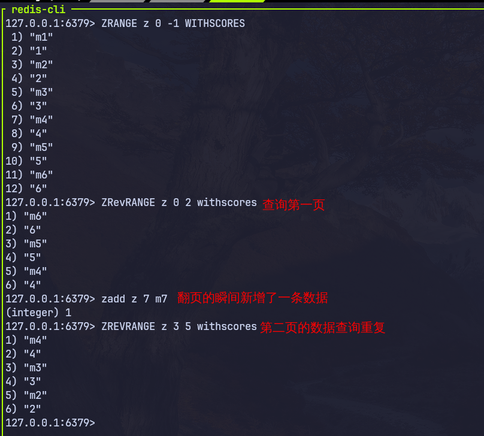
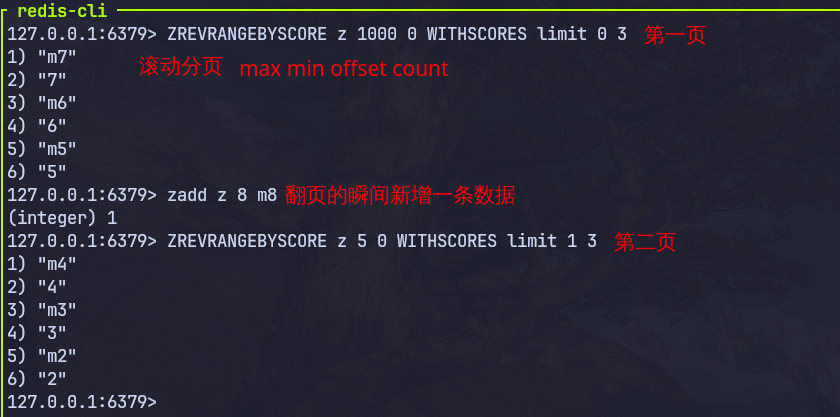

# 滚动分页

高并发、实时更新



- max: currentStamp| 上一次查询的最小值
- min:  0
- offset: 0| 1 不包含上次最小值 | 上一次结果中与最小值一样的元素的个数
- count： 分页大小


```java
        // 获取当前用户
        UserDTO user = UserHolder.getUser();
        // 推送: saveBlog 新增博客的时候推送
        // String key = "feed:" + userId;
        // stringRedisTemplate.opsForZSet().add(key, blog.getId().toString(),
        // System.currentTimeMillis());
        // 查询收件箱
        String key = "feed:" + user.getId();
        // zrevrangebyscores z max min withscores limit offset count
        Set<ZSetOperations.TypedTuple<String>> typedTuples = stringRedisTemplate.opsForZSet()
                .reverseRangeByScoreWithScores(key, 0, max, offset, 2);
        // 非空判断
        if (typedTuples == null || typedTuples.isEmpty()) {
            return Result.ok();
        }
        // 解析数据 blogId minTime offset
        List<Long> ids = new ArrayList<>(typedTuples.size());
        long minTime = 0;
        int os = 1;// 不包含上次最小值
        for (ZSetOperations.TypedTuple<String> typedTuple : typedTuples) {
            // 获取id
            String blogId = typedTuple.getValue();
            ids.add(Long.valueOf(blogId));
            long time = typedTuple.getScore().longValue();
            if (time == minTime) {
                os++;
            } else {
                minTime = time;
                os = 1;
            }
        }
```

后端实现滚动分页（尤其是高性能的滚动分页）主要有两种思路。虽然传统的 `OFFSET` 分页最简单，但在大数据量或高频更新的场景下，**游标分页（Cursor-based Pagination）** 才是真正的工业级解决方案。

---

## 1. 偏移量分页 (Offset-based)

这是最基础的方式，逻辑与传统页码分页一致。

- **参数**：`limit` (每页条数), `offset` (跳过条数)。
- **SQL 查询**：

```sql
SELECT * FROM articles 
ORDER BY create_time DESC 
LIMIT 10 OFFSET 20;

```

### 缺点（滚动分页的死穴）

1. **性能瓶颈**：随着 `OFFSET` 增大，数据库需要扫描并舍弃掉前面的行。如果偏移量是 1,000,000，性能会急剧下降。
2. **数据重复或缺失**：如果在用户滚动时，数据库插入了一条新数据，原本在第 1 页最后一条的数据会“挤到”第 2 页，导致用户看到**重复内容**。

---

## 2. 游标分页 (Cursor-based) —— 推荐

这种方式不使用偏移量，而是记录“上一次看到的最后一条数据”的标记。

- **参数**：`limit`, `last_id` (上一次返回列表中最后一条记录的唯一标识)。
- **SQL 查询**：

```sql
SELECT * FROM articles 
WHERE id < last_id  -- 假设 ID 是自增且按 ID 倒序排列
ORDER BY id DESC 
LIMIT 10;

```

### 为什么它更适合滚动分页？

- **性能恒定**：无论翻到第几页，数据库都能通过索引直接定位到 `last_id` 的位置，查询效率极高。
- **解决数据漂移**：因为它是基于具体记录点进行定位的，即使列表上方插入了新数据，也不会影响当前游标之后的查询结果。

---

## 3. 后端接口响应设计

为了方便前端处理，后端返回的数据结构建议包含**“下一个游标”**或**“是否有更多”**的标志位。

### 推荐的 JSON 返回格式

```json
{
  "data": [
    { "id": 105, "title": "文章A" },
    { "id": 104, "title": "文章B" },
    ...
    { "id": 96, "title": "文章J" }
  ],
  "paging": {
    "last_id": 96,       // 前端下次请求时带上这个 ID
    "has_more": true,    // 告诉前端是否还需要继续监听滚动
    "total": 1000        // 可选，有些 UI 需要显示总数
  }
}

```

---

## 4. 复杂场景：多字段排序

如果不是按简单的 ID 排序，而是按“点击量”或“时间”排序，游标该怎么设计？

**解决方案：组合游标**
你需要将排序字段和唯一 ID 拼接在一起。例如按点赞数 `likes` 排序：

1. 前端请求：`GET /list?last_likes=100&last_id=5`
2. SQL 实现：

```sql
SELECT * FROM articles
WHERE (likes < last_likes) OR (likes = last_likes AND id < last_id)
ORDER BY likes DESC, id DESC
LIMIT 10;

```

*注：加上 `id` 是为了处理 `likes` 相同的情况，保证分页的唯一性和连续性。*

---

## 总结建议

- **小规模、静态数据**：用 `OFFSET` 没问题，简单粗暴。
- **社交信息流、电商列表、实时更新数据**：务必使用 **游标分页**。
- **性能优化**：确保你排序和过滤的字段（如 `id` 或 `create_time`）已经建立了**索引**。
