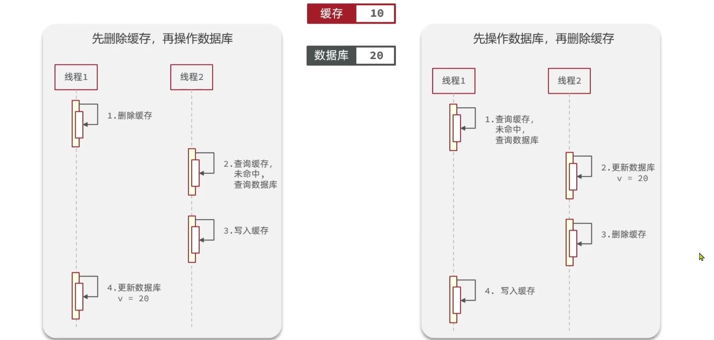

# 缓存同步策略

- cache aside:旁路缓存 调用者更新数据时更新缓存(读： 先读缓存，缓存没有则读数据库，然后回写缓存,先更新数据库，然后删除缓存)
- read/write through:读写穿透  数据库和缓存集成为一个服务，调用者调用api，不关心数据库和缓存
(将缓存视为主要数据存储，**应用程序只读写缓存**，由缓存层负责同步更新数据库)
- Write Behind:异步写回 都针对缓存完成，独立线程异步将数据写到数据库，实现最终一致性,**先写缓存，再异步写数据库**
（适合数据量大、对一致性要求不高的场景（如点赞数、阅读量））性能至上、牺牲安全

读写穿透和异步写回都需要一个“中间层”或“代理角色”来接管数据同步，但这个“额外服务”的形式有所不同

## cache aside

- 删除缓存，更新数据库时删除缓存，查询的时候在去更新缓存


先操作数据库在删除缓存线程安全性问题小一点

```java
    @Override
    @Transactional
    public Result updateShop(Shop shop) {
        // 写入数据库
        updateById(shop);
        // delete cache 这里事务发生回滚了 redis删除的数据不会恢复
        // redisTemplate.delete(RedisConstants.CACHE_SHOP_KEY + shop.getId());
        TransactionSynchronizationManager.registerSynchronization(
            new TransactionSynchronization() {
            @Override
            public void afterCommit() {
                // 确保事务提交成功之后在删除缓存  单体应用  如果是分布式则需使用mq
                redisTemplate.delete(RedisConstants.CACHE_SHOP_KEY + shop.getId());
                TransactionSynchronization.super.afterCommit();
            }
        });
        return Result.ok();
    }
```

### 高并发场景下可能出现不一致问题

#### 先删除缓存 后更新数据库

thread a ： 删除了缓存x
thread b : 发现缓存失效，去查数据库，拿到旧数据
thread b : 回写旧数据
thread a : 更新数据库

#### 先更新数据库，后删除缓存

1. 缓存刚好失效
2. a: 读库，得到旧值1
3. b： 更新数据库 x=2
4. b: delete cache(缓存为空 啥也没删除)
5. a： 更新缓存 x = 1

这种情况概率低很多，必须5在4之前发生，但是数据库更新操作一般比较慢，
线程a总是在线程b删除缓存之前完成更新缓存

#### 延时双删

1. 缓存刚好失效
2. a: 读库，得到旧值1
3. b： 更新数据库 x=2
4. b: delete cache(缓存为空 啥也没删除) thread.sleep(500)
5. a： 更新缓存 x = 1
6. b: 再次delete cache

先更新数据库，后删除缓存，任然可能出现不一致问题

缺点： sleep 会阻塞主接口，高并发场景下可能出现 服务器线程池满的情况 到底sleep多久不太好确定

#### 延时双删除+mq

第一次删除完成之后，发送一个延迟消息到mq，（2s) 异步第二次删除缓存
不阻塞主线程，接口秒回

#### 延迟双删 + Canal

写请求：更新 DB → 删缓存。
Canal：监听 Binlog，发现更新 → 延迟几百毫秒再删一次缓存。
效果： 结合了两者的优点，多了一重保险

#### canal

- [canal](/docs/dataLayer/relational/canal/index.md)

数据库改完 → 产生 Binlog → Canal 解析 → 发送 MQ → 消费者删 Redis

#### 强一致性

分布式锁
