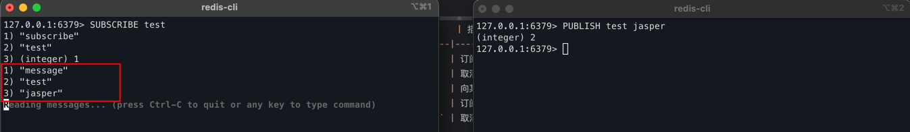

# pub sub

Redis 的 Pub/Sub（发布/订阅）是一种消息通信模式，允许消息的发布者（Publisher）将消息发送到频道（channel），
而订阅者（Subscriber）只需订阅感兴趣的频道即可接收到消息。发布者和订阅者之间是**松耦合**的，彼此不直接通信。

## 常用命令

| 命令                                     | 描述          |
|----------------------------------------|-------------|
| `SUBSCRIBE channel [channel ...]`      | 订阅一个或多个频道   |
| `UNSUBSCRIBE [channel [channel ...]]`  | 取消订阅频道      |
| `PUBLISH channel message`              | 向某个频道发布消息   |
| `PSUBSCRIBE pattern [pattern ...]`     | 订阅与某模式匹配的频道 |
| `PUNSUBSCRIBE [pattern [pattern ...]]` | 取消模式匹配订阅    |

```bash
PSUBSCRIBE news.* sports.*
PUNSUBSCRIBE news.* sports.*
```

- `*` 多个字符
- ? 单个字符

---

## 示例（使用 redis-cli）



---

## 注意事项

1. **消息不会被持久化**，只有在线订阅者能收到消息。
2. 不能在 Redis 的集群模式中横跨节点(a节点发布，b节点订阅）使用 `SUBSCRIBE`。
3. 使用 `psubscribe` 可支持通配符匹配频道，例如：`psubscribe news.*`。
4. Pub/Sub 模式适合即时通信、消息广播等场景，不适合重要数据传输（可结合 Stream 或消息队列如 RabbitMQ）。

## 实际场景

1. 聊天室中“对方正在输入”
    • A 开始输入，向频道 typing:user123 发布一个事件
    • B 订阅这个频道，收到消息后在界面显示 “对方正在输入…”

     这种消息没必要存档，实时通知即可。
2. 游戏或实时互动提醒
• 玩家 A 发起对战，发送 PUBLISH battle.invite user456
• 玩家 B 订阅相关频道，界面立即弹出对战邀请提示

 适合实时性强但不需要消息留存的场景。

## springboot 集成
