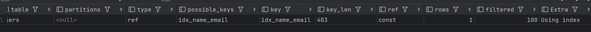

# index
一种用于快速查询和检索数据的数据结构，排序好的数据结构

## advantage and disadvantage
- advantage
  - 加快数据检索速度，减少io次数
  - 唯一性索引可以保证每一行数据的唯一性
- disadvantage
  - 占用磁盘空间
  - 对表中的数据进行增删改的时候，如果数据有索引，那么索引也需要动态的修改，会降低 SQL 执行效率
## b+ tree
  - InnoDB存储引擎中的主键索引是基于一种名为B+树（B-Plus Tree）的数据结构实现的。B+树是一种自平衡的树，使得树的所有叶节点具有相同的深度。
  - 该结构特别适合于处理大量动态更新的场景，因为它能够高效地管理高度平衡，从而优化查询和数据操作的速度。

B+树的特点：
所有数据记录节点都是叶节点：这是B+树与普通B树的主要区别，B树的数据记录可以存放在内部节点，而B+树的数据只存在于叶节点，内部节点仅存储键值信息。
叶节点之间有指针连接：所有的叶节点通过指针连接在一起，这样可以提高区间访问的性能，使得遍历成为可能。
高空间利用率：B+树的内部节点不存储数据，只存储键，因此可以在同样大小的磁盘页中存储更多的键。

按照应用维度划分：

- 主键索引：加速查询 + 列值唯一（不可以有 NULL）+ 表中只有一个。
- 普通索引：仅加速查询。唯一索引：加速查询 + 列值唯一（可以有 NULL）。
- 覆盖索引：一个索引包含（或者说覆盖）所有需要查询的字段的值。
- 联合索引：多列值组成一个索引，专门用于组合搜索，其效率大于索引合并。
- 全文索引：对文本的内容进行分词，进行搜索。目前只有 CHAR、VARCHAR ，TEXT 列上可以创建全文索引。一般不会使用，效率较低，通常使用搜索引擎如 ElasticSearch 代替

### 覆盖索引
覆盖索引（Covering Index）是一种索引策略，其特点是索引本身包含了查询所需的所有数据。在使用覆盖索引时，数据库系统可以直接从索引中获取数据，而无需访问表中的行。这种方式可以显著提高查询性能，尤其是在处理大型数据集时。

### 举例说明

假设我们有一个用户表 `Users`，其中包含用户的ID、姓名、年龄和邮箱地址，表结构如下：

``` sql
CREATE TABLE Users (
    id INT AUTO_INCREMENT PRIMARY KEY,
    name VARCHAR(100),
    age INT,
    email VARCHAR(100)
);
```

我们经常需要根据用户的姓名查询其邮箱地址。为了优化这种查询，我们可以创建一个包含`name`和`email`的复合索引。

### 创建覆盖索引

``` sql
CREATE INDEX idx_name_email ON Users (name, email);
```

这里，`idx_name_email` 索引包括了 `name` 和 `email` 两个列。当执行基于 `name` 的查询并且只需要 `email` 信息时，MySQL 可以仅通过索引来获取数据，无需回表查询原始数据行。

### 使用覆盖索引的查询示例

``` sql
SELECT email FROM Users WHERE name = 'Alice';
```

在这个查询中，如果使用了覆盖索引 `idx_name_email`，数据库引擎可以直接从索引中获取所有需要的信息（即 `email`），
因为索引已经包含了查询涉及的所有列（`name` 和 `email`）。这样，查询操作就避免了对数据表的额外访问，从而节省了I/O成本并提高了查询速度。

### 检查覆盖索引的使用

要验证MySQL是否使用了覆盖索引，可以使用 `EXPLAIN` 语句来查看查询的执行计划：

``` sql
EXPLAIN SELECT email FROM Users WHERE name = 'Alice';
```

在结果中，如果`Extra`列显示为“Using index”，这意味着查询使用了覆盖索引，且没有进行额外的数据表访问。



## 索引失效的场景
- like %开头
- 联合索引违反最左原则
- or 俩边有一个列没有索引就会失效
- 索引列参与运算
- 数据类型不一样 int类型 参数为字符串

在MySQL中，对于联合索引（复合索引），索引的列顺序是很重要的，因为它决定了索引如何被查询优化器使用。然而，当你在查询中使用`=`操作符或`IN`操作符连接索引的各个列时，查询中的条件顺序并不需要与索引定义中的列顺序完全一致。MySQL的查询优化器足够智能，能够识别并利用现有索引，即使WHERE子句中的条件顺序与索引列的顺序不完全匹配。

### 索引的工作原理
当你创建一个联合索引，比如在列`(a, b, c)`上，索引条目是按这三个列的值的组合来排序存储的。这意味着，对于给定的查询：

``` sql
SELECT * FROM table WHERE a = 1 AND b = 2 AND c = 3;
```

索引`(a, b, c)`可以非常有效地用来查找这些行，因为索引中的条目是根据这三个列连续排序的。但是，即使查询条件的顺序变为：

``` sql
SELECT * FROM table WHERE b = 2 AND c = 3 AND a = 1;
```

MySQL的查询优化器仍然能识别出`(a, b, c)`索引可以有效地支持这个查询，因为所有涉及的列都被包括在索引中，并且都使用了等值条件（`=`）。优化器会重新排列这些条件以匹配索引的顺序。

### 使用`IN`操作符
当使用`IN`操作符时，情况类似。例如，如果你有一个查询：

``` sql
SELECT * FROM table WHERE a IN (1, 2) AND b IN (3, 4) AND c = 5;
```

即使条件的顺序与索引`(a, b, c)`不匹配，查询优化器也能有效地使用索引，因为`IN`操作符可以看作多个`=`条件的逻辑OR。优化器会分析这些条件并尝试以最有效的方式使用索引。

### 重要的限制和注意事项
尽管条件的顺序在使用`=`和`IN`时不必与索引完全一致，但有几个重要的限制和最佳实践：

1. **索引前缀**：如果查询只使用了索引的一部分列，只有当这些列是索引的最左前缀时，索引才会被使用。例如，如果有索引`(a, b, c)`，查询可以只用`a`或`a`和`b`的条件来有效利用索引，但不能只用`b`或`c`。

2. **非等值条件**：如果查询中的某个条件是范围查询（如`>`、`<`、`BETWEEN`、`!=`），则该条件之后的所有列在索引中的效率会大大降低。例如，如果有`a = 1 AND b > 2`，则索引`(a, b, c)`在`b`之后的部分（即`c`）将不会有效利用索引。

了解这些索引的使用方式和限制可以帮助你更好地设计查询和索引策略，从而优化MySQL数据库的性能。

## 怎么看有没有走索引
- explain
- 慢查询log
- show profiles
- performance_schema