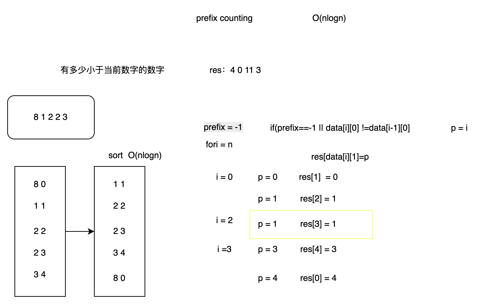

# 前缀计数

for: 统计比当前元素小的个数

本质就是： 有多少个比我小 换成 我在有序数组中的位置: 同一批相等的数字，则共享同一个前缀计数

在有序结构里，用位置表示统计结果


## demo 


```java
class S1365PrefixCounting {
    public int[] smallerNumbersThanCurrent(int[] nums) {
        int n = nums.length;
        int[][] data = new int[n][2];
        for (int i = 0; i < n; i++) {
            data[i][0] = nums[i];
            data[i][1] = i;
        }
        Arrays.sort(data,new Comparator<int[]>(){
            @Override
            public int compare(int[] o1, int[] o2) {
                return o1[0] - o2[0];
            }
        });
        int prev = -1;
        int[] res = new int[n];
        for (int i = 0; i < n; i++) {
            //prev = -1 第一位  断路后面不会走到也不会数组越界
            if (prev == -1 || data[i][0] != data[i-1][0]) {
                prev = i;
            }
            res[data[i][1]] = prev;
        }
        return res;
    }
}
```



