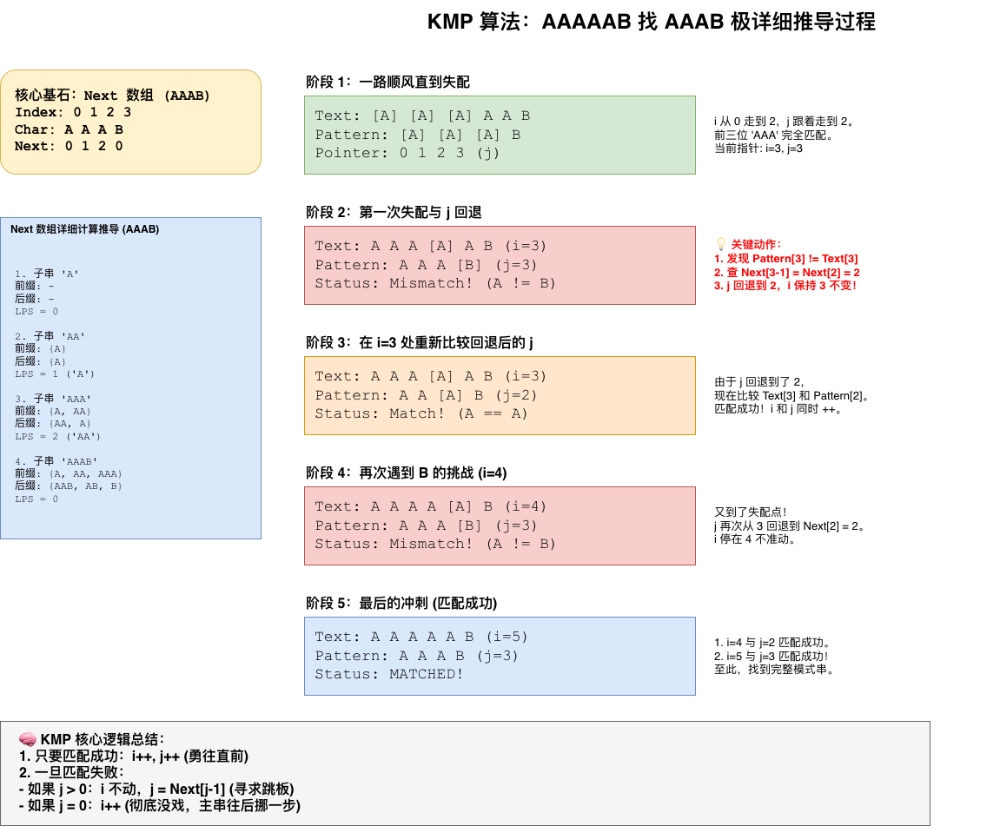

# kmp

KMP（Knuth–Morris–Pratt）是经典的字符串匹配算法，核心作用：

- 在一个长字符串（文本）中，快速查找某个子串（模式串）
- 时间复杂度：O(n + m)（不会回退主串指针）

在暴力匹配中，如果模式串在第 j 位失配，主串指针 i 会回退到起始位置的下一位。
而 KMP 发现：失配位之前的字符我们已经知道了。
通过预处理模式串，我们可以得到一个 Next 数组（也叫 LPS：Longest Proper Prefix which is also Suffix）。
它记录了：当第 j 位失配时，模式串应该跳到哪个位置继续匹配。

next数组，最长相等前后缀




```java
package com.jasper.kmp;

/**
 * @author jasper
 * @since 2026-05-06 10:21:21
 */
public class KMP {

    private int[] buildNext(String pattern) {
        int n = pattern.length();
        int[] next = new int[n];
        int j = 0;
        for (int i = 1; i < n; i++) {
            while (j > 0 && pattern.charAt(i) != pattern.charAt(j)) {
                // j is the length of the matched prefix
                // next[j-1]还能复用的最长前缀
                j = next[j - 1];
            }
            if (pattern.charAt(i) == pattern.charAt(j)) {
                j++;
            }
            next[i] = j;
        }
        return next;
    }

    public int strStr(String str, String needle) {
        if (needle.isEmpty()) return 0;
        int[] next = buildNext(needle);
        int j = 0;
        for (int i = 0; i < str.length(); i++) {
            while (j > 0 && str.charAt(i) != needle.charAt(j)) {
                j = next[j - 1]; // j is the length of the matched prefix
            }
            if (str.charAt(i) == needle.charAt(j)) {
                j++;
            }
            if (j == needle.length()) {
                return i - needle.length() + 1;
            }
        }
        // if not return -1
        return -1;
    }
}

```