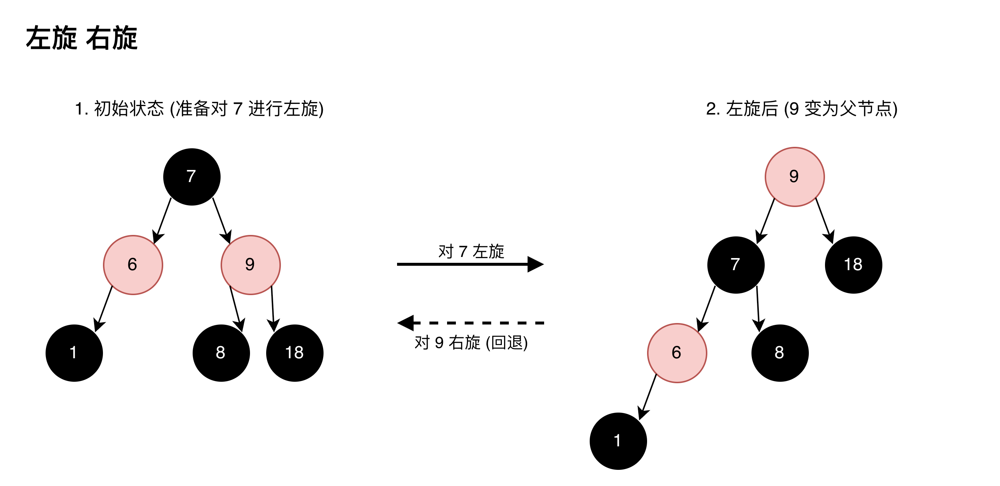
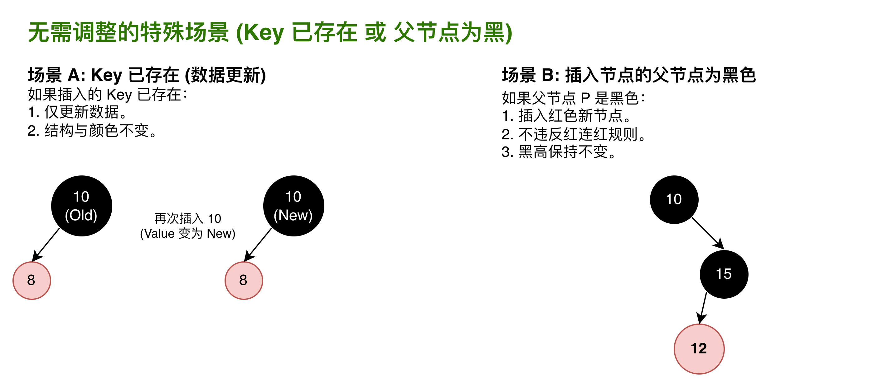
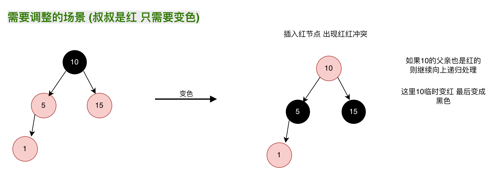
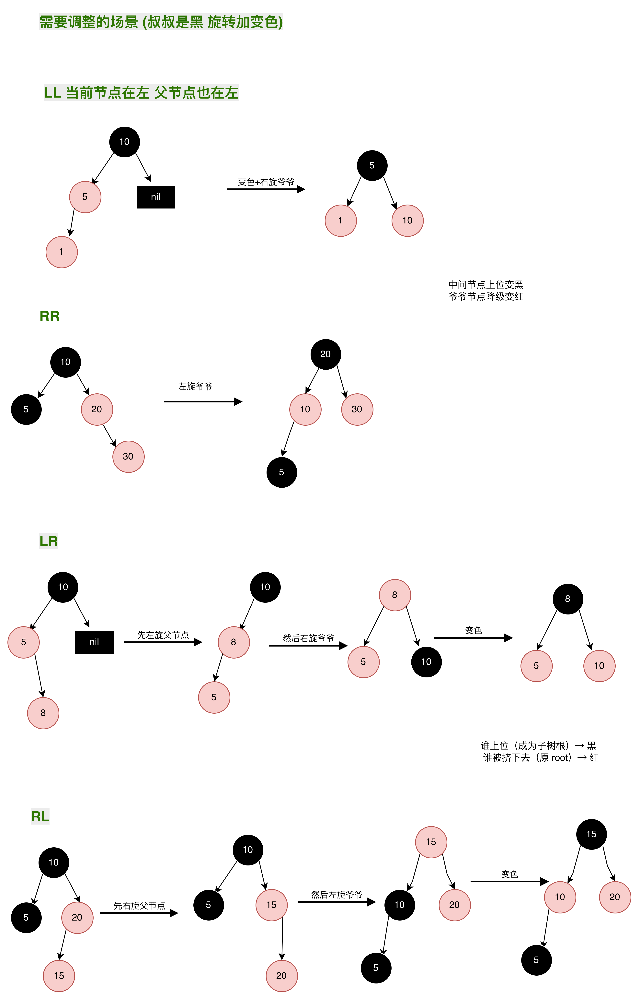

# 红黑树

自平衡的二叉搜索树，解决bst最坏情况下变成O(n)的情况

- 每个节点要么红色 要么黑色
- 根节点必须是黑色
- 不能有俩个红色节点连在一起 
- 任何一个节点到叶子节点中，黑色节点数必须相等(黑高相等)
- 叶子节点(nil)必须是黑色

## 左旋 右旋 

1. 左旋 (Left Rotate): 支点 7 下沉，其右子 9 上升。原本 9 的左子 8 移交给 7 作为右子。
2. 右旋 (Right Rotate): 支点 9 下沉，其左子 7 上升。原本 7 的右子 8 移交给 9 作为左子。
3. 性质维持: 旋转前后，所有节点的 BST 顺序均保持 1-6-7-8-9-18 不变。

## 插入 

新节点默认是红色：否则会破坏黑高
可能违反：红红冲突（父节点也是红色）

### 无需调整的场景

### 需要调整 

#### 叔叔是红

#### 叔叔是黑

