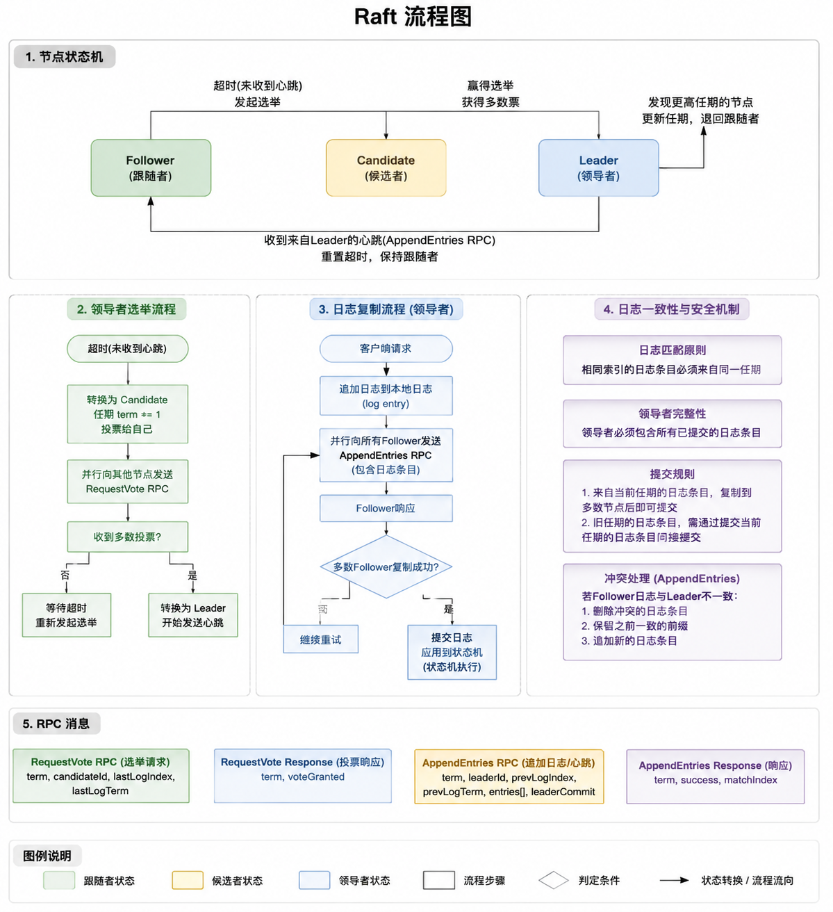

# raft 


## 1. Raft 是什么

**Raft** 是一种分布式一致性协议，用于让多个节点在存在网络延迟或节点故障时也能达成一致状态。它解决的问题和 **Paxos** 类似，但更易理解和实现。典型应用是 **分布式数据库**、**日志复制系统**（比如 **etcd**、**Consul**）。

核心目标：

* **一致性**：所有健康节点最终看到相同的状态。
* **高可用**：部分节点故障时系统仍能工作。
* **易理解**：比 Paxos 更直观。

---

## 2. Raft 的三个核心角色

一个 Raft 集群中的节点角色主要有三种：

1. **Leader（领导者）**

   * 集群中唯一的写操作入口。
   * 负责接收客户端请求、将日志复制到 Follower。
   * 处理大部分逻辑，保证一致性。

2. **Follower（跟随者）**

   * 被动节点，接收 Leader 的心跳和日志。
   * 超时后可能发起选举成为 Candidate。

3. **Candidate（候选者）**

   * 当 Follower 超时没收到心跳，会变成 Candidate 并发起选举。
   * 获得多数票后成为 Leader。

> 类比：Leader 就像班长，Follower 是学生，Candidate 是自荐的学生，如果班长不出现，大家投票选新班长。

---

## 3. Raft 的核心机制

### 3.1 选举（Leader Election）

**目的**：确保集群中只有一个 Leader。

流程：

1. Follower 超过 **选举超时**（Election Timeout）没收到 Leader 心跳 → 变成 Candidate。
2. Candidate 给其他节点发 **RequestVote**。
3. 收到多数票 → 成为 Leader。
4. Leader 每隔固定时间发送 **心跳（AppendEntries RPC 空日志）** 给 Followers。
5. 如果 Candidate 或 Follower 收到比自己 term（任期）大的信息 → 回退到 Follower。

**注意**：term 是 Raft 的核心概念，表示任期，单调递增。

---

### 3.2 日志复制（Log Replication）

**目的**：保证所有节点拥有一致的状态机日志。

流程：

1. 客户端请求写入 → 发送给 Leader。
2. Leader 将日志条目追加到自己的日志中。
3. Leader 并行发送 **AppendEntries** 给所有 Follower。
4. 当日志条目被多数节点确认（committed） → Leader 应用到状态机 → 返回给客户端。
5. Follower 收到日志条目 → 写入本地日志 → 回复 Leader。

> 核心原则：**只要日志在大多数节点提交，就被认为是安全的**。

---

### 3.3 安全性和一致性

1. **日志匹配原则**
   如果两个日志在相同索引的条目有不同的 term，后续日志会被覆盖，以确保一致性。

2. **Leader 完整性**
   新 Leader 必须包含之前任期被提交的日志条目，保证不会丢失已经提交的操作。

3. **客户端线性一致性（可选）**
   Raft 支持读写线性化，通过 Leader 保证顺序。

---

## 4. Raft 的几个关键概念

* **Term（任期）**：每次选举都会增加 term，保证选举唯一性。
* **Majority（多数节点）**：提交日志和选举都是多数原则。
* **Heartbeat（心跳）**：Leader 定期发送，防止 Follower 发起选举。
* **CommitIndex**：已提交的最高日志索引。
* **LastApplied**：已应用到状态机的最高日志索引。

---

## 5. Raft 的状态机概念

Raft 实际上是通过 **状态机复制**（State Machine Replication）保证一致性：

```
客户端请求 → Leader 日志复制 → 日志提交 → 各节点应用到状态机 → 客户端响应
```

> 举个简单例子：假设状态机是一个计数器，每条日志是“加 1”或“减 1”。所有节点应用相同顺序日志，最终计数器结果一致。

---

## 6. Raft 的优势

* 易于理解，比 Paxos 清晰。
* 强一致性，保证日志顺序不丢。
* 可处理节点故障和网络分区。

---

## 7. 常见问题和优化

1. **Leader 崩溃** → 选举新的 Leader。
2. **网络延迟** → 通过心跳和日志匹配保证一致性。
3. **Follower 落后** → Leader 会自动补充缺失日志。
4. **性能优化**：

   * 批量 AppendEntries
   * 日志压缩（Snapshot）
   * 读请求可以直接服务 Leader 或通过 Lease 实现可扩展读


## 随机超时时间

你可能会问：如果大家总是同时起义，导致选票一直被瓜分（Split Vote），集群岂不是永远选不出老大、瘫痪了？

Raft 采用了一个极度简单却极其聪明的办法：随机选举超时时间（Randomized Election Timeout）。

Raft 规定，每个节点的超时时间不是固定的，而是在一个区间内随机摇号（例如 150ms 到 300ms 之间）。

这样一来，通常总会有一个节点（比如 A 节点摇到了 160ms，B 节点摇到了 250ms）率先超时。

A会比别人更早发起起义，在别人还没反应过来（还没超时）的时候，就把大家的票全收走了，
从而极大地避免了选票被瓜分的情况。通常在一轮内就能稳稳地选出 Leader。



