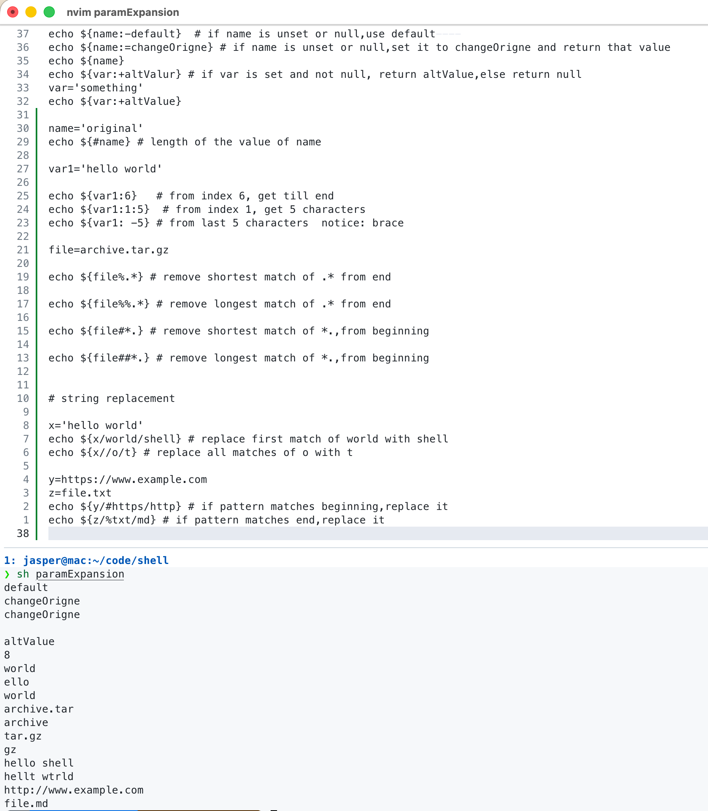

# 参数

在执行 Shell 脚本时，向脚本传递参数，脚本内获取参数的格式为 $n，n 代表一个数字，1 为执行脚本的第一个参数，2 为执行脚本的第二个参数。
例如 $1、$2 等来引用传递给脚本的参数，其中 $1 表示第一个参数，$2 表示第二个参数

## 特殊参数

| 参数 | 说明 |
|----|--------------------------------|
| $0 | 脚本的文件名                         |
| $# | 传递到脚本的参数个数                     |
| $* | 以一个单字符串显示所有向脚本传递的参数            |
| $@ | 与$*相同，但是使用时加引号，并在引号中返回每个参数     |
| $$ | 脚本运行的当前进程 ID 号                 |
| $! | 后台运行的最后一个进程的 ID 号              |
| $? | 显示最后命令的退出状态。0表示没有错误，其他任何值表明有错误 |

```shell
echo "shell 传递参数"
echo "参数文件名：$0"
echo "第一个参数: $1"
echo "第二个参数: $2"
echo "参数的个数: $#"
echo "$*"
echo "$@"
echo "进程id:$$"
sleep 100 &    # 将 sleep 100 放入后台
echo "运行的最后一个进程id $!"        # 显示 sleep 100 进程的 PID，例如 12345
kill $!        # 终止该后台进程
echo "最后命令的状态 $?"

cp file1.txt /some/nonexistent/path
if [ $? -ne 0 ]; then
    echo "复制失败"
else
    echo "复制成功"
fi
```

output:
sh parm a "b c" d
shell 传递参数
参数文件名：parm
第一个参数: a
第二个参数: b c
参数的个数: 3
a b c d
a b c d
进程id:56388
运行的最后一个进程id 56389
最后命令的状态 0
cp: file1.txt: No such file or directory
parm: line 14: 56389 Terminated: 15          sleep 100
复制失败

$* 有双引号时 会将所有的参数合并为一个参数  a b c d
$@ 有双引号时 会将每个参数都作为一个独立的参数  a "b c"  d

## 参数替换 parameter expansion

### 默认值与赋值

```shell
echo ${name:-default}  # if name is unset or null,use default
echo ${name:=changeOrigne} # if name is unset or null,set it to changeOrigne and return that value
echo ${name}
echo ${var:+altValur} # if var is set and not null, return altValue,else return null
var='something'
echo ${var:+altValue}
```

### 获取变量长度

```shell
name='original'
echo ${#name} # length of the value of name
```

### 截取子字符串

```shell
echo ${var1:6}   # from index 6, get till end
echo ${var1:1:5}  # from index 1, get 5 characters
echo ${var1: -5} # from last 5 characters  notice: brace
```

### 删除子串 / 模式匹配

| 形式                | 含义       | 例子                                          |
| ----------------- | -------- | ------------------------------------------- |
| `${VAR#pattern}`  | 删除开头最短匹配 | `file="abc.txt"` → `${file#*.}` → `txt`     |
| `${VAR##pattern}` | 删除开头最长匹配 | `file="a.b.c.txt"` → `${file##*.}` → `txt`  |
| `${VAR%pattern}`  | 删除末尾最短匹配 | `file="a.b.c.txt"` → `${file%.*}` → `a.b.c` |
| `${VAR%%pattern}` | 删除末尾最长匹配 | `file="a.b.c.txt"` → `${file%%.*}` → `a`    |

```shell
file="archive.tar.gz"
echo ${file%.*}   # archive.tar
echo ${file%%.*}  # archive
echo ${file#*.}   # tar.gz
echo ${file##*.}  # gz
```

### 字符串替换

| 形式                     | 含义                      |
| ---------------------- | ----------------------- |
| `${VAR/pattern/repl}`  | 替换第一个匹配的 pattern 为 repl |
| `${VAR//pattern/repl}` | 替换所有匹配的 pattern         |
| `${VAR/#pattern/repl}` | 如果开头匹配 pattern，替换为 repl |
| `${VAR/%pattern/repl}` | 如果结尾匹配 pattern，替换为 repl |

```shell
# string replacement

x='hello world'
echo ${x/world/shell} # replace first match of world with shell
echo ${x//o/t} # replace all matches of o with t

y=https://www.example.com
z=file.txt
echo ${y/#https/http} # if pattern matches beginning,replace it
echo ${z/%txt/md} # if pattern matches end,replace it
```

### usage

- [usage](./usage.md)


