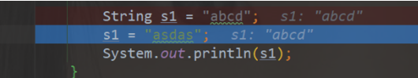
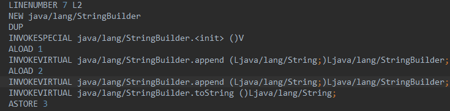

# String

```java
public final class String
    implements java.io.Serializable, Comparable<String>, CharSequence {
    /** The value is used for character storage. */
    private final char value[];
}
```

### String 的不可变

private final char value[];

对字符串的截取、拼接等操作都是重新生成了新的字符串对象
给一个已有字符串第二次赋值，不是在原内存地址修改数据，而是一个新的对象（新地址）



- 保存字符串的字符数组是 final 并且私有的 没有提供/暴露修改这个字符串的方法
- 类被 final 修饰 防止子类破坏 String 不可变

1. value 不可变 是 value 这个引用地址不可变 但是 Array 数组是可变的
2. value 只是 stack 上的一个引用，数组是在堆上，堆里数组本身数据是可变的

```java
public class ArrayChangeDemo {
    public static void main(String[] args) {
        final int[] value = {1,2,3};
        int[] anotherValue = {4,5,6};
//        value =anotherValue;
        value[2]=6;
        System.out.println(value[2]);
    }
}

//6
```

### 不可变的好处

- 线程安全 多个线程可以安全的共享 String 对象
- String 作为参数传递给方法时，不会因为方法内部对 String 的修改而导致外部产生意外的结果。

```java
package com.jasper.StringDemo;

public class ChangeDemo {
  public static void main(String[] args) {
    String myString = "Hello";
    printString(myString);
    // 在调用方法后，我们期望myString保持不变
    System.out.println("After method call: " + myString);
  }

  public static void printString(String str) {
    str = "asd";
    System.out.println(str);
  }
}
// asd
// After method call: Hello
```

- String 被广泛用作哈希表的键，因为其不可变性保证了哈希码的稳定性，保证哈希值不会频繁的变更
  使用 StringBuilder 破坏了 hashSet 的唯一性

```java
package com.jasper.StringDemo;

import java.util.HashSet;

public class BuilderDemo {
    public static void main(String[] args) {
        HashSet<StringBuilder> hs = new HashSet<>();
        StringBuilder a = new StringBuilder("a");
        StringBuilder ab = new StringBuilder("ab");
        hs.add(a);
        hs.add(ab);
        System.out.println(hs);
        StringBuilder s = a;
        s.append("b");
        System.out.println(hs);
    }
}
// [ab, a]
// [ab, ab]
```

### 字符串常量池

jdk8 以后存储在堆中
JVM 为了针对字符串提升性能和减少内存消耗开辟的一块区域，避免字符串的重复创建

```java
package com.jasper.StringDemo.stringdemo;

public class Demo3 {
    public static void main(String[] args) {
        String a = "aa";
        String b = "aa";
        System.out.println(a == b);
    }
}
// true
```

当我们创建一个字符串常量时，它会存储在字符串常量池中，只创建一个对象。
当我们创建一个字符串对象时，如果字符串对象的内容是一个已经存在在字符串常量池中的字符串，
那么这个对象会指向已经存在的字符串常量，而不会创建一个新的字符串常量

### intern

- 直接使用双引号声明出来的 `String`对象会直接存储在常量池中。
- 如果不是用双引号声明的 `String`对象，可以使用 `String`提供的 `intern`方法。intern 方法会从字符串常量池中查询当前字符串是否存在，若不存在就会将当前字符串放入常量池中

```java
String s1 = new String("hello"); // 创建了一个新的字符串对象
String s2 = s1.intern();         // s2 是池中的 "hello" 对象的引用
String s3 = "hello";             // s3 也是池中的 "hello" 对象的引用
//System.out.println(s1 == s2); // 输出 false，因为 s1 是堆中的对象
//System.out.println(s2 == s3); // 输出 true，因为 s2 和 s3 都指向字符串池中的对象
```

在上面的代码中：

s1 是通过 new String("hello") 创建的一个新的对象，它不在字符串池中。
s2 是通过 s1.intern() 得到的池中的对象引用。
s3 直接指向池中的 "hello" 对象。
可以看出，s2 和 s3 实际上指向的是同一个内存位置，即字符串池中的 "hello"。

#### intern() 方法的应用场景
intern() 通常用于以下场景：

内存优化： 当你的应用程序中有大量重复的字符串时，使用 intern() 可以显著减少内存的使用。通过将这些字符串放入池中，所有相同内容的字符串都会共享同一个对象。

字符串比较优化： 在需要大量进行字符串比较的场景下，使用 intern() 可以使比较操作更快，因为可以直接比较对象引用而不是逐字符比较。

多线程同步： 在多线程环境中，可以使用 intern() 方法确保相同的字符串内容使用同一个锁对象
#### 风险

使用 intern() 后，字符串对象将被放入堆中的字符串池中。尽管堆的大小通常比永久代大得多，但如果大量不同的字符串对象都被放入池中，仍然会占用堆内存，这可能会导致内存消耗增大。
堆内存耗尽的风险依然存在，特别是在大量使用 intern() 的情况下，因为 JVM 会不断创建新的字符串对象并将它们放入池中

### stringBuilder and stringBuffer
- 每次对 String 类型进行改变的时候，都会生成一个新的 String 对象
- `StringBuffer` 每次都会对 `StringBuffer` 对象本身进行操作，而不是生成新的对象并改变对象引用
- 使用 `StringBuilder` 相比使用 `StringBuffer` 能获得性能提升，但却要冒多线程不安全的风险

1. 少量数据 String
2. 单线程大量数据 StringBuilder
3. 多线程大量数据 StringBuffer

### 字符串的拼接

字符串通过+的方式拼接，本质是通过 StringBuilder 调用 append 方法实现的，拼接完之后会调用 toString 方法得到一个字符串对象



### String.format

String.format 是 Java 中的一个方法，用于格式化字符串。它类似于 C 语言中的 printf 函数，可以用来创建格式化的字符串，主要用于输出特定格式的数据

```java
String formattedString = String.format(locale, format, arguments);
```

locale 是一个可选参数，指定了格式化规则所使用的地区（例如，数字和日期的显示方式在不同的国家可能不同）。
format 是一个字符串，定义了如何格式化后续的参数。它可以包含普通文本以及特殊格式说明符。
arguments 是将被插入到 format 字符串中对应位置的一系列值。
格式说明符通常以 % 开始

- %s 字符串

```java
public class FormatDemo {
  public static void main(String[] args) {
    String jasper = String.format("name is %s and age is %s", "jasper", "20");
    System.out.println("jasper = " + jasper);
  }
}
//jasper = name is jasper and age is 20
```

## equals

使用字符串比较时，将字符串常量写到前面更好，可以避免空指针问题

``` java
if("abc".equals(a)){
}else if(a.equals("abc")){
} 
```

写到后面 a变量为null就会报空指针异常