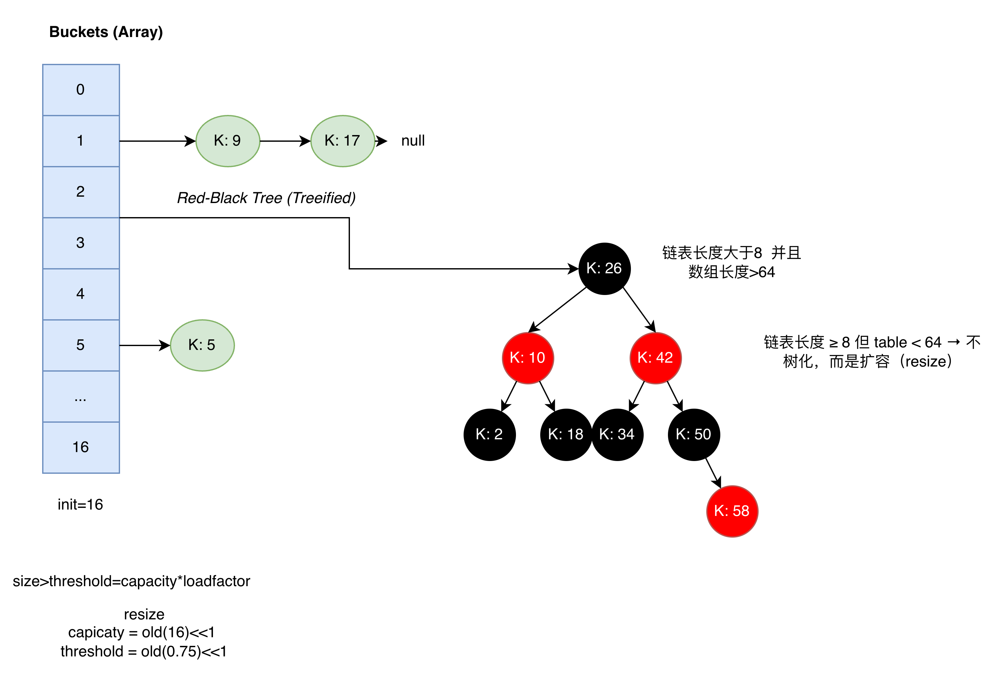

# hashmap 源码




是jdk21的源码 但是整体逻辑没怎么变

先找到key，找到则覆盖，找不到插入
当链表长度>=8 并且table>= 64 则树化
当size》capacity*loadFactor 扩容

```java 
    /**
     * The default initial capacity - MUST be a power of two.
     * 计算数组下标
     * i = (n - 1) & hash   n-1=15&hash = 1111&hash   如果不是2的幂：n=10 n-1=9  1001 分布会很不均衡 
     * 这里只用了低位
     */
    static final int DEFAULT_INITIAL_CAPACITY = 1 << 4; // aka(also known as 也就是) 16  0001   1 0000 2^4

    /**
     * The maximum capacity, used if a higher value is implicitly specified
     * by either of the constructors with arguments.
     * MUST be a power of two <= 1<<30.
     */
    static final int MAXIMUM_CAPACITY = 1 << 30; //aka 1073741824

    /**
     * The load factor used when none specified in constructor.
     * 如果设为 1.0： 空间利用率极高，但必须等到桶全满才扩容。这会导致在接近 1.0 时发生大量的哈希碰撞，查询性能大幅下降
     */
    static final float DEFAULT_LOAD_FACTOR = 0.75f;

    /**
     * The bin count threshold for using a tree rather than list for a
     * bin.  Bins are converted to trees when adding an element to a
     * bin with at least this many nodes. The value must be greater
     * than 2 and should be at least 8 to mesh with assumptions in
     * tree removal about conversion back to plain bins upon
     * shrinkage.
     */
    static final int TREEIFY_THRESHOLD = 8;

    /**
     * The bin count threshold for untreeifying a (split) bin during a
     * resize operation. Should be less than TREEIFY_THRESHOLD, and at
     * most 6 to mesh with shrinkage detection under removal.
     */
    static final int UNTREEIFY_THRESHOLD = 6;

    /**
     * The smallest table capacity for which bins may be treeified.
     * (Otherwise the table is resized if too many nodes in a bin.)
     * Should be at least 4 * TREEIFY_THRESHOLD to avoid conflicts
     * between resizing and treeification thresholds.
     */
    static final int MIN_TREEIFY_CAPACITY = 64;

    transient Node<K,V>[] table;
    /**
     * 链表中的一个节点
     * Basic hash bin node, used for most entries.  (See below for
     * TreeNode subclass, and in LinkedHashMap for its Entry subclass.)
     */
    static class Node<K,V> implements Map.Entry<K,V> {
        final int hash;
        final K key;
        V value;
        Node<K,V> next;

        Node(int hash, K key, V value, Node<K,V> next) {
            this.hash = hash;
            this.key = key;
            this.value = value;
            this.next = next;
        }

        public final K getKey()        { return key; }
        public final V getValue()      { return value; }
        public final String toString() { return key + "=" + value; }

        public final int hashCode() {
            return Objects.hashCode(key) ^ Objects.hashCode(value);
        }

        public final V setValue(V newValue) {
            V oldValue = value;
            value = newValue;
            return oldValue;
        }

        public final boolean equals(Object o) {
            if (o == this)
                return true;

            return o instanceof Map.Entry<?, ?> e
                    && Objects.equals(key, e.getKey())
                    && Objects.equals(value, e.getValue());
        }
    }

    static final int hash(Object key) {
        int h;
        // 无符号右移 直接补0 
// h        = 1010 0000 0000 0000 0000 0000 0000 1111
// h >>> 16 = 0000 0000 0000 0000 1010 0000 0000 0000
// 让高位参与低位运算，避免hash冲突
// 对hashcode做扰动 让哈希分布更加均匀
        return (key == null) ? 0 : (h = key.hashCode()) ^ (h >>> 16);
    }
final V putVal(int hash, K key, V value, boolean onlyIfAbsent,
                   boolean evict) {
      // 数组             链表 第一个节点 
        Node<K,V>[] tab; Node<K,V> p; int n, i;
      // 懒加载 第一次put才初始化
        if ((tab = table) == null || (n = tab.length) == 0)
            n = (tab = resize()).length;
      // 计算数组下标 没有冲突直接插入
        if ((p = tab[i = (n - 1) & hash]) == null)
            tab[i] = newNode(hash, key, value, null);
        // 有冲突
        else {
        // e 下一个节点 p 当前节点
            Node<K,V> e; K k;
        //  key 已经存在 后面会覆盖旧值    引用或者内容
            if (p.hash == hash && ((k = p.key) == key || (key != null && key.equals(k))))
                e = p;
        // rbtree
            else if (p instanceof TreeNode)
                e = ((TreeNode<K,V>)p).putTreeVal(this, tab, hash, key, value);
            else {
          // linkedlist
                for (int binCount = 0; ; ++binCount) {
            // 链表尾部 插入 p = 链表中第一个元素
                    if ((e = p.next) == null) {
                        p.next = newNode(hash, key, value, null);
                        if (binCount >= TREEIFY_THRESHOLD - 1) // -1 for 1st 链表长度>8 则树化 tab 要小于64
                            treeifyBin(tab, hash);
                        break;
                    }
            // 判断链表中有没有重复的
                    if (e.hash == hash &&
                        ((k = e.key) == key || (key != null && key.equals(k))))
                        break;
                    p = e;
                }
            }
        // 覆盖旧值
            if (e != null) { // existing mapping for key
                V oldValue = e.value;
          // hashmap 允许值为null
                if (!onlyIfAbsent || oldValue == null)
                    e.value = value;
          // 给linkedhashmap用的  节点被访问之后用的
                afterNodeAccess(e);
                return oldValue;
            }
        }
      // 记录 HashMap 被“结构性修改”的次数，用于迭代器检测并发修改（fail-fast）
      // scene 一遍遍历 一遍修改结构   HashIterator
        ++modCount;
        if (++size > threshold)
            resize();
      // 给linkedhashmap用的 节点被插入之后用的 删除最老的节点  实现lru   removeEldestEntry
      // template method design pattern 
        afterNodeInsertion(evict);
        return null;
    }
final Node<K,V>[] resize() {
      // 旧数组
        Node<K,V>[] oldTab = table;
      // 旧容量
        int oldCap = (oldTab == null) ? 0 : oldTab.length;
      // 旧扩容阈值 capacity*loadFactor
        int oldThr = threshold;
        int newCap, newThr = 0;
        if (oldCap > 0) {// 初始化过
            if (oldCap >= MAXIMUM_CAPACITY) {
                threshold = Integer.MAX_VALUE;
                return oldTab; // 到最大容量直接返回旧数组
            }
            else if ((newCap = oldCap << 1) < MAXIMUM_CAPACITY &&
                     oldCap >= DEFAULT_INITIAL_CAPACITY)
                newThr = oldThr << 1; // double threshold
        // 容量和阈值都翻倍
        }
      // 有thresold 但是table还没有建 new HashMap(16)
        else if (oldThr > 0) // initial capacity was placed in threshold
            newCap = oldThr;//threshold 代理了 capacity 的职责 tableSizeFor
      // new HashMap()
        else {               // zero initial threshold signifies using defaults
            newCap = DEFAULT_INITIAL_CAPACITY;//16 
            newThr = (int)(DEFAULT_LOAD_FACTOR * DEFAULT_INITIAL_CAPACITY);//16*0.75=12
        }
        if (newThr == 0) {
            float ft = (float)newCap * loadFactor;
            newThr = (newCap < MAXIMUM_CAPACITY && ft < (float)MAXIMUM_CAPACITY ?
                      (int)ft : Integer.MAX_VALUE);
        }
        threshold = newThr;
        @SuppressWarnings({"rawtypes","unchecked"})
        Node<K,V>[] newTab = (Node<K,V>[])new Node[newCap];
        table = newTab;
      // 迁移数据
        if (oldTab != null) {
            for (int j = 0; j < oldCap; ++j) {
                Node<K,V> e;
                if ((e = oldTab[j]) != null) {
                    oldTab[j] = null;// 断开引用 帮助gc
                    if (e.next == null)// 没有链表 单节点
            // p = tab[i = (n - 1) & hash]) 重新计算位置
                        newTab[e.hash & (newCap - 1)] = e;
                    else if (e instanceof TreeNode) // 是rbtree
                        ((TreeNode<K,V>)e).split(this, newTab, j, oldCap);
                    else { // preserve order 链表
                        Node<K,V> loHead = null, loTail = null;//原位置
                        Node<K,V> hiHead = null, hiTail = null;//新位置
                        Node<K,V> next;
                        do {
                            next = e.next;// 保存下一个节点 防止断链
                          /*
oldIndex = hash & (oldCapacity - 1)
newIndex = hash & (oldCapacity*2 - 1)
16 -> 32   01111 -> 11111  只多了一个高位1
                         */
                            if ((e.hash & oldCap) == 0) {// 高位=0 留在原位置
                                if (loTail == null)
                                    loHead = e;
                                else
                                    loTail.next = e;
                                loTail = e;
                            }
                            else {// 高位 = 1 去新的位置 
                                if (hiTail == null)
                                    hiHead = e;
                                else
                                    hiTail.next = e;
                                hiTail = e;
                            }
                        } while ((e = next) != null);
                        if (loTail != null) {
                            loTail.next = null;
                            newTab[j] = loHead;// 原位置
                        }
                        if (hiTail != null) {
                            hiTail.next = null;
                            newTab[j + oldCap] = hiHead;//新位置
                        }
                    }
                }
            }
        }
        return newTab;
    }

    // binCount >= TREEIFY_THRESHOLD - 1 = 7
    final void treeifyBin(Node<K,V>[] tab, int hash) {
        int n, index; Node<K,V> e;
        if (tab == null || (n = tab.length) < MIN_TREEIFY_CAPACITY)//64
            resize();
        else if ((e = tab[index = (n - 1) & hash]) != null) {
            TreeNode<K,V> hd = null, tl = null;
            do {
                TreeNode<K,V> p = replacementTreeNode(e, null);
                if (tl == null)
                    hd = p;
                else {
                    p.prev = tl;
                    tl.next = p;
                }
                tl = p;
            } while ((e = e.next) != null);
            if ((tab[index] = hd) != null)
                hd.treeify(tab);
        }
    }
```


