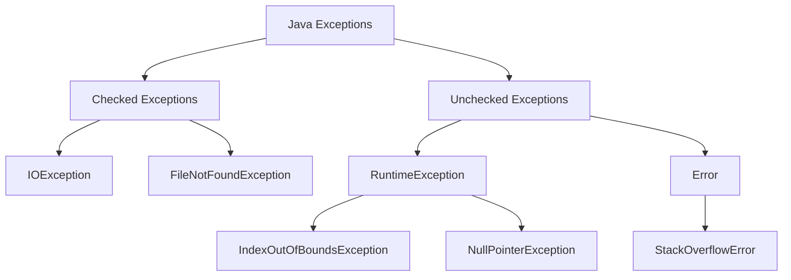

# 异常


在Java中，异常是程序运行时发生的不正常条件，它打断了正常的指令流。Java提供了强大的异常处理机制，允许程序在遇到异常时优雅地恢复。这里是Java异常处理的全部知识点概览：

### 异常的分类

Java中的异常分为两大类：受检异常（Checked Exceptions）和非受检异常（Unchecked Exceptions）。

1. **受检异常（Checked Exceptions）**:
   这类异常在编译时就必须处理，否则编译器不允许通过。这类异常通常是外部错误，程序员需要预见并在程序中处理。例如，`IOException`、`FileNotFoundException`
   等。
2. **非受检异常（Unchecked Exceptions）**: 这类异常包括运行时异常（`RuntimeException`）和错误（`Error`
   ）。它们通常是程序错误或硬件错误，如数组越界（`IndexOutOfBoundsException`）、空指针（`NullPointerException`
   ）、堆栈溢出（`StackOverflowError`）等。

### 异常处理机制

Java提供了`try-catch`、`throw`、`throws`和`finally`关键字来处理异常。

1. **try-catch**: 用来捕获异常。`try`块包含可能抛出异常的代码，`catch`块用来处理异常。

``` java
try{
        // 可能抛出异常的代码
        }catch(ExceptionType name){
        // 异常处理代码
        }
```

**多重捕获**: Java 7及以上版本支持一个`catch`块捕获多个异常类型。

``` java
try{
        // 可能抛出多个异常的代码
        }catch(ExceptionType1 |
ExceptionType2 name){
        // 异常处理代码
        }
```

**finally块**: 无论是否捕获或处理异常，`finally`块中的代码总会被执行。通常用于关闭资源。

``` java
try{
        // 可能抛出异常的代码
        }catch(ExceptionType name){
        // 异常处理代码
        }finally{
        // 清理代码，总会执行
        }
```

**throw**: 用于明确地抛出一个异常实例。

``` java
throw new ExceptionType("Error Message");
```

**throws**: 声明一个方法可能抛出的异常，告诉调用者此方法可能抛出的异常类型。

``` java
public void someMethod() throws ExceptionType {
    // 可能抛出ExceptionType异常的代码
}
```

### 自定义异常

用户可以通过继承`Exception`类或其子类来创建自定义异常。

``` java
public class MyException extends Exception {
    public MyException(String message) {
        super(message);
    }
}

// 使用
throw new

MyException("This is a custom exception");
```

### 异常链

异常链允许程序在抛出新异常时保留原始异常的信息。

``` java
try{
        // 一些代码
        }catch(IOException e){
        throw new

MyException("Another exception occurred",e);
}
```

### try-with-resources

Java 7引入的try-with-resources语句自动管理资源，无需显式关闭资源。该语句要求资源实现`AutoCloseable`或`Closeable`接口。

``` java
try(ResourceType resource = new ResourceType()){
        // 使用资源的代码
        }
```

### 断言

断言（assertions）是用来在测试期间保证程序内部状态的一种机制，它是非受检异常的一种形式。

``` java
assert 条件 :"错误信息";
```
Java中的断言（Assertion）是一种用于在测试阶段帮助开发者检查假设的机制。它用于在代码执行期间确保表达式为真。如果表达式为假，断言将抛出一个`AssertionError`。它们通常用于调试目的，用于验证代码的某些部分的状态。

要使用断言，需要用到`assert`关键字，后面跟上一个布尔表达式：

``` java
assert expression;
```

还可以为断言提供一个额外的消息参数，如果断言失败，这个消息会被传递给`AssertionError`：

``` java
assert expression : "Error message";
```

如果断言为真，则程序继续执行。如果断言为假，则程序会抛出一个`AssertionError`，可能还会打印出错误消息（如果提供了的话）。

断言通常在开发和测试阶段启用，用来捕捉代码中的逻辑错误。在生产环境中，通常会禁用它们以避免性能损耗。可以通过JVM启动参数`-ea`（或`-enableassertions`）启用断言，通过`-da`（或`-disableassertions`）禁用断言。

使用断言时需要谨慎，因为它们不应用于可恢复的条件检查，或是在运行时希望常常检查的条件（例如，参数校验等）。断言失败是致命的，不可恢复的，因此仅应在测试阶段使用，或者当你确信条件永远为真时使用。

下面是一个使用断言的简单示例：

```java
public class Main {
    public static void main(String[] args) {
        int value = calculateValue();

        // 断言value大于0，如果不是，则抛出AssertionError
        assert value > 0 : "计算的值必须大于0";

        System.out.println("计算的值为: " + value);
    }

    private static int calculateValue() {
        // 计算过程...
        return -1; // 假设这是计算结果
    }
}
```

在这个例子中，如果`calculateValue`方法返回的值不大于0，那么断言会失败，并抛出一个带有消息"计算的值必须大于0"的`AssertionError`。在没有启用断言的情况下，即使值为负数，程序也会正常运行，不会抛出错误。
- Exception 程序本身可以处理的异常，可以通过catch来捕获
   - checked 必须处理的异常
   - unchecked 可以不处理
- Error
   - 程序无法处理的错误，一般jVM会选择线程终止

### Throwable 类常用方法有哪些？

- `String getMessage()`: 返回异常发生时的简要描述
- `String toString()`: 返回异常发生时的详细信息
- `String getLocalizedMessage()`: 返回异常对象的本地化信息。使用 `Throwable` 的子类覆盖这个方法，可以生成本地化信息。如果子类没有覆盖该方法，则该方法返回的信息与 `getMessage()`返回的结果相同
- `void printStackTrace()`: 在控制台上打印 `Throwable` 对象封装的异常信息

```
try {
    System.out.println("Try to do something");
    throw new RuntimeException("RuntimeException");
} catch (Exception e) {
    System.out.println("Catch Exception -> " + e.getMessage());
} finally {
    System.out.println("Finally");
}
```

输出：

```
Try to do something
Catch Exception -> RuntimeException
Finally

```

**注意：**不要在 finally 语句块中使用 return**!
当 try 语句和 finally 语句中都有 return 语句时，try 语句块中的 return 语句会被忽略。
这是因为 try 语句中的 return 返回值会先被暂存在一个本地变量中，当执行到 finally 语句中的 return 之后，
这个本地变量的值就变为了 finally 语句中的 return 返回值。