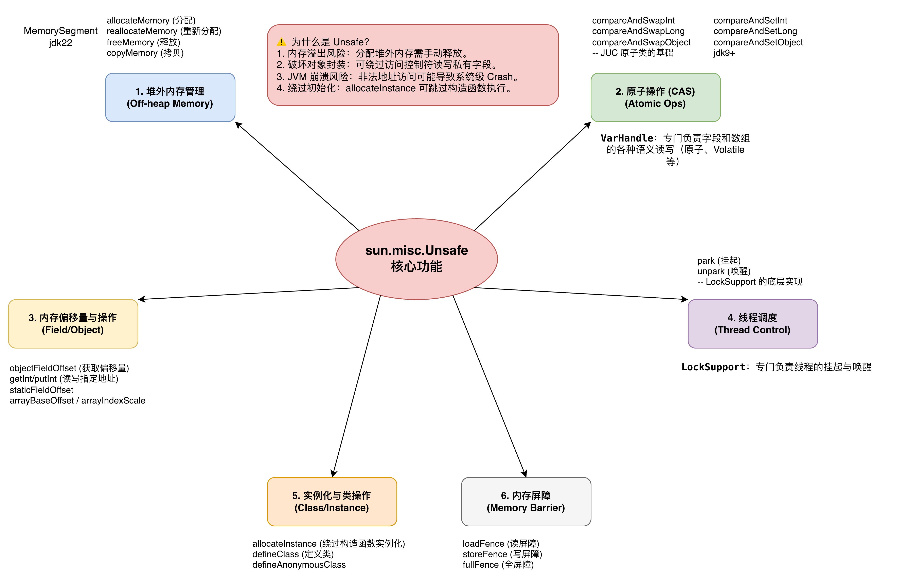

# unsafe

一把“绕过 JVM 安全机制，直接操作内存和线程”的底层工具,Java 里的 “C 指针能力”

允许直接操作内存、执行 CAS 和控制内存屏障，
是 Java 高性能并发实现的基础，
但由于不安全且非标准，在 JDK9 后逐步被 VarHandle 替代。

jdk9以后 compareAndSetInt替代了compareAndSwapInt, 为varhandle提供底层支持




## unsafe 获取

给内部类使用的只有类加载器是bootstrap的时候才可以获取

```Java
    @CallerSensitive
    public static Unsafe getUnsafe() {
        Class<?> caller = Reflection.getCallerClass();
        if (!VM.isSystemDomainLoader(caller.getClassLoader()))
            throw new SecurityException("Unsafe");
        return theUnsafe;
    }
```

通过反射获取

## 直接改对象字段(绕过private)
```Java
public class GetDemo {
    public static void main(String[] args)
            throws NoSuchFieldException,
                    SecurityException,
                    IllegalArgumentException,
                    IllegalAccessException {
        // theUnsafe 的私有静态成员变量，它持有单例对象
        Field f = Unsafe.class.getDeclaredField("theUnsafe");
        f.setAccessible(true);
        Unsafe unsafe = (Unsafe) f.get(null);

        Field field = User.class.getDeclaredField("age");
        // 这里虽然没有实例化 但是类加载的时候会在类元信息记录偏移地址 没有分配 只是记录偏移量
        long offset = unsafe.objectFieldOffset(field);
        System.out.println("offset = " + offset);

        User user = new User();
        unsafe.putInt(user, offset, 100);
        System.out.println(user);
    }
}
```

## 自己实现atoimcInteger 

```Java
@SuppressWarnings({"removal", "unused"})
class MyAtomicInt {
    private volatile int value;

    private static final Unsafe unsafe;
    private static final long offset;

    static {
        try {
            Field f = Unsafe.class.getDeclaredField("theUnsafe");
            f.setAccessible(true);
            unsafe = (Unsafe) f.get(null);

            offset = unsafe.objectFieldOffset(MyAtomicInt.class.getDeclaredField("value"));
        } catch (Exception e) {
            throw new RuntimeException(e);
        }
    }

    public int incrementAndGet() {
        int prev;
        do {
            prev = unsafe.getIntVolatile(this, offset);
        } while (!unsafe.compareAndSwapInt(this, offset, prev, prev + 1));
        return prev + 1;
    }
}
```

## 堆外内存管理

MemorySegment (JDK 22)：专门负责操作堆外内存

```java 
@SuppressWarnings("removal")
public class MemoryManage {
    public static void main(String[] args)
            throws NoSuchFieldException,
                    SecurityException,
                    IllegalArgumentException,
                    IllegalAccessException {
        Field f = Unsafe.class.getDeclaredField("theUnsafe");
        f.setAccessible(true);
        Unsafe unsafe = (Unsafe) f.get(null);
        long address = unsafe.allocateMemory(8);
        System.out.println("address = " + address);

        unsafe.putLong(address, 123456L);
        long long1 = unsafe.getLong(address);
        System.out.println("long1 = " + long1);

        unsafe.freeMemory(address);
    }
}
```

## 线程阻塞

```java
@SuppressWarnings({"removal"})
public class ThreadBlock {
    public static void main(String[] args)
            throws NoSuchFieldException,
                    SecurityException,
                    IllegalArgumentException,
                    IllegalAccessException,
                    InterruptedException {
        Field f = Unsafe.class.getDeclaredField("theUnsafe");
        f.setAccessible(true);
        Unsafe unsafe = (Unsafe) f.get(null);
        Thread t =
                new Thread(
                        () -> {
                            System.out.println("start park");
                            // 如果 isAbsolute 是 false，0L 意味着无限期等待，直到被显式唤醒（unpark）或被中断
                            // 如果你写 1,000,000,000L（1秒，单位纳秒），线程会睡 1 秒后自动醒来
                            unsafe.park(false, 0L);
                            System.out.println("unparked");
                        });
        t.start();
        Thread.sleep(2000);
        unsafe.unpark(t);
    }
}
```

## 内存屏障 

```text 
unsafe.storeFence(); // 写屏障
unsafe.loadFence();  // 读屏障
unsafe.fullFence();  // 全屏障
```
