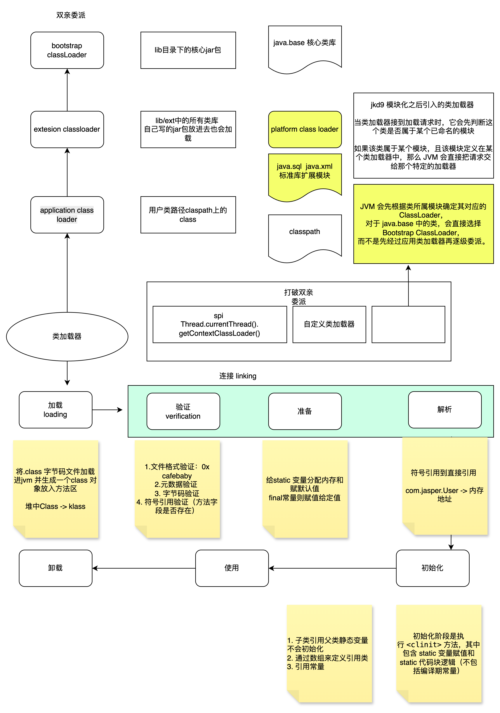

# 虚拟机类加载机制

## 五个阶段详解

**① 加载（Loading）**
ClassLoader 通过全限定类名找到 `.class` 文件的二进制字节流，将其转化为方法区的运行时数据结构，并在堆中生成对应的 `Class` 对象作为访问入口。

**② 验证（Verification）**
确保字节码合法、安全。分为文件格式验证（魔数 `0xCAFEBABE`）、元数据验证（继承关系）、字节码验证（指令合法性）、符号引用验证四步。

**③ 准备（Preparation）**
为静态变量在方法区分配内存，赋**默认值**（`int` 为 `0`，`Object` 为 `null`），注意这里不是代码中写的初始值，`final static` 常量除外（直接赋字面量）。

**④ 解析（Resolution）**
将常量池中的**符号引用**替换为**直接引用**（内存地址）。包括类和接口、字段、方法的解析。可能在初始化后才触发（延迟解析）。

**⑤ 初始化（Initialization）**
执行 `<clinit>()` 方法（类变量赋初始值 + 静态块），由 JVM 保证线程安全（加锁）。触发条件有六种，典型的是 `new`、访问静态成员、反射调用等。

