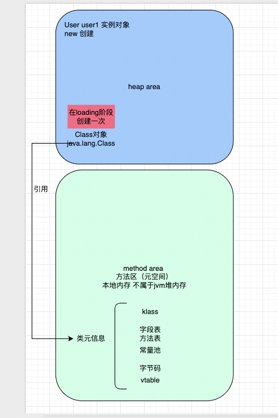

# loading 

将.class 字节码文件加载进jvm 并生成一个class 对象放入方法区

## process 

1. 通过类的全限定名找到 .class 文件

- 磁盘：classpath
- jar包
- 网络
- 动态生成 asm/bytebuddy
- 内存流

2. 读取字节码到内存

读取.class 文件二进制数据

3. 在方法区（元空间 MetaSpace）生成 Class 对象

`Class<User>`

## impl

```text 
loadClass(name)
   ↓
加锁
   ↓
findLoadedClass（缓存）
   ↓
有？→ 直接返回
   ↓
没有？
   ↓
交给 parent.loadClass()
   ↓
父加载成功？→ 返回
   ↓
失败？
   ↓
findClass（自己加载）
   ↓
defineClass（生成 Class对象）

```

## change 

- 方法区发生变化 ： 类元信息classmetadata（字段 方法 常量池） 类的运行结构klass 
- 堆创建Class对象 
- jvm 内部结构： klass（cpp) Class(java)

类元信息：类的描述信息： 类名 父类 接口 字段信息 方法信息 方法字节码 运行时常量池 修饰符 类加载器 注解信息（元空间）  
klass：JVM 中用于存储这些元信息的底层 C++数据结构，Class 对象则是其在 Java 层的访问入口

堆中的Class 对象是 JVM 中 Klass 结构在 Java 层的访问入口，所有对类元信息的操作，本质上都是通过 Class 间接访问底层的 Klass

```text
Class → 持有指向 Klass 的引用
       ↓
通过 native 方法访问
```

类的元信息在方法区（JDK8 后为 Metaspace）中以 Klass 结构存储，而对应的 Class 对象位于堆中，作为访问这些元信息的入口




:::warning
❌ 不执行 static 代码块  
❌ 不执行 static 赋值  
❌ 不初始化类变量  
❌ 不 new 对象  

:::

```java
public class LoadingDemo {

    public static class User {
        static {
            System.out.println("init");
        }

        static int a = 10;
    }
    /*
    ClassLoader.loadClass() 和 Class.forName(name, false, loader) 只会触发类加载（Loading），不会执行初始化；
    只有在主动使用类（如访问静态变量）时，才会触发 Initialization
     */
    public static void main(String[] args) throws Exception {

        System.out.println("===== 方式1：loadClass =====");
        ClassLoader loader = LoadingDemo.class.getClassLoader();
    // Java 编译后，内部类的“真实类名”就是用 $ 表示的
        Class<?> clazz1 = loader.loadClass(
                "com.jasper.classload.loading.LoadingDemo$User"
        );

        System.out.println("加载完成，但没有初始化");
        System.out.println(clazz1);

        System.out.println("\n===== 方式2：forName(false) =====");
        Class<?> clazz2 = Class.forName(
                "com.jasper.classload.loading.LoadingDemo$User",
                false,  // 不初始化
                loader
        );

        System.out.println("加载完成，但没有初始化");
        System.out.println(clazz2);

        System.out.println("\n===== 主动触发初始化 =====");
        // 触发初始化
        System.out.println(User.a);
    }
}
```

## 数组的类加载

数组不是通过类加载器加载的，是jvm运行时自动创建的
也不走双亲委派 数组类的类加载器由其元素类型决定

```java
public class LoadingArrayDemo {
    public static class User {
        static {
            System.out.println("init");
        }

        static int a = 10;
    }

    public static void main(String[] args) {
        User[] arr = new User[10];
        System.out.println(User[].class.getName());//[Lcom.jasper.classload.loading.LoadingArrayDemo$User;
    }
}

```
