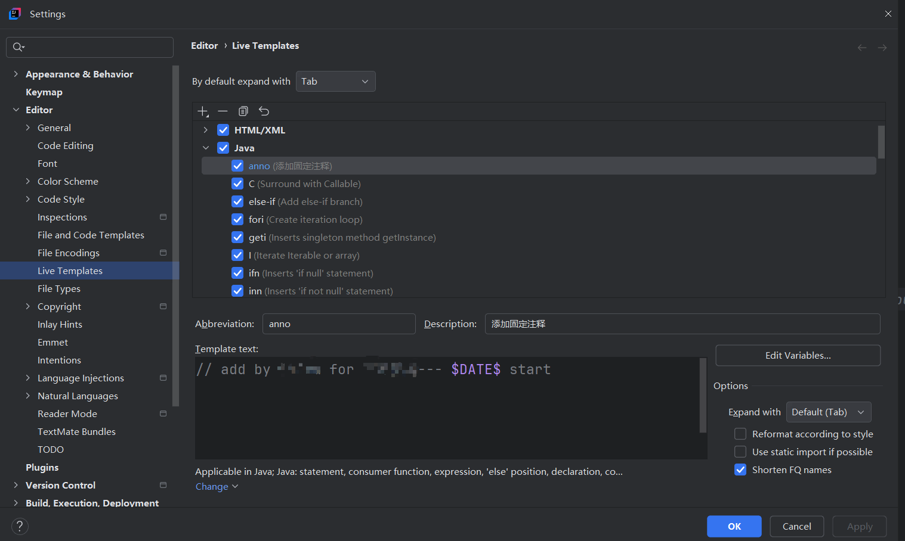

# 自动补全

## idea 自定义的 template
editor.liveTemplate

- .var
- .nn
- .if
- .null
- list.for
- fori
- .cast

## 添加live templateve

添加固定注释： anno  则生成  add by xxx for xxx 20250728 start

在右侧点击 + 号，选择 Live Template。
- Abbreviation（缩写）：anno（这是你输入 .anno 后触发的关键词）
- Description（描述）：可选，比如 “Insert author annotation”
- Template text（模板内容）：输入你想要生成的固定注释，例如：

