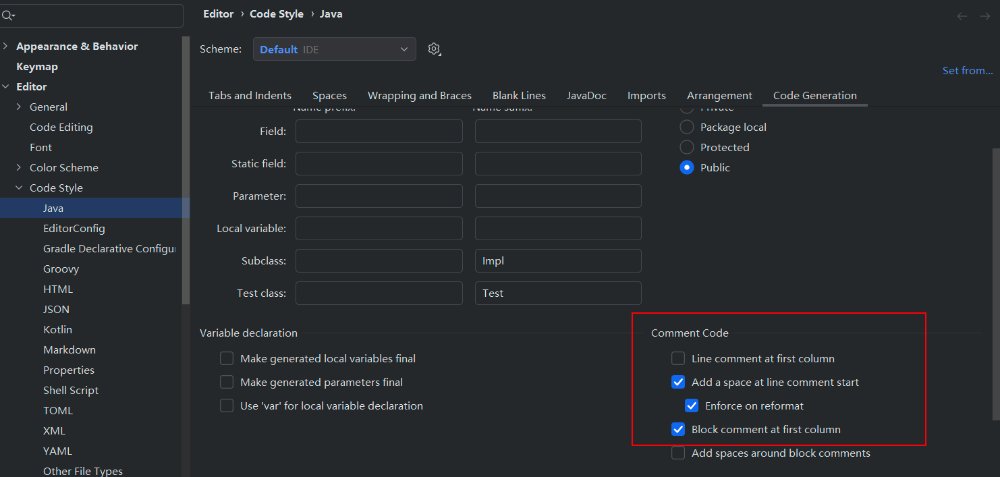

# tips

## 快速通过复制的代码生成java类

直接在文件夹复制可以直接生成类


## 注释

渲染的文档 可以使用 `<br>` 换行
使用 ctrl+shift+/ 可以生成   /** */ 格式的注释

## source code

Library source does not match the bytecode for class

1. 打开 IntelliJ IDEA，进入菜单：File > Project Structure > Libraries。
2. 在左侧列表中，找到并选择显示问题的库（Library）。
3. 在右侧的“Classes”、“Sources”、“JavaDocs”选项卡中，切换到 Sources。
4. 选中已附加的源代码路径，点击右侧的减号（-）按钮，移除该源代码。
5. 点击 Apply，然后点击 OK，保存并关闭设置窗口

## 注释缩进

前后效果对比：

```java
void test(){
// 你好
    // 你好 
    System.out.println("hello");
}
```



## 导包设置


editor -> code style -> java -> import 可以设置超过多少个将一个包下的导包写成*
