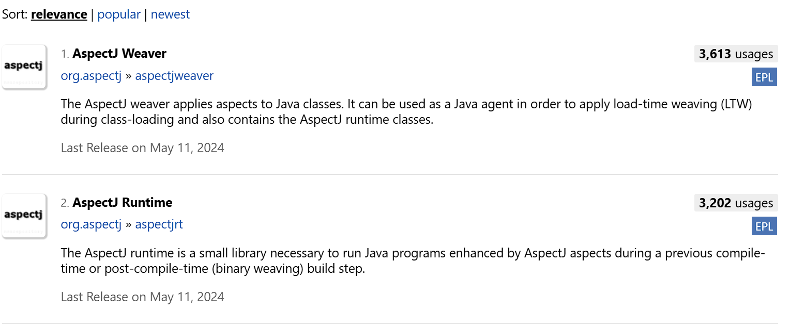

# spring 

> Using the AspectJ compiler and weaver enables use of the full AspectJ language and is discussed in Using AspectJ 
> with Spring Applications.



```xml
<!-- https://mvnrepository.com/artifact/org.springframework.boot/spring-boot-starter-aop -->
<dependency>
    <groupId>org.springframework.boot</groupId>
    <artifactId>spring-boot-starter-aop</artifactId>
    <version>3.3.5</version>
</dependency>
```

> To use @AspectJ aspects in a Spring configuration, you need to enable Spring support for configuring Spring AOP based on @AspectJ aspects and auto-proxying beans based on whether or not they are advised by those aspects. By auto-proxying, we mean that, if Spring determines that a bean is advised by one or more aspects, it automatically generates a proxy for that bean to intercept method invocations and ensures that advice is run as needed


