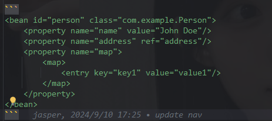

# bean

## xml

```java
public class Person {
    private String name;
    private Address address;
    private Map<String, String> map;
}
```

property可以给类的属性设置默认值



parent属性用于指定当前bean继承自哪个父bean。
当Spring容器遇到这样的bean定义时，它会先查找并初始化父bean，然后将父bean的所有属性复制到子bean中。
接着，Spring会继续处理子bean的属性，覆盖那些已经在父bean中存在的同名属性，或者添加新的属性。

map元素用于定义一个Map类型的属性。<property name="map"></property>
表示person类的一个属性。这个属性是一个Map类型，用于存储键值对。