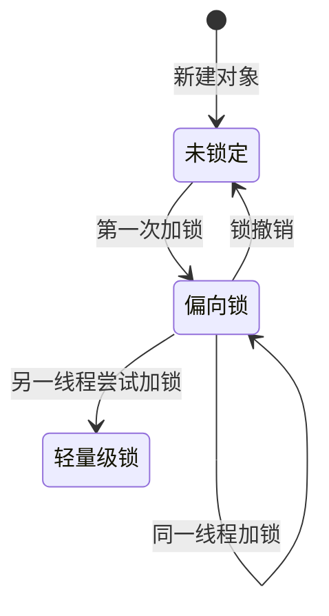
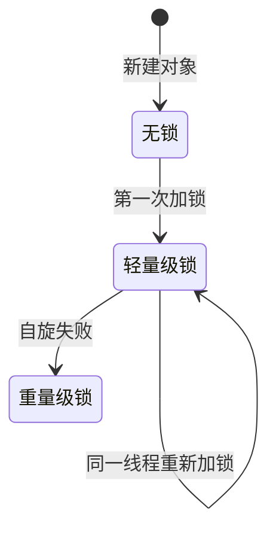
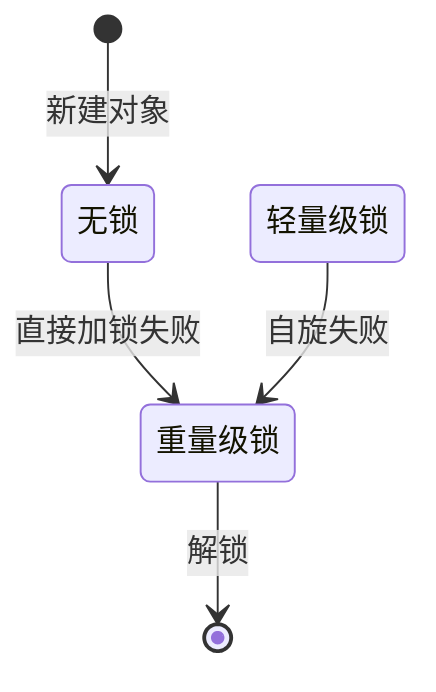
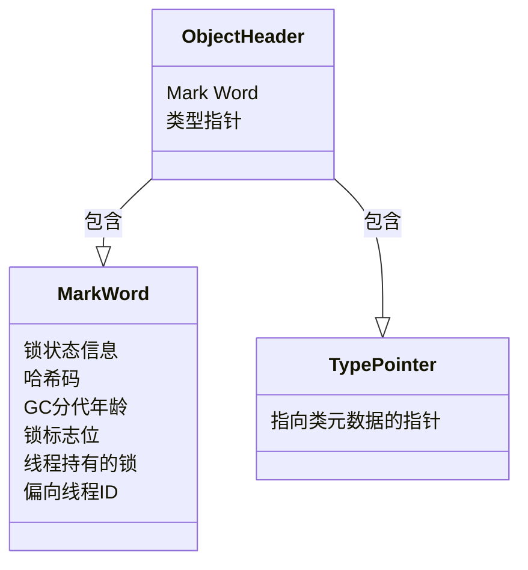

# 锁的优化和升级
Java虚拟机（JVM）为了提高锁的效率和性能，采用了多种锁优化技术。这些技术可以在不同的场景下动态地应用，以减少锁操作对并发性能的影响。锁的优化和升级主要包括偏向锁、轻量级锁和重量级锁三种状态，它们各自适用于不同的并发场景。

### 1. 偏向锁（Biased Locking）

- **目的**：偏向锁是为了在无竞争情况下提高性能而引入的。它的核心思想是，如果一个线程获得了锁，那么锁就进入偏向模式，当这个线程再次请求锁时，将会无需进行同步。
- **工作机制**：当锁对象第一次被线程获得时，虚拟机会在对象头中存储偏向锁的线程ID，以后该线程进入和退出同步块时不需要进行CAS操作，只需要简单地检查对象头的Mark Word里是否存储着指向当前线程的偏向锁。
- **适用场景**：单一线程频繁执行同步块操作。
- [biased lock](lock/biasedLock.md)

### 2. 轻量级锁（Lightweight Locking）

- **目的**：轻量级锁设计用来优化多线程竞争锁的场景，但竞争的程度不是特别激烈。它减少了传统锁在操作系统中的开销。
- **工作机制**：当一个线程尝试获取锁时，如果锁对象没有被锁定（即无偏向锁），JVM会在当前线程的栈帧中创建一个锁记录（Lock Record），然后尝试使用CAS将对象头的Mark Word更新为指向锁记录的指针。如果成功，当前线程获得锁。如果有另一个线程已经持有了锁，那么当前线程尝试自旋等待锁释放。
- **适用场景**：线程交替执行同步块操作。

### 3. 重量级锁（Heavyweight Locking）

- **目的**：在有激烈竞争的情况下，为了减少线程之间的竞争，将锁的控制权交给操作系统的Mutex Lock来管理，每个重量级锁都会关联一个系统级别的互斥量。
- **工作机制**：当轻量级锁尝试失败后（即自旋失败），锁就会膨胀为重量级锁。此时，如果有线程试图获取锁，将会阻塞并进入操作系统的等待队列，直到锁被释放。
- **适用场景**：多线程竞争激烈，且长时间持有锁。
  Java虚拟机（JVM）为了优化同步操作，引入了锁粗化（Lock Coarsening）和锁消除（Lock Elimination）这两种优化技术。这些技术的目的是减少锁操作的开销，提高多线程程序的执行效率。

### 4. 锁粗化（Lock Coarsening）

**原理**：通常情况下，同步块的作用域应该尽可能小，只在共享数据的实际访问期间持有锁，以减少线程间的竞争。然而，如果一系列的操作都对同一个对象反复加锁解锁，这种细粒度的锁定可能会导致不必要的性能损耗。在这种情况下，JVM会将多个连续的锁扩展（粗化）为一个更大范围的锁，这样可以减少锁的获取和释放次数，从而提高性能。

**应用场景**：适用于连续对同一个对象加锁的场景。例如，在一个循环中对同一个对象反复加锁解锁：

``` java
for(int i = 0; i < n; i++) {
    synchronized(lockObject) {
        // 操作共享数据
    }
}
```

在这种情况下，JVM可能会将锁的范围扩展到整个循环之外，只在循环开始时加锁，结束后解锁。

### 5. 锁消除（Lock Elimination）

**原理**：锁消除是指JVM通过分析确定某段代码中，对某个对象加锁操作是不必要的，因为对象不可能被其他线程访问到，那么JVM就会去掉这个对象的加锁操作。这种技术基于逃逸分析（Escape Analysis）技术。

**应用场景**：适用于只被单一线程访问的对象。例如，局部变量在方法中创建并且只在方法内部使用，而不会逃逸出方法被其他线程访问：
lock对象是一个局部变量，它被创建在method方法的栈帧内部，这意味着它是线程私有的。
每个线程调用method方法时，都会在自己的栈上创建一个新的lock对象，
各个线程之间的lock对象是互相独立的
```java
public void method() {
    Object lock = new Object();
    synchronized(lock) {
        // 操作
    }
}
```

在这个例子中，因为`lock`对象只在`method`方法内部使用，不会被其他线程访问，所以JVM可以安全地消除这个同步块。

### 总结

锁粗化和锁消除都是JVM在运行时为了减少同步开销而采取的优化措施。通过这些优化，JVM能够提高代码在多线程环境下的执行效率，减少不必要的同步开销。这两种技术的应用都是完全自动进行的，不需要程序员在代码中显式指定。

### 锁的升级过程

- **锁升级**：默认情况下，新创建的对象使用偏向锁。当有另一个线程尝试获取这个对象的锁时，如果持有偏向锁的线程正在执行同步代码，JVM会暂停持有偏向锁的线程，撤销偏向锁，升级到轻量级锁。如果轻量级锁的自旋失败，进一步升级为重量级锁。
- **锁降级**：JVM当前不支持锁的降级。一旦锁升级为重量级锁，就不会降级为轻量级锁或偏向锁。

### 性能考量

锁的优化和升级是JVM为了提高并发性能的策略。通过适用不同的锁策略，JVM能够在不同的并发场
景下保持较高的性能。理解这些机制有助于开发者编写更高效的并发程序。然而，过度依赖锁优化可能会导致新的性能问题，因此在设计并发程序时，应尽量减少锁的竞争，合理利用并发工具和数据结构。

使用Mermaid语法分别描述偏向锁、轻量级锁和重量级锁的状态转换过程的图表。这将帮助你更直观地理解锁的升级路径。

### 偏向锁



- **未锁定到偏向锁**：当一个新建的对象第一次被线程加锁时，对象头的Mark Word被标记为偏向模式，并记录下当前线程的ID。
- **偏向锁状态下**：如果同一线程再次请求锁，直接进入同步代码块，不需要重新加锁。
- **偏向锁到轻量级锁**：当另一个线程尝试获取锁时，如果持有偏向锁的线程正在执行同步代码块，JVM将会暂停持有偏向锁的线程，锁会升级为轻量级锁。

### 轻量级锁



- **无锁到轻量级锁**：当一个线程尝试加锁时，如果对象没有被锁定，JVM在当前线程的栈帧中创建一个锁记录，然后通过CAS操作尝试把对象头的Mark Word设置为指向锁记录。
- **轻量级锁状态下**：如果同一线程重新进入同步代码块，它可以直接进入，不需要重新获取锁。
- **轻量级锁到重量级锁**：当有多个线程竞争同一个锁，且轻量级锁的自旋锁定尝试失败时，锁会升级为重量级锁。

### 重量级锁



- **无锁到重量级锁**：在直接尝试加锁失败的情况下，如果对象已经被其他线程锁定，线程将直接尝试获取重量级锁。
- **轻量级锁到重量级锁**：如果轻量级锁的自旋尝试失败，表明锁竞争激烈，此时锁会升级为重量级锁。
- **重量级锁状态下**：线程进入等待状态，直到锁被释放。

这些图表描述了Java中锁的三种状态及其转换过程，有助于理解不同锁状态之间是如何转换的，以及每种锁适用的场景。

## 对象头
在Java中，对象头（Object Header）是Java对象在内存中的一部分，用于存储对象自身的运行时数据，比如对象的哈希码（HashCode）、对象的锁状态信息、对象的年龄（在GC中使用）等。对象头对于JVM的运行至关重要，它使JVM能够管理对象以及执行垃圾收集、同步等操作。

对象头主要可以分为两部分：

### 1. Mark Word（标记字段）

这部分存储对象自身的运行时数据，包括但不限于：

- **哈希码**：默认情况下，存储对象的hashCode，由`Object.hashCode()`方法产生。
- **GC分代年龄**：对象在GC中的年龄。
- **锁状态信息**：记录对象被线程加锁的状态。对象可能处于无锁状态、轻量级锁状态、重量级锁状态或偏向锁状态等。
- **线程持有的锁**：指示哪个线程持有了锁。
- **偏向线程ID**：偏向锁的线程ID。
- **锁标志位**：表示对象头的Mark Word部分是哪种锁。

### 2. 类型指针

- **指向类元数据的指针**：这部分用于确定对象是哪个类的实例。JVM通过这个指针来访问类的方法区，以便获取类的方法数据、常量池等信息。

### 锁状态

对象头的Mark Word部分还记录了对象当前的锁状态。在Java中，锁可以有以下几种状态：

- **无锁状态**：对象没有被任何线程锁定。
- **偏向锁状态**：对象被一个线程多次锁定，那么JVM就会给这个线程偏向，使其后续的加锁、解锁操作都无需实际操作同步语句，提高性能。
- **轻量级锁状态**：当偏向锁被另一个线程访问时，如果原线程不持有锁，则升级为轻量级锁。轻量级锁通过CAS操作和自旋来减少线程阻塞。
- **重量级锁状态**：当轻量级锁的自旋锁定尝试失败（即有多个线程同时竞争锁），锁会升级为重量级锁，此时会阻塞其他线程。

对象头是理解Java同步和垃圾收集机制的关键，尤其是在并发编程和性能调优中发挥着重要作用。通过管理对象头中的数据，JVM能够实现高效的同步机制和垃圾收集策略。

