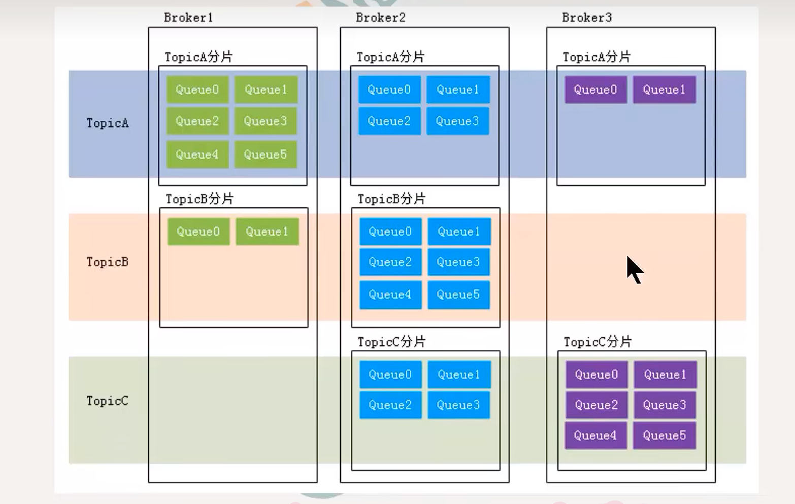

# 基本概念

1. 消息 数据
2. 主题 topic 一类消息的集合  分类 
   - 生产者对应多个topic
   - 消费者对应一个topic
   - 一个message对应一个topic
   - 一个topic对应多个message
3. 队列
   - queue   分区 partition
   - 一个topic对应多个queue（partition）
4. 分片
   
5. 消息标识 
   - msgId
   - offsetMsgId
   - key