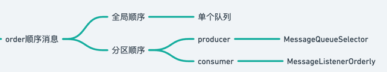

# 顺序消息

RocketMQ 的顺序消息（Ordered Message）是一种保证消息严格按照发送顺序进行消费的消息类型，适用于对消息顺序有严格要求的场景，如订单处理、交易流水等。
RocketMQ 提供了两种顺序消息方式：全局顺序消息和分区顺序消息。

- 全局顺序消息

全局顺序消息保证所有消息按照严格的顺序被消费，这意味着所有消息都被写入同一个队列（queue）并按照 FIFO（First In First Out）的顺序进行消费。
•	优点：
•	绝对保证消息的顺序性。
•	缺点：
•	吞吐量受限，因为所有消息都必须按照严格顺序进入同一个队列，无法并行处理。

实现方式：
•	生产者发送消息到特定的队列（queue）。
•	消费者按照 FIFO 顺序从该队列消费消息，保证顺序性。

- 分区顺序消息

分区顺序消息保证相同的消息分组（如相同订单号的消息）按照顺序消费，但不同分组的消息可以并行消费，从而提高吞吐量。
•	优点：
•	适用于业务逻辑需要部分顺序的场景，比如按订单 ID 分区，保证同一订单的消息顺序，但不同订单的消息可以并行消费，提高效率。
•	缺点：
•	需要合理的消息分区策略，否则可能导致顺序错乱。

实现方式：
1.	生产者在发送消息时，基于某个标识（如订单 ID）选择相同的 MessageQueue，确保相同标识的消息进入同一个队列。
2.	消费者从该队列按顺序消费消息，确保相同标识的消息有序处理。

```java
// 生产者发送顺序消息
SendResult sendResult = producer.send(new Message("TopicTest", "TagA", "OrderID001", "Hello RocketMQ".getBytes()),
        new MessageQueueSelector() {
           @Override
           public MessageQueue select(List<MessageQueue> mqs, Message msg, Object arg) {
// 通过订单ID选择队列
              int index = arg.hashCode() % mqs.size();
              return mqs.get(index);
           }
        }, "OrderID001");
```
- 消费端的顺序消费

RocketMQ 采用消费锁机制保证顺序消费：
•	单线程拉取和消费：消费者会按 FIFO 顺序拉取队列中的消息并处理。
•	消费失败会阻塞消费：如果消费失败（返回 ConsumeConcurrentlyStatus.RECONSUME_LATER），则该消息会被重新消费，后续消息不会被处理，确保顺序性。
``` java
consumer.registerMessageListener(new MessageListenerOrderly() {
@Override
public ConsumeOrderlyStatus consumeMessage(List<MessageExt> msgs, ConsumeOrderlyContext context) {
for (MessageExt msg : msgs) {
System.out.println("Consume Message: " + new String(msg.getBody()));
}
return ConsumeOrderlyStatus.SUCCESS;
}
});
```


- 使用场景
   •	订单系统：确保同一订单的状态变更（如创建、支付、发货）按照顺序处理。
   •	交易系统：保证同一账户的交易流水不会乱序。
   •	日志收集：保证日志按照时间顺序记录和存储。


- 顺序消息 vs 普通消息

特性	顺序消息	普通消息
消息顺序	保证严格顺序	无法保证顺序
并发消费	受限，单队列消费	可高并发消费
适用场景	订单、交易流水等	通用消息处理

总结：
•	全局顺序消息适用于要求严格顺序的业务，但吞吐量较低。
•	分区顺序消息适用于部分顺序的场景，能够在保证局部顺序的同时提高吞吐量。
