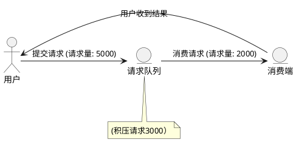
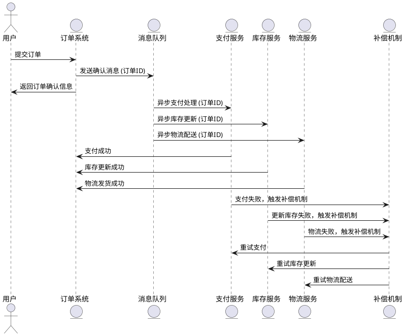
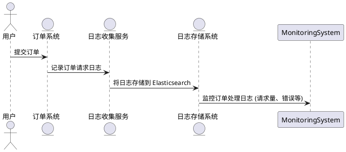
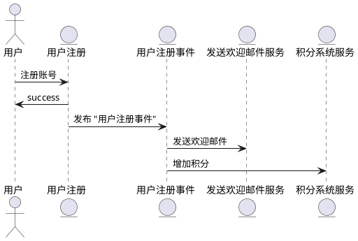

# usage 

## mq

mq,message queue,提供消息队列服务的中间件，提供了消息生产、存储、消费全过程api的软件系统
消息就是数据

## usage

- 限流削峰: 当系统面临突发流量时，可以使用 RocketMQ 进行流量削峰，将高并发请求先暂时存入消息队列，慢慢处理，从而避免服务崩溃或过载

- 异步解耦 订单处理系统中，当用户下单时，立即发送确认消息，但支付、等操作可以在后台异步进行。

- 数据收集 业务日志 监控数据 用户行为 kafka

- 分布式事务: 在分布式订单系统中，用户支付时，系统需要同时进行扣款操作和库存更新。若支付操作成功而库存更新失败，可以通过
  RocketMQ 的事务消息机制回滚库存操作，保证数据一致性。
  - 分布式事务: 强一致性    涉及全局锁 性能低          
  - rocketmq: 最终一致性   异步 减少锁竞争 提高性能

- 事件驱动架构: 用户在系统中注册账号后，系统会发布“用户注册事件”，该事件会被其他微服务（如发送欢迎邮件、积分系统等）订阅和处理

## 常见mq产品

- rocketmq 自研协议
- rabbitmq erlang语言开发 难二开
- kafka 高吞吐率 大数据场景下 日志采集 没有遵循常见的mq协议 自研协议
  以下是 **RocketMQ**、**Kafka** 和 **RabbitMQ** 的表格对比：

| **特性**      | **RocketMQ**        | **Kafka**           | **RabbitMQ**                      |
|-------------|---------------------|---------------------|-----------------------------------|
| **发布-订阅模型** | 支持                  | 支持                  | 支持                                |
| **消息模型**    | 点对点、发布-订阅           | 发布-订阅               | 点对点、发布-订阅                         |
| **消息存储方式**  | 文件存储（基于顺序写入日志）      | 文件存储（基于顺序写入日志）      | 内存、磁盘（可以选择）                       |
| **消息可靠性**   | 强一致性（支持分布式事务）       | 高吞吐量，较强的一致性         | 强一致性、消息持久化                        |
| **消息顺序性**   | 支持（消息队列按顺序消费）       | 支持（分区内消息顺序保证）       | 支持（可以配置队列顺序）                      |
| **吞吐量**     | 高吞吐量                | 极高吞吐量（适合大规模日志数据）    | 吞吐量较低（适用于中小规模应用）                  |
| **消息过滤**    | 支持标签过滤（Tag）         | 支持基于键值的消息分区和消费者分配策略 | 支持基于Routing Key的消息过滤（Routing Key） |
| **延迟**      | 较低                  | 较低                  | 较高（但有更强的路由控制）                     |
| **分区机制**    | 支持分区（主题分区，适合扩展）     | 支持分区，分区内顺序消费        | 支持队列的分配，适合负载均衡                    |
| **消费者模型**   | 支持顺序消费、并行消费         | 支持消费者组，消费者组内负载均衡    | 支持消费者组，支持多个消费者消费同一队列              |
| **性能**      | 高效，适合大规模分布式消息传递系统   | 极高的吞吐量，适合日志、流处理等应用  | 性能较低，但更适合传统消息队列应用                 |
| **消息重复消费**  | 提供消息去重机制（但默认情况下不去重） | 消费者可以保证消息不重复消费，但要配置 | 支持通过“消息确认”来避免重复消费                 |
| **易用性**     | 安装和使用相对复杂           | 安装和使用相对简单（社区支持较好）   | 安装和配置较为简便，社区支持活跃                  |
| **编程语言支持**  | Java、C、Python、Go等   | Java、Python、Go等     | Java、Python、Ruby等                 |
| **适用场景**    | 适合大规模、高吞吐量、分布式应用    | 适合大数据流处理、日志处理、事件流   | 适合传统消息队列应用，支持复杂路由和高可靠性            |
| **事务消息**    | 支持（基于分布式事务）         | 不原生支持事务，但可以实现       | 支持（通过事务队列和事务消息机制）                 |
| **消息持久化**   | 支持                  | 支持                  | 支持                                |
| **集群与高可用**  | 支持分布式集群和高可用性（容错机制）  | 支持分布式集群和高可用性        | 支持集群部署和高可用性（基于镜像队列）               |
| **版本**      | 开源版和商业版（由阿里巴巴维护）    | 开源版（由Apache维护）      | 开源版（由Pivotal维护）                   |

### 总结：

- **RocketMQ**：特别适合高吞吐量、低延迟的分布式系统，支持分布式事务和强一致性，适合对消息的顺序性和高可靠性有严格要求的应用。
- **Kafka**：非常适合日志收集、大数据流处理等场景，具备极高的吞吐量，主要用于处理大量的事件流和数据流。它的消息顺序性保证仅在分区内有效。
- **RabbitMQ**：适合处理传统的消息队列应用，支持丰富的路由机制和多种消费者模型，消息可靠性和易用性较强，但吞吐量和性能不及Kafka和RocketMQ。

## 常见mq协议

常见的 **消息队列协议** 主要包括以下几种：

### 1. **AMQP (Advanced Message Queuing Protocol)**
- **概述**：AMQP 是一种开源的、基于消息队列的高级消息队列协议，广泛应用于各种消息队列系统中（如 RabbitMQ）。它用于提供可靠的消息传递、路由和消息队列服务，尤其适合企业级应用。
- **特点**：
    - 支持多种消息传递模式（发布/订阅、点对点等）。
    - 支持消息的持久化和事务管理。
    - 提供高级功能，如消息确认、消息路由、队列管理等。
- **应用场景**：适合高可用和高可靠性的系统，尤其是需要强一致性和高级路由功能的场景。

### 2. **MQTT (Message Queuing Telemetry Transport)**
- **概述**：MQTT 是一个轻量级的消息传输协议，专门为低带宽、高延迟或不稳定网络环境设计，广泛应用于物联网（IoT）设备和消息传输中。
- **特点**：
    - 轻量级，带宽占用小，适合嵌入式系统和物联网设备。
    - 基于发布/订阅模型，支持消息的质量等级（QoS）控制。
    - 支持持久化会话和消息队列功能。
- **应用场景**：广泛用于物联网（IoT）应用，适合需要低带宽、高并发和较长延迟容忍的环境。

### 3. **JMS (Java Message Service)**
- **概述**：JMS 是 Java 平台上的一种消息队列API，提供了消息的生产、消费、路由和事务支持，允许开发者以标准化方式处理消息。
- **特点**：
    - 专为 Java 环境设计，支持异步消息传递。
    - 支持点对点（Queue）和发布/订阅（Topic）模式。
    - 提供消息的可靠传输和事务支持。
- **应用场景**：主要用于 Java 企业级应用（如基于 Spring 的系统），特别是需要可靠消息传递的场景。

### 4. **STOMP (Simple Text Oriented Messaging Protocol)**
- **概述**：STOMP 是一种简单的基于文本的消息协议，设计用于消息队列和代理之间的交互，特别适用于WebSocket和JavaScript应用。
- **特点**：
    - 基于文本，易于理解和实现。
    - 简单的协议，适合与 WebSocket 配合使用。
    - 支持双向通信，适用于浏览器和服务器之间的消息传递。
- **应用场景**：适合轻量级的消息传递需求，常见于 Web 应用和实时消息通信系统中。

### 总结：
- **AMQP** 和 **JMS** 是最常见的消息队列协议，通常用于企业级应用，提供强一致性和事务支持。
- **MQTT** 适用于物联网和低带宽环境，特点是轻量级和低延迟。

rocketmq使用自己的协议