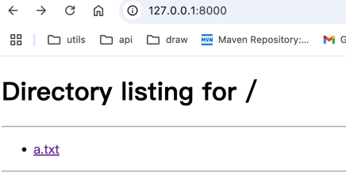

# python -m 的用法

python -h 查看帮助信息，可以看到 -m 的用法

-m mod : run library module as a script (terminates option list) 
其作用是将模块当成脚本来运行，这样可以直接运行模块，而不用通过 python 文件名.py 来运行。
terminates option list  表示之后的其他选项都不会生效

## 典型用法

1. 启动一个http服务 可以访问当前执行目录下的文件
```python
python3 -m http.server 8000
```

