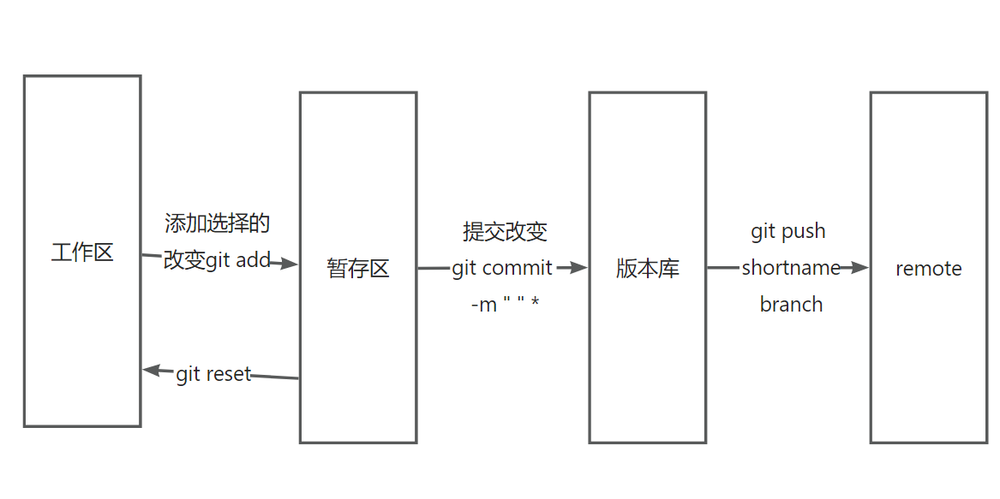

# basic

git 是一个分布式的版本控制工具

## 功能

+ 代码回溯
+ 版本切换
+ 多人协作
+ 远程备份

## git 仓库


+ commit:提交,将本地文件和版本信息保存到本地仓库
+ push:推送,将本地仓库文件和版本信息上传到远程仓库，
+ pull:拉取,将远程仓库文件和版本信息下载到本地仓库

## git常用命令

### git全局设置

Git全局设置
当安装Git后首先要做的事情是设置用户名称和email地址。这是非常重要的，因为**每次Git提交都会使用该用户信息**。
在Git命令行中执行下面命令:

设置用户信息

```zsh
git config --global user.name "itcast"
git config --global user.email "<hello@itcast.cn>"

# 查看配置信息

git config --list
git config --global init.defaultBranch master

# 设置git init之后的默认分支名称
```

### 获取Git仓库

要使用Git对我们的代码进行版本控制，首先需要获得Git仓库。

获取Git仓库通常有两种方式:

+ 在本地初始化一个Git仓库

git init

+ 从远程仓库克隆 (常用)

git clone 远程仓库地址

### 工作区、暂存区、版本库概念



+ 版本库:前面看到的.git隐藏文件夹就是版本库，版本库中存储了很多配置信息、日志信息和文件版本信息等
+ 工作区:包含.git文件夹的目录就是工作区，也称为工作目录，主要用于存放开发的代码
+ 暂存区: .git文件夹中有很多文件,其中有一-个index文件就是暂存区,也可以叫做stage。暂存区是-一个临时保存修改文件的地方

### Git工作区中文件的状态

Git工作区中的文件存在两种状态:

+ untracked 未跟踪( 未被纳入版本控制)    不被git管理
+ tracked已跟踪(被纳入版本控制)

1) Unmodified未修改状态

2) Modified 已修改状态

3) Staged已暂存状态;    暂存区

### 本地仓库常用命令

+ git status 查看文件状态
+ git add 将文件的修改加入暂存区
+ git reset 将暂存区的文件取消暂存或者是切换到指定版本               --untracket
git reset --hard (log 查看commit后面的id）
+ git commit将暂存区的文件修改提交到版本库
+ git log 查看日志

### 远程仓库操作

+ git remote 查看远程仓库
+ git remote -v 查看远程仓库
+ git remote add   shortname 链接
添加远程仓库  (eg git remote add origin [https://gitee.com/he-ziqiang/test.git](https://gitee.com/he-ziqiang/test.git))
+ git clone 从远程仓库克隆
+ git pull 从远程仓库拉取   git pull shortname branch
+ git push 推送到远程仓库   git push shortname branch

注意:如果当前本地仓库不是从远程仓库克隆,而是本地创建的仓库，并且仓库中存在文件，此时再从远程仓库拉取文件的时候会报错(fatal: refusing to merge unrelated histories )  
解决此问题可以在git pull命令后加入参数--allow-unrelated-histories

### 分支操作

分支是Git使用过程中非常重要的概念。使用分支意味着你可以把你的工作从开发主线上分离开来,以免影响开发主线。

同一个仓库可以有多个分支,各个分支相互独立,互不干扰。

通过git init命令创建本地仓库时默认会创建- -个master分支。

+ git branch 查看分支
+ git branch -r 远程仓库分支
+ git branch -a all

+ git branch [name]创建分支
+ git checkout [name]切换分支
+ git push [shortName] [name]推送至远程仓库分支
+ git merge [name]合并分支

+ git tag 列出已有的标签

+ git tag [name]创建标签
+ git push [shortName] [name]将标签推送至远程仓库
+ git checkout -b [branch] [name]检出标签
