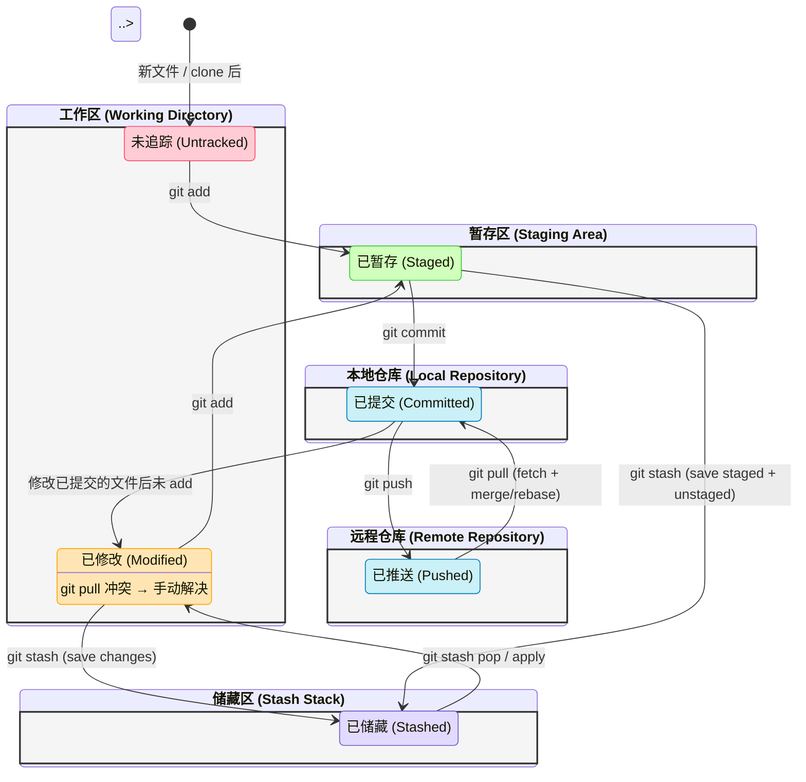

# concept 

## 工作区

- 工作区 (Working Directory)：正在修改代码的地方
- 暂存区 (Staging Area / Index)：一个中间区域，用来存放你准备提交的修改。
- 本地仓库 (Repository)：保存所有版本记录的地方（即隐藏的 .git 文件夹）

## hunk 
Hunk = “代码块变更单元” / “补丁块”
Git 看变更时，不是一行一行单独看，而是把连续的、相关的修改归成一个 hunk。
比如你一次改了 5 行连续的代码 → 这就是一个 hunk。
如果你在文件里改了两处不挨着的地方 → 就会分成两个 hunk。

Hunk action = 对某个 hunk（变更块）直接做操作

## line blame 

“行级 Git blame” / “这行代码是谁改的”

它会告诉你当前光标所在的那一行代码：
是谁（作者）
什么时候（commit 时间）
在哪个 commit 里改的
commit 的 message（简短或完整）
