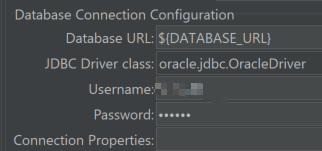

# jmeter 连接数据库

## 目录
- lib 库文件
  - lib/ext 扩展文件 

## procedure
 
1. 下载数据库驱动(oracle,mysql)放到 /lib 目录下 
   1. mac下使用brew安装时，可以使用brew --prefix jmeter看jmeter的安装位置 libexec文件夹下的lib 
2. 写数据库连接配置 jdbc connection configuration 
   1. Variable Name of Pool declared in JDBC Connection Configuration 定义的连接池变量名称, 当你需要在多个线程组或多个HTTP请求中使用同一个数据库连接时，
   可以通过设置这个变量名称来引用同一个连接池，从而避免重复创建数据库连接，提高性能和资源利用率
   2. 
3. jdbc request  指定连接池名称 
