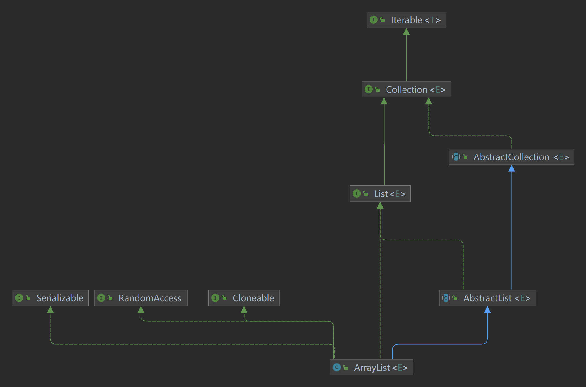

# ArrayList

- 底层通过数组实现
- size(), isEmpty(), get(), set()方法均能在常数时间内完成
- add()方法的时间开销跟插入位置有关，
- addAll()方法的时间开销跟添加元素的个数成正比。
``` java
public class ArrayList<E> extends AbstractList<E>
        implements List<E>, RandomAccess, Cloneable, java.io.Serializable
{
    private static final long serialVersionUID = 8683452581122892189L;

    /**
     * 默认的初始容量
     */
    private static final int DEFAULT_CAPACITY = 10;

    /**
     * 用于空实例的共享空数组实例。
     */
    private static final Object[] EMPTY_ELEMENTDATA = {};

    /**
     * 共享空数组实例用于默认大小的空实例。我们
     * 将此与EMPTY_ELEMENTDATA区分开来，以了解
     * 添加了第一个元素膨胀多少。
     */
    private static final Object[] DEFAULTCAPACITY_EMPTY_ELEMENTDATA = {};

    /**
     * 存储 ArrayList 元素的数组缓冲区。
     * ArrayList 的容量是此数组缓冲区的长度。任何
     * 空 ArrayList with elementData == DEFAULTCAPACITY_EMPTY_ELEMENTDATA
     * 将在添加第一个元素时扩展为 DEFAULT_CAPACITY。
     */
    transient Object[] elementData; // non-private to simplify nested class access

    /**
     * The size of the ArrayList (the number of elements it contains).
     *
     * @serial
     */
    private int size;
```
## constructor
``` java
    /**
 * Constructs an empty list with the specified initial capacity.
 *
 * @param  initialCapacity  the initial capacity of the list
 * @throws IllegalArgumentException if the specified initial capacity
 *         is negative
 */
public ArrayList(int initialCapacity) {
    if (initialCapacity > 0) {
        this.elementData = new Object[initialCapacity];
    } else if (initialCapacity == 0) {
        this.elementData = EMPTY_ELEMENTDATA;
    } else {
        throw new IllegalArgumentException("Illegal Capacity: "+
                initialCapacity);
    }
}

/**
 * Constructs an empty list with an initial capacity of ten.
 */
public ArrayList() {
    this.elementData = DEFAULTCAPACITY_EMPTY_ELEMENTDATA;
}

/**
 * Constructs a list containing the elements of the specified
 * collection, in the order they are returned by the collection's
 * iterator.
 *
 * @param c the collection whose elements are to be placed into this list
 * @throws NullPointerException if the specified collection is null
 */
public ArrayList(Collection<? extends E> c) {
    elementData = c.toArray();
    if ((size = elementData.length) != 0) {
        // c.toArray might (incorrectly) not return Object[] (see 6260652)
        if (elementData.getClass() != Object[].class)
            elementData = Arrays.copyOf(elementData, size, Object[].class);
    } else {
        // replace with empty array.
        this.elementData = EMPTY_ELEMENTDATA;
    }
}
```
当toArray()方法用在一些特定的、非标准的集合实现上时，
可能会出现返回数组类型不是预期的Object[]类型的情况。
但这种情况非常罕见，通常发生在自定义集合实现或某些特定场景下，
标准的Java集合框架中的toArray()用法应该不会遇到这个问题


## `System.arraycopy`方法和`Arrays.copyOf`

### System.arraycopy

- **直接系统调用**：`System.arraycopy`是一个原生方法，直接利用系统级别的复制，通常执行得更快。
- **更多控制**：允许你指定源数组的开始位置、目标数组、目标数组的开始位置以及要复制的元素数量。这提供了更高的灵活性，允许部分复制数组。
- **无返回值**：直接在目标数组上进行操作，不返回新数组。你需要事先创建目标数组。
- **用法示例**：
  ``` java
  int[] src = {1, 2, 3, 4, 5};
  int[] dest = new int[5];
  System.arraycopy(src, 0, dest, 0, src.length);
  ```

### Arrays.copyOf

- **简化的API**：`Arrays.copyOf`提供了一个更简单、更易用的API来复制数组。它返回一个新数组，该数组的长度可以是原数组的长度的任何值。
- **自动扩展或截断**：如果指定的新长度大于原数组的长度，剩余的位置将用默认值填充（例如，`null`对于对象类型，`0`对于整型）。如果小于原数组的长度，只复制前面的元素。
- **类型转换**：`Arrays.copyOf`还可以在复制的同时完成类型转换，例如从`int[]`到`Integer[]`，需要配合相应的方法重载或包装器使用。
- **用法示例**：
  ``` java
  int[] original = {1, 2, 3, 4, 5};
  int[] copied = Arrays.copyOf(original, original.length); // 完整复制
  int[] extended = Arrays.copyOf(original, 10); // 扩展并填充
  int[] truncated = Arrays.copyOf(original, 3); // 截断复制
  ```

### 主要区别

- **用途和灵活性**：`System.arraycopy`更适合于在已存在的数组之间进行高效的部分或完整复制，特别是当你不需要创建新数组，或者需要特定的复制范围时。而`Arrays.copyOf`更适合于创建原数组的一个修改版副本，特别是当你需要一个全新的数组，或者想要改变数组大小时。
- **性能**：虽然`System.arraycopy`在底层可能更快，但在实际应用中，这两种方法的性能差异通常不是决定因素。选择使用哪一个更多地取决于具体的需求和上下文。

简而言之，两者都是用于数组复制的强大工具，选择使用哪一个取决于你的具体需求。

## 扩容机制
``` java
    /**
     * Appends the specified element to the end of this list.
     *
     * @param e element to be appended to this list
     * @return <tt>true</tt> (as specified by {@link Collection#add})
     */
    public boolean add(E e) {
        ensureCapacityInternal(size + 1);  // Increments modCount!!
        elementData[size++] = e;
        return true;
    }
    
    private void ensureCapacityInternal(int minCapacity) {
        ensureExplicitCapacity(calculateCapacity(elementData, minCapacity));
    }
    
    private static int calculateCapacity(Object[] elementData, int minCapacity) {
        if (elementData == DEFAULTCAPACITY_EMPTY_ELEMENTDATA) {
            return Math.max(DEFAULT_CAPACITY, minCapacity);
        }
        return minCapacity;
    }
    
    private void ensureExplicitCapacity(int minCapacity) {
        modCount++;

        // overflow-conscious code
        //最小容量大于数组长度
        if (minCapacity - elementData.length > 0)
            grow(minCapacity);
    }
        /**
      * 要分配的数组的最大大小。
     * 某些 VM 在数组中保留一些标头字。
     * 尝试分配更大的数组可能会导致
     * OutOfMemoryError：请求的数组大小超出虚拟机限制
     */
    private static final int MAX_ARRAY_SIZE = Integer.MAX_VALUE - 8;
    
    private void grow(int minCapacity) {
        // overflow-conscious code
        int oldCapacity = elementData.length;
        int newCapacity = oldCapacity + (oldCapacity >> 1); //1.5倍
        //新容量还是小于最小需求 则newCapcity=最小需求
        if (newCapacity - minCapacity < 0)
            newCapacity = minCapacity;
        if (newCapacity - MAX_ARRAY_SIZE > 0)
            newCapacity = hugeCapacity(minCapacity);
        // minCapacity is usually close to size, so this is a win:
        elementData = Arrays.copyOf(elementData, newCapacity);
    }
    
        private static int hugeCapacity(int minCapacity) {
        if (minCapacity < 0) // overflow
            throw new OutOfMemoryError();
            //检查minCapacity是否大于最大数组大小（MAX_ARRAY_SIZE），
            //如果是，则返回Integer.MAX_VALUE，否则返回最大数组大小
        return (minCapacity > MAX_ARRAY_SIZE) ?
            Integer.MAX_VALUE :
            MAX_ARRAY_SIZE;
    }
```