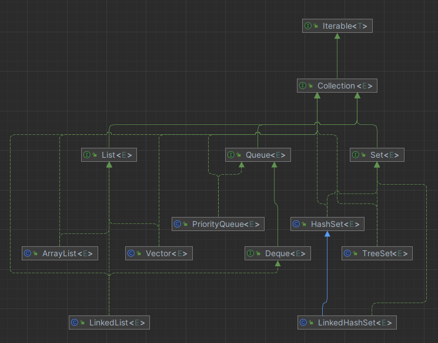

# 集合

## Collection




### List

- ArrayList
    - 基于动态数组实现
    - 支持随机访问 RandomAccess
- Vector
    - 和ArrayList一样 线程安全
- LinkedList
    - 基于双向链表实现

### Set

- HashSet
    - 基于哈希表实现  快速查找 无序的
- LinkedHashSet
    - 使用双向链表维护元素的插入顺序
- TreeSet
    - 基于红黑树 自然排序

### Queue

- Queue 单端队列
    - LinkedList
    - PriorityQueue 一个基于优先级**堆**的无界优先级队列，元素根据其自然顺序或者构造时指定的 `Comparator` 进行排序
- Deque 双端队列
    - LinkedList


## Map

- HashMap

    - 基于哈希表实现
- HashTable

    - 线程安全 使用 ConcurrentHashMap 来支持线程安全 ConcurrentHashMap 引入了分段锁
- LinkedHashMap

    - 维护着一个双向链表来记录插入顺序或访问顺序
- TreeMap

    - TreeMap 是基于红黑树的 NavigableMap 实现


## Iterator
创建一个Iterator实例并开始遍历集合时，迭代器的“指针”或“游标”位于集合的第一个元素之前，
而不是指向第一个元素。这意味着，在调用next()方法之前，迭代器并不指向任何元素
- boolean hasNext()：如果迭代器中还有元素可以遍历，则返回true。
- E next()：返回迭代中的下一个元素，并且更新迭代器的状态。
- void remove()：从集合中移除next()方法最后一次返回的元素，这个方法可以在执行next()方法后调用。
- forEachRemaining(Consumer<? super E> action) 对每个剩余元素执行给定操作
``` java
public class IteratorExample {
    public static void main(String[] args) {
        List<String> programmingLanguages = Arrays.asList("Java", "Python", "C++", "JavaScript", "Kotlin");
        Iterator<String> iterator = programmingLanguages.iterator();

        // 假设我们已经遍历了前两个元素
        if (iterator.hasNext()) iterator.next(); // 遍历"Java"
        if (iterator.hasNext()) iterator.next(); // 遍历"Python"

        // 现在，我们想对剩余的元素执行操作
        Consumer<String> action = System.out::println; // 定义一个简单的打印操作

        // 使用forEachRemaining应用这个操作
        iterator.forEachRemaining(action);
    }
}

``` 
``` java
ublic class IteratorRemoveExample {
    public static void main(String[] args) {
        List<String> programmingLanguages = new ArrayList<>(Arrays.asList("Java", "Python", "C++", "JavaScript", "Kotlin"));
        Iterator<String> iterator = programmingLanguages.iterator();

        // 自定义操作，打印并在满足条件时移除元素
        Consumer<String> action = element -> {
            System.out.println("Processing: " + element);
            if (element.contains("o")) {
                iterator.remove(); // 注意：此操作必须紧跟在next()调用之后 设计来删除由next()方法最后一次返回的元素
            }
        };

        // 遍历并尝试移除元素
        while (iterator.hasNext()) {
            String current = iterator.next(); // 获取当前元素
            action.accept(current); // 执行自定义操作
        }

        // 打印最终的列表
        System.out.println("Filtered List: " + programmingLanguages);
    }
}
```
### ConcurrentModificationException
是Java中的一个运行时异常（RuntimeException），它通常会在一个或多个线程在对集合进行修改时，
另一个线程正在通过迭代器遍历这个集合的情况下抛出。
不过，这个异常也可以在单线程环境中发生，如果在迭代过程中直接修改了集合，
而没有通过迭代器自身的remove()或add()方法（如果迭代器支持的话）来做这些修改
``` java
        List<String> list = new ArrayList<>(Arrays.asList("Java", "C++", "Python"));
        for (String s : list) {
            if (s.equals("Java")) {
                list.remove(s); // 这会抛出ConcurrentModificationException
            }
        }
```
``` java
        // 假设list是一个共享的集合
        Thread t1 = new Thread(() -> {
            Iterator<String> iterator = list.iterator();
            while (iterator.hasNext()) {
                System.out.println(iterator.next());
                try {
                    Thread.sleep(100); // 模拟长时间操作
                } catch (InterruptedException e) {
                    e.printStackTrace();
                }
            }
        });

        Thread t2 = new Thread(() -> {
            list.add("Ruby"); // 修改集合
        });

        t1.start();
        t2.start();

```