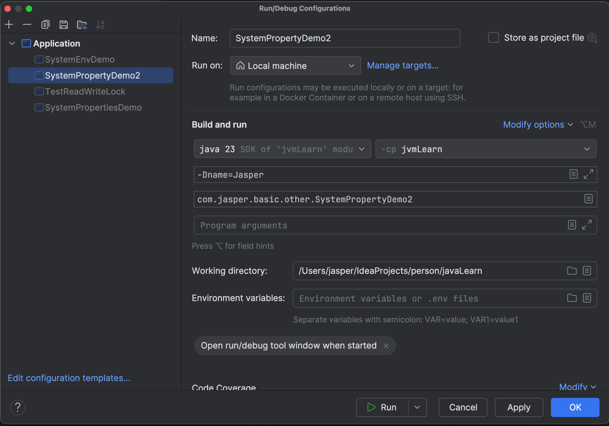

# System

## System.getProperty
System.getProperty(String key) 是用来获取 系统属性 的方法，常用于获取 Java 环境或操作系统相关信息

System.getProperty(String key, String defaultValue) 是用来获取 系统属性 的方法，常用于获取 Java 环境或操作系统相关信息，如果没有找到指定的属性，则返回默认值

eg: 
java.runtime.version = 23.0.2+7-58
user.name = jasper
stdout.encoding = UTF-8
path.separator = :
os.version = 15.4.1

## 常用属性

``` java
System.getProperty("user.dir") 获取当前工作目录
```


-D 是 Java 启动参数中的一个标志，用于设置系统属性（System Properties），这些属性在程序中可以通过 System.getProperty("key") 获取

```java
//获取不到则取默认值
    private volatile String namesrvAddr = System.getProperty(MixAll.NAMESRV_ADDR_PROPERTY, System.getenv(MixAll.NAMESRV_ADDR_ENV));
```

```java
package com.jasper.basic.other;

public class SystemPropertyDemo2 {
    public static void main(String[] args) {
        final String property = System.getProperty("name", "default");
        System.out.println("property = " + property);
    }
}
```
## System.getenv

System.getenv() 是 Java 提供的用来获取环境变量的方法，常用于读取系统级配置，比如用户主目录、PATH、临时目录、Java 相关设置等。

