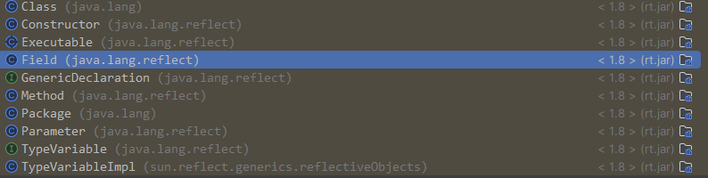

# 注解

在Java中，注解（Annotations）是一种用于为代码提供元数据的形式。从Java 5开始引入，注解提供了一种在不改变应用逻辑的情况下，为代码添加信息的方法。注解可以被用来在编译时进行代码检查，代码分析，以及在运行时通过反射机制实现一些特定功能。

### 主要用途

1. **编译检查**：通过注解可以让编译器对代码做额外的检查，避免潜在的错误。例如，`@Override` 注解可以用来确保一个方法确实覆盖了父类的方法。
2. **代码分析**：一些框架和库通过使用注解来进行代码分析，从而减少需要编写的模板代码量。比如，许多Java Web和Spring框架会大量使用注解来简化配置。
3. **运行时处理**：一些注解可以在程序运行时被读取，并根据注解提供的信息执行特定操作。反射机制常用于此目的。

### 常见的Java内置注解

- `@Override`：表示一个方法声明打算重写父类中的方法。
- `@Deprecated`：标记了注解的元素已经过时。
- `@SuppressWarnings`：指示编译器忽略特定警告。
- `@FunctionalInterface`：表示一个接口是函数式接口。

### 自定义注解

除了使用Java内置的注解之外，你还可以创建自己的注解。自定义注解可以通过使用`@interface`关键字来定义。例如：

``` java
import java.lang.annotation.ElementType;
import java.lang.annotation.Retention;
import java.lang.annotation.RetentionPolicy;
import java.lang.annotation.Target;

@Retention(RetentionPolicy.RUNTIME) // 定义注解的生命周期
@Target(ElementType.METHOD) // 定义注解应用的地方（方法）
public @interface MyAnnotation {
    // 定义注解的元素
    String description() default "This is my annotation";
}
```

### AnnotatedElement

在Java反射API中，`AnnotatedElement`是一个接口，它是所有程序元素（如类、方法、字段等）的共有父接口，这些程序元素可以被注解。这个接口提供了查询其上注解的方法，允许运行时通过反射机制访问这些注解。`Class`、`Method`、`Field`、`Constructor`等反射类都实现了`AnnotatedElement`接口，因此它们都可以用来查询注解信息。



#### 主要方法

`AnnotatedElement`接口定义了多种方法来查询注解，这里是一些主要的方法：

- `boolean isAnnotationPresent(Class<? extends Annotation> annotationClass)`: 判断此元素上是否存在指定类型的注解。
- `<T extends Annotation> T getAnnotation(Class<T> annotationClass)`: 返回该元素上存在的、指定类型的注解；如果该类型的注解不存在，则返回null。
- `Annotation[] getAnnotations()`: 返回此元素上存在的所有注解。
- `Annotation[] getDeclaredAnnotations()`: 返回直接存在于此元素上的所有注解，不包括继承的注解。

#### 使用场景

`AnnotatedElement`接口的使用场景广泛，主要用于反射机制中处理注解。通过这个接口，可以在运行时动态地查询类、方法、字段等元素的注解信息，这对于开发框架、库或需要运行时处理注解的应用程序非常有用。例如，一个依赖注入框架可能会通过注解来指定依赖项，然后在运行时查询这些注解来动态地注入依赖对象。

#### 示例代码

下面是一个使用`AnnotatedElement`接口查询方法注解的简单示例：

```java
import java.lang.annotation.Retention;
import java.lang.annotation.RetentionPolicy;
import java.lang.annotation.Annotation;
import java.lang.reflect.Method;

@Retention(RetentionPolicy.RUNTIME)
@interface MyAnnotation {
    String value();
}

class MyClass {
    @MyAnnotation(value = "Hello, Annotation!")
    public void myMethod() {
    }
}

public class AnnotationDemo {
    public static void main(String[] args) throws Exception {
        Method method = MyClass.class.getMethod("myMethod");

        if (method.isAnnotationPresent(MyAnnotation.class)) {
            MyAnnotation annotation = method.getAnnotation(MyAnnotation.class);
            System.out.println(annotation.value());
        }
    }
}
```

在这个示例中，首先定义了一个运行时注解`MyAnnotation`，然后在`MyClass`的`myMethod`方法上使用这个注解。主程序通过反射获取`myMethod`方法的`Method`对象，然后检查是否存在`MyAnnotation`注解，并输出注解的`value`属性值。

通过这种方式，`AnnotatedElement`接口使得在运行时查询和处理注解变得简单直接。


### 元注解

Java提供了几个所谓的“元注解”，用于注解其他的注解：

- `@Target`：标记注解可以应用的Java元素类型（如方法、字段、类等）。

```java

    public enum ElementType {
        /** Class, interface (including annotation type), or enum declaration */
        TYPE,

        /** Field declaration (includes enum constants) */
        FIELD,

        /** Method declaration */
        METHOD,

        /** Formal parameter declaration  形式参数声明*/
        PARAMETER,

        /** Constructor declaration */
        CONSTRUCTOR,

        /** Local variable declaration 局部变量声明*/
        LOCAL_VARIABLE,

        /** Annotation type declaration */
        ANNOTATION_TYPE,

        /** Package declaration */
        PACKAGE,

        /**
         * Type parameter declaration 类型参数
         *
         * @since 1.8
         */
        TYPE_PARAMETER,

        /**
         * Use of a type 任何类型的使用
         *
         * @since 1.8
         */
        TYPE_USE
    }
    
  ```

  ``` 
  class Box<@NonNull T> { // 此处的 @NonNull 就是一个注解，应用于类型参数T上
      // ...
  }
  ```
- `@Retention`：标记注解在哪一个级别可用（源代码中、类文件中、运行时）。

  - ``` java
    public enum RetentionPolicy {
        /**
         * Annotations are to be discarded by the compiler.
         * 该注解只在源代码阶段保留，会被编译器丢弃，不会包含在编译生成的 .class 文件中
         */
        SOURCE,

        /**
         * Annotations are to be recorded in the class file by the compiler
         * but need not be retained by the VM at run time.  This is the default
         * behavior.
         */
        CLASS,

        /**
         * Annotations are to be recorded in the class file by the compiler and
         * retained by the VM at run time, so they may be read reflectively.
         *
         * @see java.lang.reflect.AnnotatedElement
         */
        RUNTIME
    }
    ```
- `@Documented`：指定该注解将被javadoc工具记录。
- `@Inherited`：允许子类继承父类中的注解。

通过使用注解，Java开发者可以为代码添加元数据，改善代码的可读性、可维护性，并利用框架提供的强大功能。

#### 类型注解

在Java中，类型注解（Type Annotations）是Java 8中引入的一个新特性，允许程序员对任何使用到类型的地方添加注解，比如对象的类型、类型强制转换、implements语句以及泛型类型参数等。这些注解提供了更多关于程序如何使用类型的信息，这些信息可以被编译器或者其他工具用于错误检查、代码分析或者编译时和运行时的处理。

类型注解扩展了Java的注解能力，使得注解不再局限于只能修饰声明，而是可以修饰任何类型的使用。例如，你可以在声明中使用类型注解来表明一个字段不应该是`null`，或者在强制转换操作中使用注解来检查转换的有效性。

##### 举例

以下是一些类型注解的使用示例：

``` java
// 使用注解指定某个字段不能为null
@NonNull String myString;

// 在类型转换中使用注解
String safeString = (@NonNull String) unsafeString;

// 使用注解指定实现的接口的特定变体
class UnmodifiableList implements @Readonly List<@Readonly String> {
    // ...
}

// 使用注解作为类型参数
List<@NonNegative Integer> numbers;

// 在抛出异常声明中使用注解
void process() throws @Critical NetworkException {
    // ...
}
```

##### 定义类型注解

要定义类型注解，你需要定义一个普通的注解，并使用`@Target`元注解来指定注解可以应用的Java元素类型。对于类型注解，通常会使用`ElementType.TYPE_USE`和/或`ElementType.TYPE_PARAMETER`。

例如：

``` java
import java.lang.annotation.*;

// 定义一个可以在任何类型使用的注解
@Target({ElementType.TYPE_USE, ElementType.TYPE_PARAMETER})
public @interface NonNegative {
}
```

这个`@NonNegative`注解现在可以用于任何类型的使用场景，以确保该类型的值不应该为负数。

##### 类型注解的用途

类型注解最显著的用途之一是在静态代码分析中，尤其是在创建自定义的类型检查器时。例如，通过使用类型注解，你可以创建一个检查器，它在编译时就能够检测潜在的`null`引用错误，或者检查数值是否可能超出预期的范围。

除了静态分析外，类型注解也可以被运行时处理工具使用，比如反射机制，它们可以读取注解信息并据此执行特定的操作。这些特性使得类型注解成为Java类型系统中一个非常强大的工具。

##### 类型注解应用

在运行时使用反射来访问和处理类型注解。

首先，定义一个类型注解`@NonNegative`：

``` java
import java.lang.annotation.*;

@Retention(RetentionPolicy.RUNTIME)
@Target(ElementType.TYPE_USE)
public @interface NonNegative {
}
```

然后，使用这个注解在一个类中标注字段和方法：

``` java
public class NumberHolder {
    @NonNegative int number;

    public NumberHolder(int number) {
        this.number = number;
    }

    @NonNegative
    public int doubleValue() {
        return number * 2;
    }
}
```

现在，编写一个使用反射来检查`NumberHolder`类的`number`字段和`doubleValue`方法是否被`@NonNegative`注解标注的方法：

``` java
import java.lang.reflect.Field;
import java.lang.reflect.Method;

public class AnnotationProcessor {
    public static void processAnnotations(Object obj) throws Exception {
        Class<?> objClass = obj.getClass();

        // 处理字段注解
        for (Field field : objClass.getDeclaredFields()) {
            if (field.isAnnotationPresent(NonNegative.class)) {
                field.setAccessible(true); // 允许访问私有字段
                int value = (int) field.get(obj);
                if (value < 0) {
                    throw new IllegalArgumentException("Field " + field.getName() + " cannot be negative.");
                }
            }
        }

        // 处理方法注解
        for (Method method : objClass.getDeclaredMethods()) {
            if (method.isAnnotationPresent(NonNegative.class)) {
                int returnValue = (int) method.invoke(obj);
                if (returnValue < 0) {
                    throw new IllegalArgumentException("Method " + method.getName() + " cannot return negative.");
                }
            }
        }
    }

    public static void main(String[] args) throws Exception {
        NumberHolder numberHolder = new NumberHolder(-5);
        processAnnotations(numberHolder);
    }
}
```

在这个示例中，`processAnnotations` 方法接收一个 `Object` 类型的参数，它首先检查这个对象的字段上是否存在 `@NonNegative` 注解，如果存在，它会检查字段的值是否非负。然后，它检查对象的方法，看它们是否有 `@NonNegative` 注解，并且它们的返回值是否非负。

当然，这只是一个简单的示例。在实际应用中，你可能需要处理更复杂的情况，比如注解用在方法参数、泛型类型等场合。通过类型注解和反射，你可以实现很多强大的功能，比如数据校验、权限检查或运行时配置。

#### @Repeatable

- @Repeatable

  在JDK 8之前，Java不支持在同一程序元素（如类、方法或字段）上多次应用相同的注解。JDK 8引入了重复注解的概念，允许同一个注解在同一声明上多次出现，前提是该注解本身必须通过`@Repeatable`元注解来标记。

  ### 使用重复注解的步骤


  1. **定义重复注解**: 首先，你需要定义一个注解，并使用`@Repeatable`元注解标记它。

  ``` java
  import java.lang.annotation.Repeatable;

  @Repeatable(MyAnnotations.class) // 指定容器注解类
  public @interface MyAnnotation {
      String value();
  }
  ```

**定义容器注解**: `@Repeatable`元注解中的值应该是另一个注解，它将用作包含重复注解的容器。

  ``` java
  public @interface MyAnnotations {
      MyAnnotation[] value(); // 容器注解持有MyAnnotation注解的数组
  }
  ```

**应用重复注解**: 之后，你就可以在一个声明上多次使用这个注解了。

  ``` java
  @MyAnnotation("First value")
  @MyAnnotation("Second value")
  public class MyClass {
      // ...
  }
  ```

  在这个例子中，`MyClass` 使用了两次 `@MyAnnotation` 注解。

  ### 使用重复注解的时候需要注意的点

  - 容器注解通常只是一个简单的容器，它的内部定义一个返回注解数组的方法。这个方法必须使用 `value` 作为其名称。
  - 当读取重复注解的时候，如果只应用了一次注解，可以直接通过注解类型来访问它；如果应用了多次，可以通过容器注解类型来访问所有的重复注解实例。

  ### 举个例子

  假设我们有一个`@Schedule`注解，我们希望在一个方法上指定多个调度时间：

  ``` java
  @Repeatable(Schedules.class)
  public @interface Schedule {
      String dayOfMonth() default "first";
      String dayOfWeek() default "Mon";
      int hour() default 12;
  }

  public @interface Schedules {
      Schedule[] value();
  }

  public class PeriodicJob {
      @Schedule(dayOfMonth="last")
      @Schedule(dayOfWeek="Fri", hour=23)
      public void doPeriodicCleanup() {
          // ...
      }
  }
  ```

  在这个例子中，`doPeriodicCleanup` 方法被标记为在每个月的最后一天以及每周五的23点执行。通过重复注解，我们能够以清晰且简洁的方式表示复杂的配置。

### 应用

``` java
import java.lang.annotation.ElementType;
import java.lang.annotation.Retention;
import java.lang.annotation.RetentionPolicy;
import java.lang.annotation.Target;

@Retention(RetentionPolicy.RUNTIME)
@Target(ElementType.METHOD)
public @interface TrackExecutionTime {
    // 可以定义注解的属性，在这个例子中我们不需要
}

```

``` java
import java.lang.reflect.Method;

public class AnnotationProcessor {

    public static void processAnnotations(Object obj) {
        Class<?> objClass = obj.getClass();

        // 遍历所有方法
        for (Method method : objClass.getDeclaredMethods()) {
            // 检查方法是否使用了TrackExecutionTime注解
            if (method.isAnnotationPresent(TrackExecutionTime.class)) {
                long startTime = System.currentTimeMillis();

                // 执行方法
                try {
                    method.invoke(obj);
                } catch (Exception e) {
                    e.printStackTrace();
                }

                long endTime = System.currentTimeMillis();
                System.out.println(method.getName() + " executed in " + (endTime - startTime) + " milliseconds.");
            }
        }
    }

    public static void main(String[] args) {
        MathUtils mathUtils = new MathUtils();
        processAnnotations(mathUtils);
    }
}

```

``` java
public class MathUtils {

    @TrackExecutionTime
    public static void calculateSum() {
        // 假装这是一个复杂的计算过程
        long sum = 0;
        for (int i = 0; i < 1000000; i++) {
            sum += i;
        }
        System.out.println("Sum: " + sum);
    }
}

```

### java注解的本质以及注解的底层实现原理

[java注解的本质以及注解的底层实现原理-CSDN博客](https://blog.csdn.net/qq_20009015/article/details/106038023)

## 自定义注解 使用Spring AOP切面实现**统一的操作日志管理**
test edit
