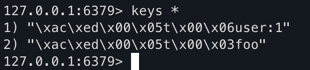
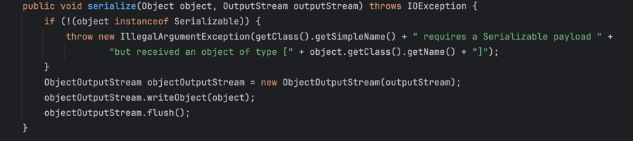

# get start 

RedisTemplate 封装了底层 Redis 命令的使用

```java
package com.jasper.redisboot.official;

import com.jasper.redisboot.pojo.User;
import org.apache.commons.logging.Log;
import org.apache.commons.logging.LogFactory;
import org.springframework.data.redis.connection.lettuce.LettuceConnectionFactory;
import org.springframework.data.redis.core.RedisTemplate;
import org.springframework.data.redis.serializer.StringRedisSerializer;

public class RedisApplication {

	private static final Log LOG = LogFactory.getLog(RedisApplication.class);

	public static void main(String[] args) {

		LettuceConnectionFactory connectionFactory = new LettuceConnectionFactory();
		connectionFactory.afterPropertiesSet();

		RedisTemplate<String, Object> template = new RedisTemplate<>();
		template.setConnectionFactory(connectionFactory);
		template.afterPropertiesSet();

		final User user = new User();
		user.setId("1").setName("Jasper").setAge(20);
		template.opsForValue().set("foo", "bar");
		template.opsForValue().set("user:1",user);
		connectionFactory.destroy();
	}
}
```

Spring 默认的 RedisTemplate 使用的是JDK 序列化（JdkSerializationRedisSerializer） 对象必须实现Serializable接口
•	默认会被转成二进制的字节流
•	在 Redis CLI 中看到的是乱码，不能直接读




