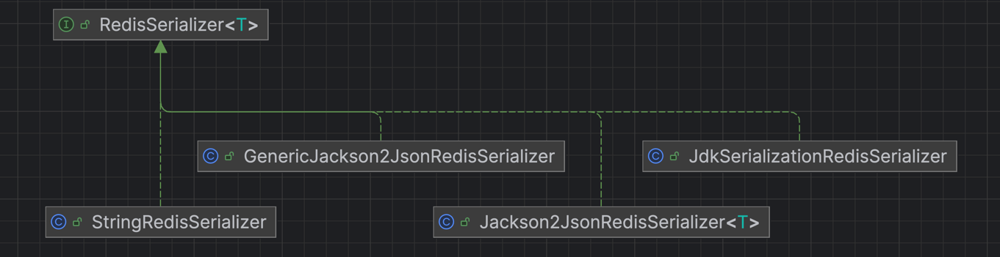

# redis template

默认使用了jdk的序列化，也提供了很多其他的序列化方式，在`org.springframework.data.redis.serializer`包中


## 模版视图
模版视图： 从 RedisTemplate 中专门针对某种 Redis 数据类型（String、Hash、List、Set、ZSet、Stream）提取出来的一组特定操作方法。

如果你希望直接使用特定类型的 Redis 操作（比如操作 Hash、List、Set 这些结构），
那么可以直接声明具体的模板接口（如 HashOperations、ListOperations）作为依赖注入，
Spring 容器会自动帮你从 RedisTemplate 中拿到对应的操作对象，
这样就不用每次手动去调用 opsForX() 方法了，代码更简洁。

🔴 传统写法（手动调用 opsForX()）
```java
@Autowired
private RedisTemplate<String, String> redisTemplate;

public void saveUser() {
    redisTemplate.opsForHash().put("user:1", "name", "jasper");
}
```
这里你要写 redisTemplate.opsForHash() 每次手动调用，很机械。


🟢 推荐的新写法（直接注入特定的操作接口）

```java
@Autowired
private HashOperations<String, String, String> hashOperations;

public void saveUser() {
    hashOperations.put("user:1", "name", "jasper");
}
```

•	这里直接把 HashOperations 注入到你的类中。
•	Spring 容器会自动从 RedisTemplate 里帮你拿到 opsForHash() 对象。
•	你的代码直接操作 Hash，更干净、更清晰。


###  接口对应的 Redis 类型
ValueOperations<K, V>	String（单值）
HashOperations<H, HK, HV>	Hash（哈希表）
ListOperations<K, V>	List（列表）
SetOperations<K, V>	Set（集合）
ZSetOperations<K, V>	ZSet（有序集合）
StreamOperations<K, HK, HV>	Stream（流式消息）


🧠 小总结
•	手动调用 opsForX() → 传统写法，灵活但代码冗长；
•	直接注入具体操作接口 → 推荐新写法，清爽又符合单一职责原则；
•	Spring 自动帮你装配，不需要你自己管理关系。

⸻

## StringRedisTemplate 和 ValueOperations
- 如果你的业务逻辑仅涉及 Redis 中的 String 类型数据，直接注入 ValueOperations<String, String> 是最好的选择，因为它更专注、代码更简洁。
- 如果你需要操作多种 Redis 数据类型（如 List、Set、Hash 等），那么直接注入 StringRedisTemplate 会更方便。

## 序列化方式

1. 双向序列化器（Two-way serializers） 基于 RedisSerializer

    双向序列化器通常指的是能够同时进行 对象到字节流的序列化 和 字节流到对象的反序列化。这个过程需要使用 RedisSerializer 接口，它是 Spring Data Redis 中的一个核心接口，
    用于处理 Java 对象和 Redis 数据之间的转换。

    在 Spring Data Redis 中，有两个主要的序列化器实现：
    - JdkSerializationRedisSerializer：基于 Java 自带的序列化机制（默认的方式），它会把对象转成字节流并存入 Redis。
    - Jackson2JsonRedisSerializer：基于 Jackson 序列化机制，将对象序列化为 JSON 格式。这个方式更为常用，通常用于需要与其他服务（尤其是跨语言服务）交互的场景。

    双向序列化器负责的就是把 Java 对象 序列化成 Redis 可以存储的格式，以及从 Redis 中 读取数据并反序列化成 Java 对象。

2. 元素读取器和写入器（Element readers and writers）

RedisElementReader 和 RedisElementWriter 是 Spring Data Redis 中的组件，用于将 Redis 中存储的单个 元素（如一个值、一个哈希字段、一个列表元素等）与 Java 对象之间进行转换。
- RedisElementReader：用于从 Redis 中读取数据并将其转换为 Java 对象。
- RedisElementWriter：用于将 Java 对象转换为 Redis 可以存储的格式，并写入 Redis。

这些组件可以提供更细粒度的控制，通常用于操作 Redis 数据结构中的单个元素，比如哈希表中的字段、集合中的成员等。

- 双向序列化器：通常是通过 RedisSerializer 接口来实现的，负责将 Java 对象转为 Redis 支持的格式，以及从 Redis 转换回来。
- 元素读取器和写入器：用于对 Redis 中的元素进行更细致的读取和写入操作，常见于一些更复杂的场景，如操作 Redis 哈希表中的单个字段、集合成员等。


配置key和valued的序列化方式

```java
package com.jasper.redisboot.config;

import org.springframework.context.annotation.Bean;
import org.springframework.context.annotation.Configuration;
import org.springframework.data.redis.connection.RedisConnectionFactory;
import org.springframework.data.redis.connection.lettuce.LettuceConnectionFactory;
import org.springframework.data.redis.core.RedisTemplate;
import org.springframework.data.redis.serializer.GenericJackson2JsonRedisSerializer;
import org.springframework.data.redis.serializer.StringRedisSerializer;

@Configuration
public class RedisConfiguration {

    @Bean
    RedisTemplate<String, Object> redisTemplate(RedisConnectionFactory connectionFactory) {
        RedisTemplate<String, Object> template = new RedisTemplate<>();
        template.setConnectionFactory(connectionFactory);
        template.setKeySerializer(new StringRedisSerializer());
        template.setValueSerializer(new GenericJackson2JsonRedisSerializer());
        return template;
    }
}

```

## RedisElementReader  RedisElementWriter 

没看懂。不知道有什么鸟用

