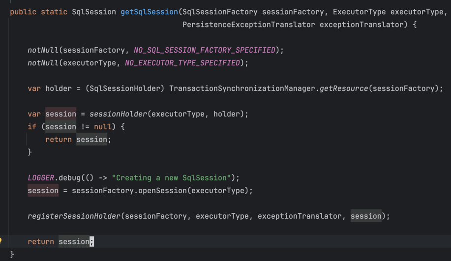

# springboot 集成mybatis

## 引入依赖
```xml
<dependency>
    <groupId>org.mybatis.spring.boot</groupId>
    <artifactId>mybatis-spring-boot-starter</artifactId>
    <version>${mybatis-spring-boot-starter.version}</version>
</dependency>
```


### 在springboot 集成mybatis时 一级缓存不生效

```java
    @GetMapping("test1Cache")
//    @Transactional(rollbackFor = Exception.class)
    public void test1Cache() {
        User user = userMapper.findById(1);
        log.info("user:{}",user);
        user = userMapper.findById(1);
        log.info("user:{}",user);
    }
```
加上事务才会生效
``` java
    @Transactional(rollbackFor = Exception.class)
``` 

因为一级缓存是会话级别的，要生效的话，必须要在同一个 SqlSession 中。但是与 springboot 集成的 mybatis，
默认每次执行sql语句时，都会创建一个新的 SqlSession！所以一级缓存才没有生效

### 源码

当调用 mapper 的方法时，最终会执行到SqlSessionUtils的getSqlSession方法

- [SqlSessionUtils](/java/framework/mybatis/sourceCode/mybatis-spring/SqlSessionUtils.md)

尝试从 Spring 当前线程的事务中获取一个已存在的 SqlSessionHolder,如果没有，就会新建一个sqlSession
