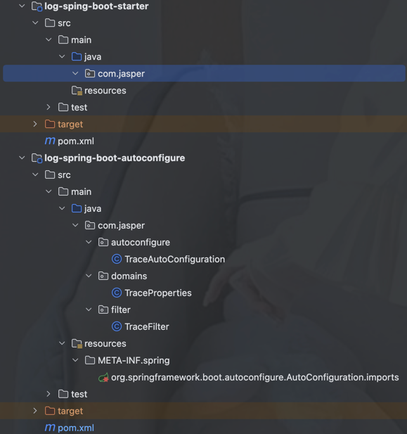

# 自定义一个springboot starter

> [官方文档](https://docs.spring.io/spring-boot/3.4-SNAPSHOT/reference/features/developing-auto-configuration.html#features.developing-auto-configuration.custom-starter)

所有官方启动器都遵循类似的命名模式;spring-boot-starter-*，其中*是特定类型的应用程序。此命名结构旨在在您需要查找启动器时提供帮助。许多 IDE 中的 Maven 集成允许您按名称搜索依赖项。
如创建自己的 Starter 部分所述，第三方 Starter 不应以 spring-boot 开头，因为它是为官方 Spring Boot 工件保留的。
相反，第三方启动器通常以项目名称开头。例如，一个名为 thirdpartyproject 的第三方启动器项目通常被命名为 thirdpartyproject-spring-boot-starter。


springboot 3.0 版本中。使用`META-INF/spring/org.springframework.boot.autoconfigure.AutoConfiguration.imports`代替spring.factories

## condition annotation

### class condition
- `@ConditionalOnClass`: 该注解用于判断某个类是否在类路径下，如果在，则条件成立。
- `@ConditionalOnMissingClass`: 该注解用于判断某个类是否不在类路径下，如果不在，则条件成立。


### bean condition
- `@ConditionalOnBean`: 该注解用于判断某个 Bean 是否在 Spring 容器中，如果在，则条件成立。
- `@ConditionalOnMissingBean`: 该注解用于判断某个 Bean 是否不在 Spring 容器中，如果不在，则条件成立。

### property condition
- `@ConditionalOnProperty`: 该注解用于判断某个属性是否在配置文件中，如果在，则条件成立。
- `@ConditionalOnMissingProperty`: 该注解用于判断某个属性是否不在配置文件中，如果不在，则条件成立。

### resource condition
- `@ConditionalOnResource`: 该注解用于判断某个资源是否在类路径下，如果在，则条件成立。
- `@ConditionalOnMissingResource`: 该注解用于判断某个资源是否不在类路径下，如果不在，则条件成立。

### web condition
- `@ConditionalOnWebApplication`: 该注解用于判断当前应用是否是一个 Web 应用，如果是，则条件成立。
- `@ConditionalOnNotWebApplication`: 该注解用于判断当前应用是否不是一个 Web 应用，如果不是，则条件成立。

### spel condition
- `@ConditionalOnExpression`: 该注解用于判断某个 SpEL 表达式是否成立，如果成立，则条件成立。

### 创建自己的starter

> Concretely, a custom starter can contain the following:
> 
> The autoconfigure module that contains the auto-configuration code for "acme".
>
> The starter module that provides a dependency to the autoconfigure module as well as "acme" and any additional dependencies that are typically useful. In a nutshell, adding the starter should provide everything needed to start using that library.
> 
> This separation in two modules is in no way necessary. If "acme" has several flavors, options or optional features, then it is better to separate the auto-configuration as you can clearly express the fact some features are optional. Besides, you have the ability to craft a starter that provides an opinion about those optional dependencies. At the same time, others can rely only on the autoconfigure module and craft their own starter with different opinions.
> 
> If the auto-configuration is relatively straightforward and does not have optional features, merging the two modules in the starter is definitely an option.


- 创建一个 Maven 项目，命名为 `log-spring-boot-starter`。
- 创建另外一个maven项目 命名为 `log-spring-boot-starter-autoconfigure`。
- 第一个项目包含autoconfigure


####  spring-boot-autoconfigure-processor

1.	自动生成 META-INF/spring/ 目录下的索引文件
	•	META-INF/spring/org.springframework.boot.autoconfigure.AutoConfiguration.imports
	•	META-INF/spring/org.springframework.boot.autoconfigure.AutoConfiguration.metadata
	•	这些索引文件替代了 spring.factories，使得 @EnableAutoConfiguration 能更高效地找到自动配置类。
2. 优化 @ConfigurationProperties 处理
	•	生成 META-INF/spring-configuration-metadata.json，用于 IDE 提供自动补全和类型检查。
3. 改进 @ConfigurationProperties 的 IDE 支持

在 Spring Boot 3.0 及以上版本中，spring-boot-autoconfigure-processor 已默认包含在 spring-boot-autoconfigure 里，不需要单独引入。

但如果你要 手动引入（通常用于 编写自定义 Starter）
```xml
    <build>
	<plugins>
		<plugin>
			<groupId>org.apache.maven.plugins</groupId>
			<artifactId>maven-compiler-plugin</artifactId>
			<configuration>
				<annotationProcessorPaths>
					<path>
						<groupId>org.springframework.boot</groupId>
						<artifactId>spring-boot-autoconfigure-processor</artifactId>
					</path>
				</annotationProcessorPaths>
			</configuration>
		</plugin>
	</plugins>
</build>
```

## 示例

项目结构


```java
/**
 * matchIfMissing 如果没有则默认启用traceFilter
 */
@Configuration
@ConditionalOnClass(Filter.class) //当 类路径（classpath）中存在 jakarta.servlet.Filter 时，才会加载该 TraceAutoConfiguration
@EnableConfigurationProperties(TraceProperties.class)
public class TraceAutoConfiguration {

    @Bean
    @ConditionalOnMissingBean //如果 Spring 容器中没有 TraceFilter，才会创建一个新的 TraceFilter, matchIfMissing = true
    @ConditionalOnProperty(prefix = "trace.log", name = "enabled", havingValue = "true")
    public TraceFilter traceFilter() {
        return new TraceFilter();
    }
}
```

```java
@Data
@ConfigurationProperties(prefix = "trace.log")
public class TraceProperties {
    private boolean enabled = true;
}
```

```java
package com.jasper.filter;

import cn.hutool.core.util.IdUtil;
import jakarta.servlet.*;
import jakarta.servlet.http.HttpServletRequest;
import lombok.extern.slf4j.Slf4j;
import org.slf4j.MDC;

import java.io.IOException;
import java.util.Enumeration;
import java.util.HashMap;
import java.util.Map;
@Slf4j
public class TraceFilter implements Filter {


    @Override
    public void doFilter(ServletRequest request, ServletResponse response, FilterChain chain)
            throws IOException, ServletException {
        HttpServletRequest httpRequest = (HttpServletRequest) request;
        String traceId = IdUtil.fastSimpleUUID().toUpperCase();
        MDC.put("traceId", traceId); // 为了能在日志中使用traceId

        try {
            // 在请求处理之前进行调用（Controller方法调用之前）
            logRequestDetails(httpRequest);

            chain.doFilter(request, response);
            // 可以在这里记录响应详情，如果需要的话
        } finally {
            MDC.remove("traceId");
        }
    }

    private void logRequestDetails(HttpServletRequest request) {
        StringBuilder message = new StringBuilder();
        String method = request.getMethod();
        String requestURI = request.getRequestURI();
        String queryString = request.getQueryString(); // 获取查询字符串
        String remoteAddr = request.getRemoteAddr(); // 获取客户端IP地址

        message.append("Received ").append(method)
                .append(" request for [").append(requestURI).append("]");
        if (queryString != null) {
            message.append("?").append(queryString);
        }
        message.append(" from IP [").append(remoteAddr).append("]");

        // 如果需要记录请求头或者请求参数，可以在这里添加
        // 打印请求参数（可根据需求选择性打印）
        Map<String, String> requestParams = getRequestParameters(request);
        if (!requestParams.isEmpty()) {
            message.append(" with parameters ").append(requestParams);
        }

        log.info(message.toString());
    }

    // 辅助方法，用于获取请求参数
    private Map<String, String> getRequestParameters(HttpServletRequest request) {
        Map<String, String> params = new HashMap<>();
        Enumeration<String> paramNames = request.getParameterNames();
        while (paramNames.hasMoreElements()) {
            String paramName = paramNames.nextElement();
            String paramValue = request.getParameter(paramName);
            params.put(paramName, paramValue);
        }
        return params;
    }

    // 初始化和销毁方法可以根据需要进行重写
    @Override
    public void init(FilterConfig filterConfig) { }
    @Override
    public void destroy() { }
}
```

META-INF/spring/org.springframework.boot.autoconfigure.AutoConfiguration.imports
```text
com.jasper.autoconfigure.TraceAutoConfiguration
```

使用时导入starter模块即可


## annotations

`@AutoConfigureBefore` 在另外一个配置类之前生效
`@AutoConfigureAfter` 在另外一个配置类之后生效
`@AutoConfigureOrder` 该注解用于指定自动配置的顺序，值越小，优先级越高。
`@AutoConfigureBefore` 和 `@AutoConfigureAfter` 注解可以用来指定自动配置的顺序。


