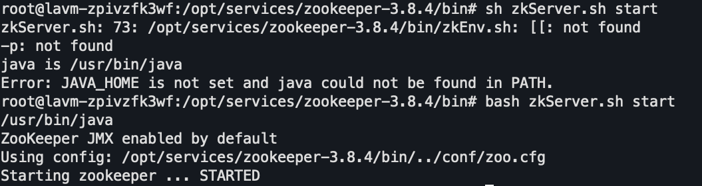

# install

https://zookeeper.apache.org/doc/r3.8.4/zookeeperStarted.html

1. 下载解压
2. 修改配置文件 dataDir
3. bin/zkServer.sh start

使用了bash特有的语法
4. 连接测试
```bash
./zkCli.sh -server 117.72.97.254:2181
```


## 集群搭建

https://zookeeper.apache.org/doc/r3.8.4/zookeeperAdmin.html#sc_zkMulitServerSetup