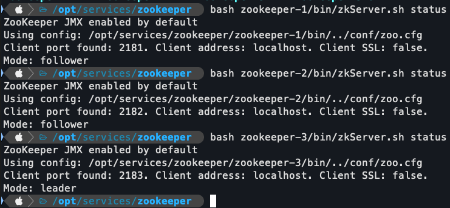

# install

https://zookeeper.apache.org/doc/r3.8.4/zookeeperStarted.html

1. 下载解压
2. 修改配置文件 dataDir
3. bin/zkServer.sh start

使用了bash特有的语法
4. 连接测试
```bash
./zkCli.sh -server 117.72.97.253:2181
```


## 集群搭建  3.8.4

采用leader-follower模式 选举产生一个leader 其他节点为follower 或者observer

- leader 处理所有写请求 协调事务性操作
- follower 处理读请求 并将写请求转发给leader
- 不参与投票，但可以接收客户端连接，缓解 Leader/Follower 的压力（只读副本）


https://zookeeper.apache.org/doc/r3.8.4/zookeeperAdmin.html#sc_zkMulitServerSetup

- server.1=zoo1:2888:3888
- server.2=zoo2:2888:3888
- server.3=zoo3:2888:3888
- ip : 服务器之前通信端口 ： 服务器之前投票选举端口


- server.1=127.0.0.1:2888:3888
- server.2=127.0.0.1:2889:3889
- server.3=127.0.0.1:2890:3890


1. 修改配置文件 zoo.cfg
2. 修改myid文件 在dataDir目录下创建myid文件，内容为当前服务器的ID（1,2,3）  1-255   enable TTL 1-254 
3. 创建initialize文件  
   - 会被视为 非投票节点（非 voter）；
   - 不会写入任何数据(数据没有同步之前)
   - 直到从一个已有的 Leader 获取集群数据后才会参与
   - 创建新集群时，必须创建该文件，否则都在等别人同步，永远不会选出leader 陷入死锁状态
4. bin/zkServer.sh start 

--- 

🚦情况一：你是 voter，且目录为空，但有 initialize 文件
1. ✅ZooKeeper 知道你是新节点，要初始化；
2. ✅会直接创建一个空的事务日志数据库；
3. ✅你加入选举和投票流程，成为正式成员；
4. ✅ 不需要和别人同步数据（因为你是第一批）；

🚦情况二：你是 voter，但目录是空的、没有 initialize

ZooKeeper 做了以下处理：
1.	❌ 不让你参与投票（防止数据未同步就选主）；
2.	✅ 你主动向 Leader 发起 Follower 连接（follower handshake）；
3.	🔁 Leader 会通过网络 发送完整的数据快照（snapshot）+ 最新日志 给你；
4.	📝 你在本地写入这份数据，完成初始化；
5.	✅ 一旦同步完成，ZooKeeper 会认为你“合格了”，你才开始拥有投票权，并能写数据

⚓️ **本地一台机器模拟集群时，通常不会因为没有创建initialize文件而选不出leader 三台机器待验证**

