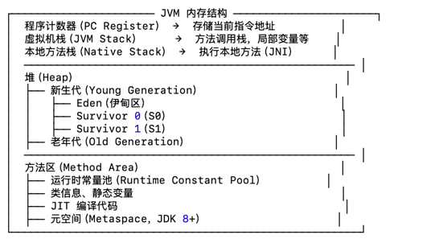

# jvm 内存结构

## 栈

## 堆

- 📌 作用：存放对象实例和数组，由 GC 进行管理，是 JVM 内存中最大的一块。
- 线程共享（所有线程访问的对象都存放在堆中）。
- 主要分为 新生代（Young Generation） 和 老年代（Old Generation）。
- GC 主要作用在堆上，回收无用的对象。

年轻代大小 = Eden 区 + 2 个 Survivor 区，默认比例 8:1:1

堆内存的划分方式会因**垃圾回收器的不同**而有所差异。

1. **传统的分代模型（如Serial, Parallel, CMS等回收器使用）**
2. **G1回收器的分区模型**

## **一、传统的分代堆内存模型**

这是最经典、最广为人知的堆内存划分方式，基于“**分代假说**”（Generational Hypothesis）：
- **弱分代假说**：绝大多数对象都是朝生夕死的。
- **强分代假说**：熬过越多次垃圾收集过程的对象就越难以消亡。

基于此，堆内存被划分为两大块：

### **1. 新生代 (Young Generation)**

* **目的**：存放新创建的对象。因为大部分对象生命周期很短，所以这里的GC非常频繁，但速度也很快。
- **内部划分**：
  - **Eden区 (伊甸园)**：绝大多数新对象都在这里分配内存。当Eden区满时，会触发一次**Minor GC (Young GC)**。
  - **Survivor区 (幸存者区)**：通常有两个大小相等的区域，称为 **From (S0)** 和 **To (S1)**。在Minor GC时，Eden区和From区中存活的对象会被复制到To区。之后，From和To的角色会互换。
  - **作用**：Survivor区的存在是为了让对象在新生代中“多活几次”GC，避免频繁地晋升到老年代。每次从Eden或From区复制到To区，对象的“年龄”会增加1。当年龄达到一定阈值（默认15，由 `-XX:MaxTenuringThreshold` 控制），对象就会被晋升到老年代。

### **2. 老年代 (Old Generation / Tenured Generation)**

* **目的**：存放从新生代中“熬”过来的、生命周期较长的对象，以及一些非常大的对象（有时大对象会直接进入老年代）。
- **特点**：这里的对象相对稳定，垃圾回收（**Major GC / Full GC**）发生的频率比新生代低得多，但每次回收的时间通常也更长。
- **触发条件**：当老年代空间不足时，会触发针对老年代的回收。如果老年代也放不下，最终会触发Full GC。

### **3. 方法区 (Method Area) / 元空间 (Metaspace)**

* **注意**：严格来说，方法区**不属于堆内存**，它是JVM规范中定义的一个独立的运行时数据区，与堆一样是线程共享的。
- **存储内容**：类信息、常量、静态变量、即时编译器编译后的代码缓存等。
- **演进**：
  - 在JDK 8之前，方法区的实现是**永久代 (Permanent Generation, PermGen)**，它在物理上是堆的一部分，因此其大小受 `-XX:PermSize` 和 `-XX:MaxPermSize` 限制，GC也会管理它。
  - **从JDK 8开始，永久代被移除，取而代之的是“元空间 (Metaspace)”**。元空间使用的是**本地内存 (Native Memory)**，而不是Java堆内存。它的大小默认只受限于机器的物理内存，也可以通过 `-XX:MetaspaceSize` 和 `-XX:MaxMetaspaceSize` 来设置。虽然元空间不属于堆，但当它空间不足时，也会触发Full GC。

---

## **二、G1回收器的分区堆内存模型**

G1为了实现可预测的停顿时间，**摒弃了物理上的新生代和老年代的固定划分**，采用了全新的内存布局：

### **1. Region (分区)**

* **核心概念**：G1将整个Java堆划分为**多个大小相等的独立区域（Region）**。每个Region的大小通常是1MB到32MB之间的2的幂次方（例如，堆为4GB时，Region可能是16MB）。
- **动态角色**：每个Region在逻辑上可以扮演Eden、Survivor或Old的角色。这些角色是动态变化的，不是固定的。例如，一个Region这次GC是Eden区，下次GC可能就变成了Old区。
- **优点**：这种设计让G1可以灵活地选择一部分Region进行回收，从而控制每次GC的停顿时间。

### **2. Humongous Region (巨型对象区)**

- **定义**：对于**非常大的对象**（其大小超过Region容量的50%），G1会特殊对待。
- **分配**：这样的对象会被直接分配到一个或多个连续的**Humongous Region**中。
- **回收**：Humongous对象的回收通常发生在并发标记阶段结束后的Cleanup阶段，或者在Full GC时。如果应用中存在大量短命的大对象，可能会导致Humongous Region回收不及时，引发Full GC，这是G1调优的一个常见关注点。

## 方法区

## 本地方法栈

## 程序计数器
