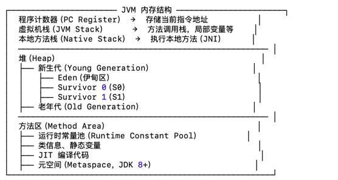

# jvm 内存结构

## 栈

## 堆

- 📌 作用：存放对象实例和数组，由 GC 进行管理，是 JVM 内存中最大的一块。
- 线程共享（所有线程访问的对象都存放在堆中）。
- 主要分为 新生代（Young Generation） 和 老年代（Old Generation）。
- GC 主要作用在堆上，回收无用的对象。

堆的结构
•	新生代（Young Generation）
•	Eden（伊甸区）：新创建的对象首先在 Eden 分配。
•	Survivor（幸存者区）：S0 和 S1 交替存放 Minor GC 存活的对象。
•	老年代（Old Generation）
•	存放生命周期较长的对象，新生代多次 GC 仍存活的对象会晋升到老年代。
•	当老年代空间不足时，触发 Major GC（Full GC）。

年轻代大小 = Eden 区 + 2 个 Survivor 区，默认比例 8:1:1
## 方法区
## 本地方法栈
## 程序计数器