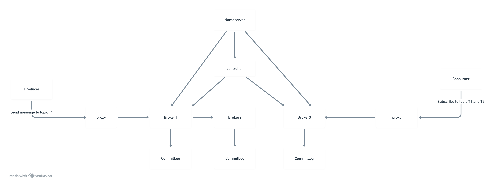

# RocketMQ 架构图

### 核心组件
1. **Producer (生产者)**
    - 发送消息到 Broker
    - 通过 NameServer 查询路由信息

2. **NameServer (名称服务器)**
    - 管理 Broker 路由信息
    - 提供访问规划

3. **Broker (中间件)**
    - **Master-Slave 实现高可用**
    - 运行为消息储存和客户端通信中心
    - 实时同步消息为 Slave

4. **Consumer (消费者)**
    - **Pull / Push 模式**
    - 从 Broker 获取消息
    - 通过 NameServer 查询路由信息

5. **Proxy (代理服务)**
    - 接入多语言客户端 (Go, Python, Node.js)
    - 可通过 HTTP/gRPC 访问

6. **Controller (高可用管理)**
    - 管理 Broker 高可用
    - 处理自动切换 Master-Slave

7. **Topic & Queue (消息储存)**
    - 消息合理组织
    - 相对独立的消息队列

### 消息流程
1. Producer 向 Broker 发送消息
2. Broker 将消息储存到 Topic & Queue
3. Consumer 通过 NameServer 找到 Broker
4. Consumer 从 Broker 消费消息

### 实现法
- 使用 **Master-Slave 集群** 增强高可用
- 配合 **Controller** 进行 Broker 的应急处理
- 采用 **Proxy** 支持多语言与跨网络访问 所有客户端流量统一接入 Proxy，再转发给后端 Broker

