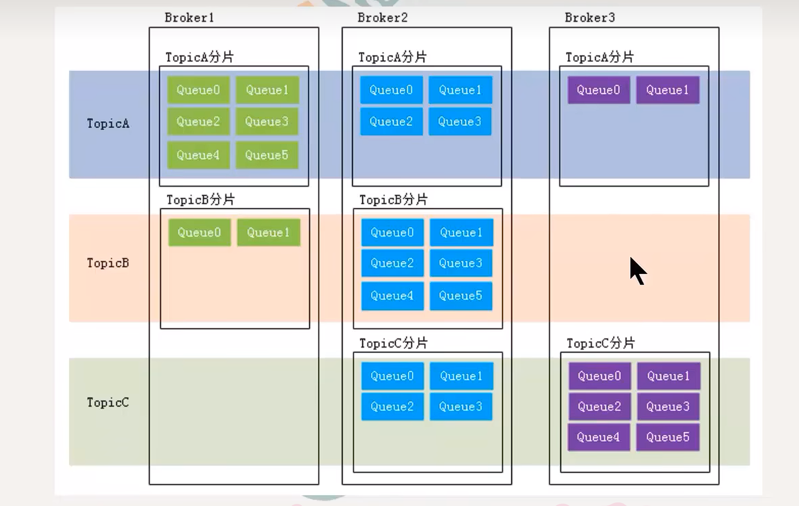

# 基本概念

1. 消息 数据
2. 主题 topic 一类消息的集合  分类
   - 生产者对应多个topic
   - 消费者对应一个topic
   - 一个message对应一个topic
   - 一个topic对应多个message
3. 队列
   - queue   分区 partition
   - 一个topic对应多个queue（partition）
4. 分片
   
5. 消息标识
   - msgId
   - offsetMsgId
   - key

## mqbroker

接收和分发消息到订阅者

Topic 消息的逻辑分类 一个 Topic 包含多个消息队列，用于存储同一类消息。
Tag 消息的进一步细分 同一 Topic 下，通过 Tag 区分不同类型的消息。
MessageQueue 消息的物理存储单元 每个 Topic 包含多个消息队列，消息队列是 Topic 的具体实现。

