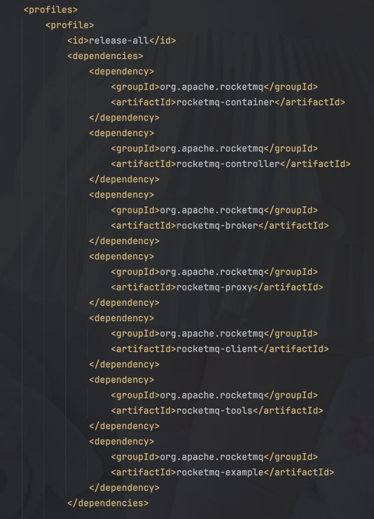

# rocketmq 从源码构建 

- [遇到的问题](./problems.md)

## 下载源码
```shell
$ unzip rocketmq-all-5.3.1-source-release.zip
$ cd rocketmq-all-5.3.1-source-release/
$ mvn -Prelease-all -DskipTests -Dspotbugs.skip=true clean install -U
$ cd distribution/target/rocketmq-5.3.1/rocketmq-5.3.1
```

-Prelease-all 用于打包所有的模块，-DskipTests 跳过测试，-Dspotbugs.skip=true 跳过代码检查，-U 强制更新依赖。

profiles 是一种可以让你根据不同的环境或需求执行不同配置的方式，通常定义在 pom.xml 或 profiles.xml 中。
-Prelease-all 的含义： -P 选项用于激活某个 Profile，release-all 是 Profile 的名称。



## 启动namesrv
- 启动namesrv 
```bash  
nohup sh bin/mqnamesrv &
```
- 验证namesrv是否启动成功 
```bash 
tail -f ~/logs/rocketmqlogs/namesrv.log
 ```
2025-03-19 20:56:26 INFO main - The Name Server boot success. serializeType=JSON, address 0.0.0.0:9876

## 启动broker and proxy 
```bash
nohup sh mqbroker -n localhost:9876 --enable-proxy &
```
- 验证是否启动成功
```bash 
tail -f ~/logs/rocketmqlogs/broker.log
```
## 停止
```bash
sh mqshutdown broker
sh mqshutdown namesrv
```

## jps 

也可以使用jps来查看是否启动成功
> [jps](/java/basic/jdk/jps.md)

## 测试发送消息
```bash
export NAMESRV_ADDR=localhost:9876
sh bin/tools.sh org.apache.rocketmq.example.quickstart.Producer
sh bin/tools.sh org.apache.rocketmq.example.quickstart.Consumer
```


## 集群部署

### namesrv

namesrv是无状态的，namesrv之间没有消息同步

### broker
