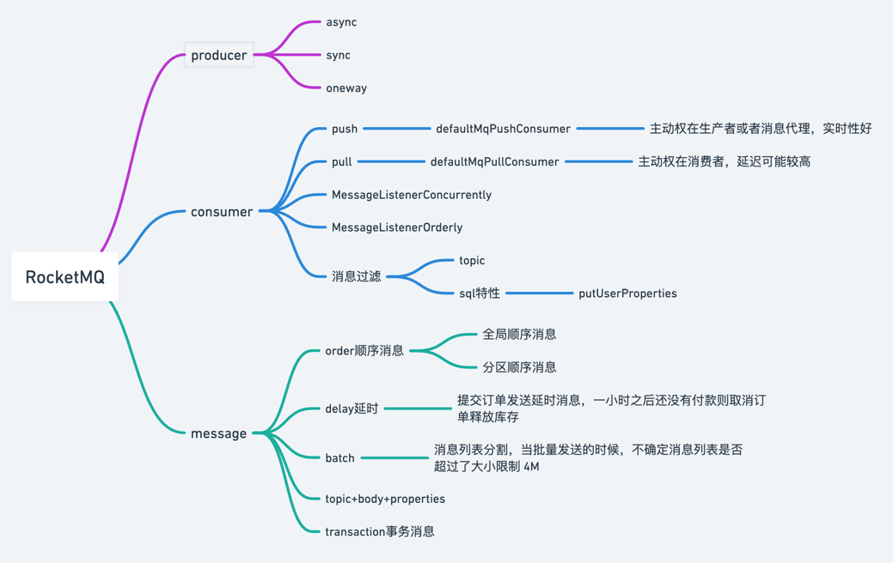

# rocketmq
> [示例代码 github地址](https://github.com/jaspercliff/springbootIntegration/tree/master/rocketmqIntegration)

- [usage](usage.md)
- [deploy](00buildAndInstall)
- [docker compose安装](dockercompose.md)
---
- [基本概念](mq/concept.md)
- [特性](mq/feature.md)
- [架构](./architecture.md)
---
- [部署和开发过程中遇到的问题](./problems.md)
- [消息过滤](./message/messageFilter.md)
- [事务消息](./message/transaction.md)
- [mqadmin工具](./tools/mqadmin.md)

- [源码调试](./调试源码.md)

## 集成
- [spring]()
- [springboot](spring/springboot.md)
- [springCloud](spring/springCloud.md)

- [乱七八糟](other.md)