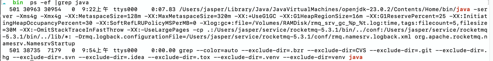
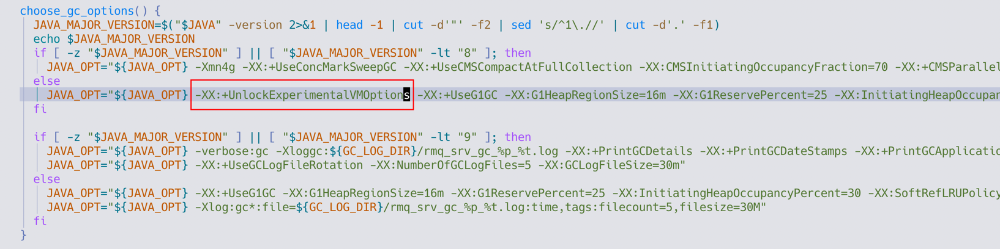

# problems

## 遇到的问题

--- 

复制官网的docker compose 文件直接启动报错
**Exception in thread "main" org.apache.rocketmq.remoting.exception.RemotingTooMuchRequestException: sendDefaultImpl call timeout**

映射配置文件
broker.conf   添加该配置brokerIP1=127.0.0.1

当 Broker 在 Docker 容器中运行时：
- 默认情况下，RocketMQ Broker 会自动获取容器的内部 IP，而这个 IP 通常是 Docker 的内部网络地址（比如 172.17.x.x）。
- Producer 在 Mac 本机运行，它通过 Namesrv 获取 Broker 地址，但是 Namesrv 返回的 IP 是 Docker 内部 IP，导致 Producer 无法正确连接。
- 设置 brokerIP1=127.0.0.1 可以强制 Broker 使用 127.0.0.1，让本机 Producer 能够正确连接。

---
**CODE: 1  DESC: The broker does not support consumer to filter message by SQL92**

broker.conf   默认不支持sql92标准
#开启过滤消息时支持SQL92标准
enablePropertyFilter=true

---


## Unrecognized VM option 'UseBiasedLocking' Error: Could not create the Java Virtual Machine. Error: A fatal exception has occurred. Program will exit.

> [biasedLock](/java/jvm/lock/biasedLock.md)

表示 Java 虚拟机（JVM）无法识别 UseBiasedLocking 这个 JVM 选项 ,JDK 版本过高
UseBiasedLocking 选项在 JDK 21 及更高版本已被移除

但是控制台 java -version 是1.8    

  
发现实际的jdk是23的 

runbroker.sh  获取java路径的shell脚本

```bash
error_exit ()
{
    echo "ERROR: $1 !!"
    exit 1
}

find_java_home()
{
    case "`uname`" in
        Darwin)
          if [ -n "$JAVA_HOME" ]; then
            JAVA_HOME=$JAVA_HOME
            return
          fi
            JAVA_HOME=$(/usr/libexec/java_home)
        ;;
        *)
            JAVA_HOME=$(dirname $(dirname $(readlink -f $(which javac))))
        ;;
    esac
}

find_java_home

[ ! -e "$JAVA_HOME/bin/java" ] && JAVA_HOME=$HOME/jdk/java
[ ! -e "$JAVA_HOME/bin/java" ] && JAVA_HOME=/usr/java
[ ! -e "$JAVA_HOME/bin/java" ] && error_exit "Please set the JAVA_HOME variable in your environment, We need java(x64)!"

export JAVA_HOME
export JAVA="$JAVA_HOME/bin/java"
export BASE_DIR=$(dirname $0)/..
export CLASSPATH=.:${BASE_DIR}/conf:${BASE_DIR}/lib/*:${CLASSPATH}

```
$JAVA_HOME 没有配置的话会使用 /usr/libexec/java_home 获取java路径

/usr/libexec/java_home -V 是 macOS 上用于查找和列出所有已安装的 JDK 版本的命令。

默认情况下会返回最高版本的jdk 

配置java版本为1.8 

##  VM option 'UseG1GC' is experimental and must be enabled via -XX:+UnlockExperimentalVMOptions.

- [g1gc](/java/jvm/gc/g1.md)
my jdk version 1.8.0_441
> [github issue](https://github.com/apache/rocketmq/issues/7996)
g1gc 在jdk8中为实验性功能 jdk11不用加该选项


添加 -XX:+UnlockExperimentalVMOptions配置