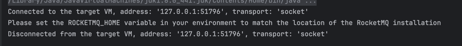
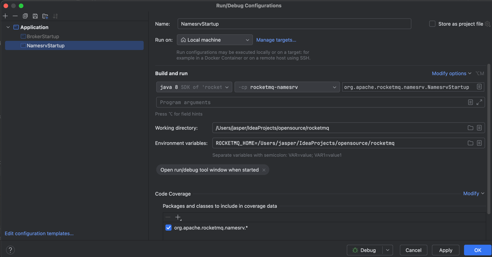
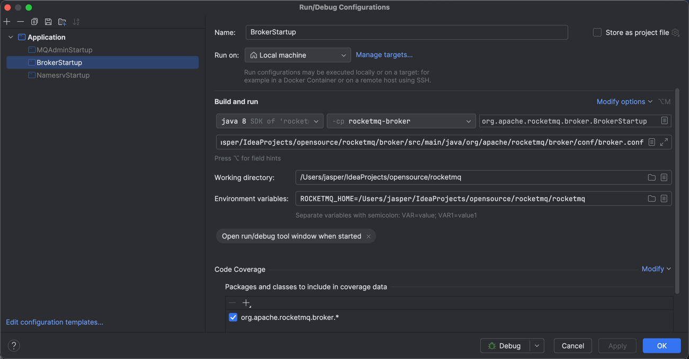

# 源码运行

## 启动namesrv


- 在idea配置环境变量 一些rocketmq的 相关脚本根据这个变量定位
``` 
ROCKETMQ_HOME=/Users/jasper/IdeaProjects/opensource/rocketmq/rocketmq
```



## 启动broker

broker和namesrv一样


## problem

producer 启动报下面的错误

```
Exception in thread "main" org.apache.rocketmq.client.exception.MQClientException: No route info of this topic: TB_TopicTest
```

> broker启动时指定配置文件 并允许自动创建topic autoCreateTopicEnable = true


