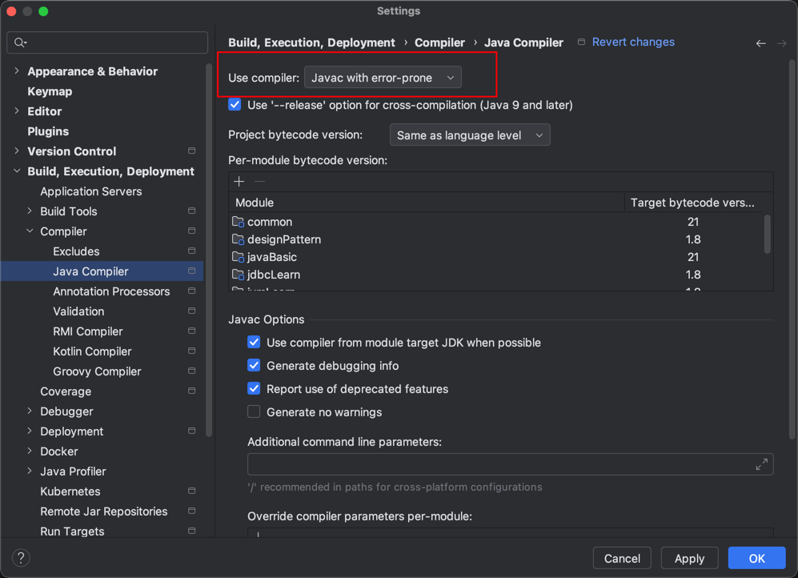

# error prone 

“Error Prone” 是 Google 提供的一个 Java 编译器插件，主要用于在 Java 编译期间发现潜在的 bug 和代码问题。
它集成在构建工具中（如 Maven、Gradle、Bazel）并作为 javac 的扩展运行。比起传统的编译器告警，它能检测更深入、更具体的问题。

🌟 为什么使用 Error Prone？
Java 编译器本身的警告机制有限，而 Error Prone 主要补充了以下几类问题：
- == 比较字符串
- 忘记在 equals 或 hashCode 中使用对象字段
- 忽略返回值（如 Future.get()）
- NullPointerException 来源
- 自动修复建议（配合 IDE 或脚本）
- 自定义规则的扩展能力

```java
public class MyClass {
public boolean compare(String a, String b) {
return a == b; // Error Prone 会报错：使用 == 比较字符串
}
}
```

Error Prone 报告：
[EqualityOperatorComparesObjects] Comparing references using '==' instead of 'equals'

```xml
    <build>
        <plugins>
            <plugin>
                <groupId>org.apache.maven.plugins</groupId>
                <artifactId>maven-compiler-plugin</artifactId>
                <version>3.11.0</version>
                <configuration>
                    <source>17</source>
                    <target>8</target>
                    <encoding>UTF-8</encoding>
                    <compilerArgs>
                        <arg>-XDcompilePolicy=simple</arg>
                        <arg>--should-stop=ifError=FLOW</arg>
                        <arg>-Xplugin:ErrorProne</arg>
                    </compilerArgs>
                    <annotationProcessorPaths>
                        <path>
                            <groupId>com.google.errorprone</groupId>
                            <artifactId>error_prone_core</artifactId>
                            <version>${error-prone.version}</version>
                        </path>
                    </annotationProcessorPaths>
                </configuration>
            </plugin>
        </plugins>
    </build>
```

idea 下载error-prone 插件



