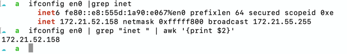

# awk

awk 是一个强大的文本分析工具，在Unix/Linux系统中广泛使用。
它特别适合处理结构化的数据文件，如CSV或TSV等，可以用来进行行和列的处理、模式匹配、数学运算等任务。


### 基本语法

`awk` 的基本语法如下：

```bash
awk 'pattern { action }' filename
```

- `pattern`：指定一个条件或模式，用于筛选行。
- `action`：当一行符合模式时要执行的操作。如果没有指定模式，则默认对所有行执行动作；如果没有指定动作，则默认打印匹配的行。
- `filename`：要处理的文件名。

### 常用特性

1. **字段分隔符**：默认情况下，`awk` 使用空格或制表符作为字段分隔符。你可以通过 `-F` 选项指定其他分隔符。

   ```bash
   awk -F, '{print $1}' filename
   ```
   这个例子将 `,` 作为字段分隔符，并打印每行的第一个字段。

2. **内置变量**：
    - `NF`: 当前行的字段数量。
    - `NR`: 当前行号。
    - `FS`: 字段分隔符。
    - `OFS`: 输出字段分隔符，默认为空格。
    - `RS`: 记录分隔符，默认为换行符。
    - `ORS`: 输出记录分隔符，默认为换行符。

3. **条件与循环**：`awk` 支持条件语句和循环结构，使其能够进行更复杂的文本处理。

4. **打印特定行或字段**：

   ```bash
   awk 'NR==2,NR==4' filename
   ```
   打印第2行到第4行的内容。

5. **使用正则表达式**：

   ```bash
   awk '/pattern/' filename
   ```
   打印包含“pattern”的所有行。

6. **结合管道使用**：

   ```bash
   command | awk '{print $1}'
   ```
   对命令的输出进行处理，这里只打印每行的第一个字段。

### 示例

- 打印文件中每个包含 "error" 的行，并显示该行的行号：
  ```bash
  awk '/error/ {print NR ": " $0}' filename
  ```

- 对于逗号分隔的文件，计算第二列的总和：
  ```bash
  awk -F, '{sum += $2} END {print sum}' filename
  ```

- 打印每行的第三个字段，假设字段由冒号分隔：
  ```bash
  awk -F: '{print $3}' filename
  ```

在 `awk` 中，`action` 是指当一行符合指定的模式（pattern）时要执行的操作。如果未指定模式，则对所有行执行动作；若没有指定动作，则默认打印匹配的行。动作通常包含在花括号 `{}` 内，并可以由多个语句组成，使用分号 `;` 或换行符分隔。

### 常见的动作(Action)

1. **打印数据**:
    - `print`: 打印当前行或指定的表达式。
    - `printf`: 格式化输出，与C语言中的 `printf` 类似。

2. **变量操作**:
    - 可以进行算术运算、赋值等操作。

3. **控制结构**:
    - 条件语句(`if`, `else`)
    - 循环(`for`, `while`)
    - 退出循环(`break`, `continue`)

4. **内置函数调用**:
    - 字符串处理函数、数学函数等。

### `$` 符号

> 在 `awk` 中，`$` 符号用于引用字段（列）。例如：
> `$0` 表示整行文本。
> `$1`, `$2`, `$3`, ... 分别表示每行的第一个、第二个、第三个...字段。字段的划分依据是 `FS` (Field Separator)变量的值，默认为空格或制表符。

#### 示例

1. **打印特定字段**:
   ```bash
   awk '{print $1}' filename
   ```
   打印文件中每行的第一个字段。

2. **使用条件和动作**:
   ```bash
   awk '$2 == "test" {print $1}' filename
   ```
   如果第二列等于 "test"，则打印该行的第一列。

3. **格式化输出**:
   ```bash
   awk '{printf "First column: %s, Second column: %s\n", $1, $2}' filename
   ```
   使用 `printf` 函数格式化输出第一和第二列。

4. **计算总和**:
   ```bash
   awk '{sum += $1} END {print "Sum: " sum}' filename
   ```
   计算文件中第一列数值的总和并在最后输出。

通过这些基本概念，你可以开始使用 `awk` 进行各种复杂的文本处理任务，从简单的数据提取到复杂的数据分析和报告生成。`awk` 的灵活性和强大功能使其成为Unix/Linux环境下不可或缺的工具之一。

## 实际应用 

