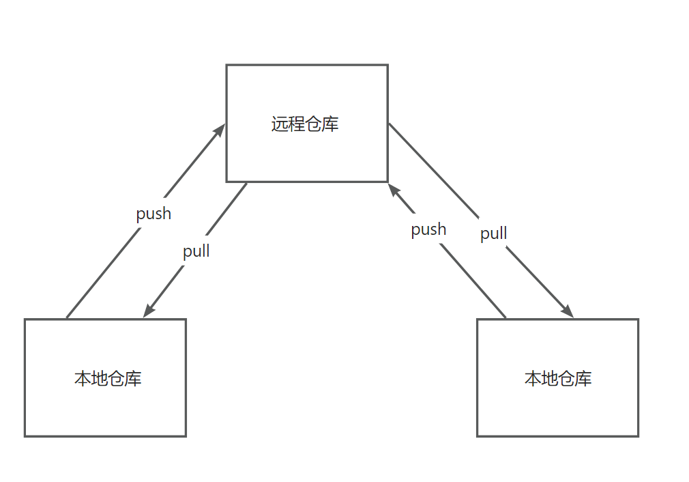
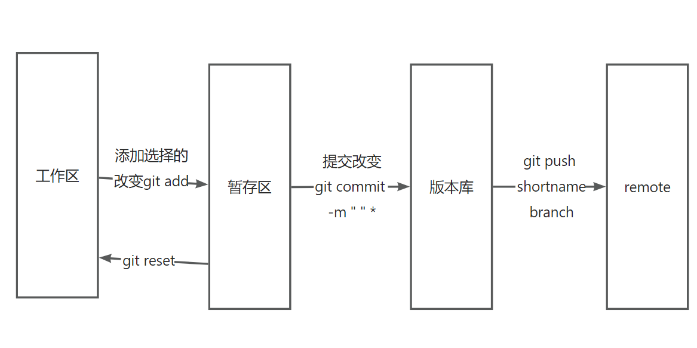

# git
git 是一个分布式的版本控制工具

## 功能
+ 代码回溯
+ 版本切换
+ 多人协作
+ 远程备份

## git 仓库

- commit:提交,将本地文件和版本信息保存到本地仓库
- push:推送,将本地仓库文件和版本信息上传到远程仓库，
- pull:拉取,将远程仓库文件和版本信息下载到本地仓库

## git代码托管服务
- gitHub (地址: [https://github.com/](https://github.com/) )，是一个面向开源及私有软件项目的托管平台，因为只支持Git作为唯一GitHulb(地址：地址)，是一个面向开源及私有软件项目的托管平台，因为只支持Git作为唯一的版本库格式进行托管，故名gitHub的版本库格式进行托管，故名GitHub

- 码云(地址: [https://gitee.com/](https://gitee.com/) ) ,是国内的一个代码托管平台，由于服务器在国内,所以相比于GitHub,码8Https://gitee.com/)，是国内的一个代码托管平台，由于服务器在国内，所以相比于GitHub，码8

- GitLab ( 地址: [https://about.gitlab.com/](https://about.gitlab.com/) )，是一个用于仓库管理系统的开源项目，使用Git作为代码管理工GitLab(地址：地址)，是一个用于仓库管理系统的开源项目，使用Git作为代码管理工具，并在此基础上搭建起来的web服务具，并在此基础上搭建起来的服务

- BitBucket ( 地址: [https://bitbucket.org/)](https://bitbucket.org/)) ，是一家源代码托管网站，采用Mercurial和Git作为分布式版本控制Bitbucket(地址：地址，是--家源代码托管网站，采用Mercurial和Git作为分布式版本控制)系统，同时提供商业计划和免费账户系统，同时提供商业计划和免费账户

## git常用命令
### git全局设置
Git全局设置
当安装Git后首先要做的事情是设置用户名称和email地址。这是非常重要的，因为**每次Git提交都会使用该用户信息**。
在Git命令行中执行下面命令:

设置用户信息

git config --global user.name "itcast"

git config --global user.email "hello@itcast.cn"

查看配置信息

git config --list

git config --global init.defaultBranch master
设置git init之后的默认分支名称

### 获取Git仓库
要使用Git对我们的代码进行版本控制，首先需要获得Git仓库。

获取Git仓库通常有两种方式:

- 在本地初始化一个Git仓库

git init

- 从远程仓库克隆 (常用)

git clone 远程仓库地址

### 工作区、暂存区、版本库概念

- 版本库:前面看到的.git隐藏文件夹就是版本库，版本库中存储了很多配置信息、日志信息和文件版本信息等
- 工作区:包含.git文件夹的目录就是工作区，也称为工作目录，主要用于存放开发的代码
- 暂存区: .git文件夹中有很多文件,其中有一-个index文件就是暂存区,也可以叫做stage。暂存区是-一个临时保存修改文件的地方

### Git工作区中文件的状态
Git工作区中的文件存在两种状态:

+ untracked 未跟踪( 未被纳入版本控制)    不被git管理
+ tracked已跟踪(被纳入版本控制)

1) Unmodified未修改状态

2) Modified 已修改状态

3) Staged已暂存状态;    暂存区

### 本地仓库常用命令
- git status 查看文件状态
- git add 将文件的修改加入暂存区
- git reset 将暂存区的文件取消暂存或者是切换到指定版本               --untracket
git reset --hard (log 查看commit后面的id）
- git commit将暂存区的文件修改提交到版本库
- git log 查看日志
### 远程仓库操作

- git remote 查看远程仓库
- git remote -v 查看远程仓库
- git remote add   shortname 链接
添加远程仓库  (eg git remote add origin [https://gitee.com/he-ziqiang/test.git](https://gitee.com/he-ziqiang/test.git))
- git clone 从远程仓库克隆
- git pull 从远程仓库拉取   git pull shortname branch 
- git push 推送到远程仓库   git push shortname branch

  
注意:如果当前本地仓库不是从远程仓库克隆,而是本地创建的仓库，并且仓库中存在文件，此时再从远程仓库拉取文件的时候会报错(fatal: refusing to merge unrelated histories )  
解决此问题可以在git pull命令后加入参数--allow-unrelated-histories

### 分支操作
分支是Git使用过程中非常重要的概念。使用分支意味着你可以把你的工作从开发主线上分离开来,以免影响开发主线。

同一个仓库可以有多个分支,各个分支相互独立,互不干扰。

通过git init命令创建本地仓库时默认会创建- -个master分支。
- git branch 查看分支
- git branch -r 远程仓库分支
- git branch -a all

- git branch [name]创建分支
- git checkout [name]切换分支
- git push [shortName] [name]推送至远程仓库分支
- git merge [name]合并分支

- git tag 列出已有的标签

- git tag [name]创建标签
- git push [shortName] [name]将标签推送至远程仓库
- git checkout -b [branch] [name]检出标签

